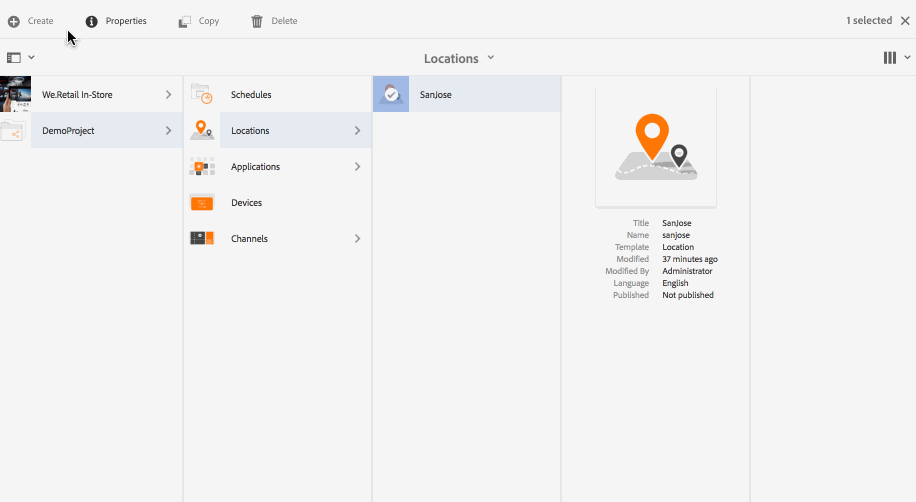
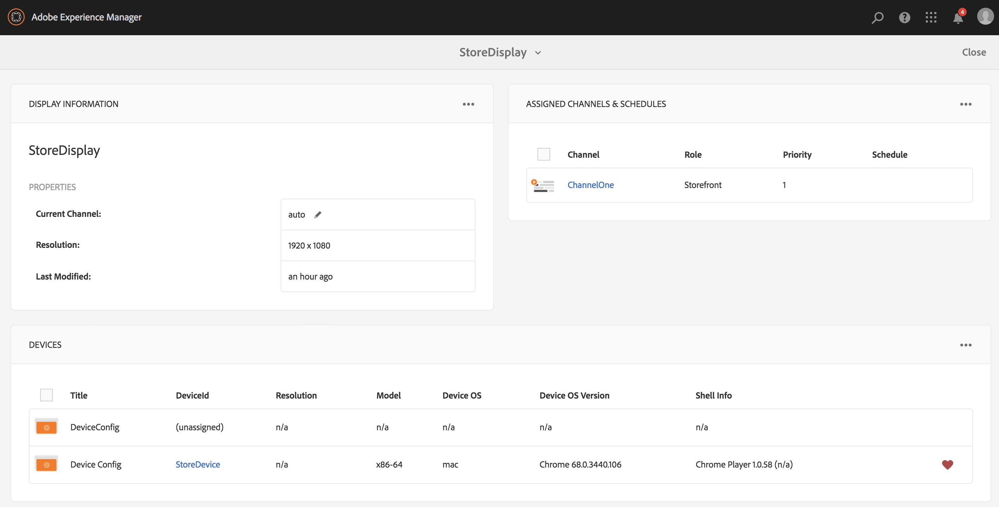

# 建立和管理顯示區 {#creating-and-managing-displays}

顯示區是虛擬的熒幕群組，通常位於彼此旁邊。 顯示通常是永久性的安裝。 這將是內容作者將搭配使用的物件，並一律參照為邏輯顯示，而不是其實體計數器部分。

建立位置後，您必須為位置建立新的顯示。

此頁面顯示建立及管理Screens的畫面。

**先決條件**：

* [設定和部署畫面](configuring-screens-introduction.md)
* [建立和管理畫面專案](creating-a-screens-project.md)
* [建立和管理頻道](managing-channels.md)
* [建立和管理位置](managing-locations.md)

## 建立新顯示區 {#creating-a-new-display}

>[!NOTE]
>
>您需要先建立位置，才能建立顯示。 若要瞭解如何建立位置，請參閱 [建立和管理位置](managing-locations.md) 以取得詳細資訊。

若要在您的位置中建立新的顯示區，請遵循下列步驟：

1. 導覽至適當位置，例如 `http://localhost:4502/screens.html/content/screens/TestProject`.
1. 選取您的位置資料夾，然後點選/按一下 **建立** 加號圖示旁邊。 將會開啟精靈。
1. 選取 **顯示** 從 **建立** 精靈並按一下 **下一個**.

1. 輸入 **名稱** 和 **標題** 顯示位置。

1. 在 **顯示** 索引標籤中，選擇配置圖的詳細資訊。 選擇所需的 **解析度** (例如， **Full HD**)。 此外，您也可以選擇水平與垂直裝置數量。

1. 按一下&#x200B;**建立**。

顯示區(*StoreDisplay*)建立並新增至位置(*聖荷西*)。

顯示就位後，下一步就是為該特定顯示建立裝置設定。 請依照以下章節建立新的裝置設定。

>[!NOTE]
>
>**下一步**：
>
>為您的位置建立顯示區後，您需要指派頻道給顯示區，以運用內容。
>
>另請參閱 [指派管道](channel-assignment.md) 區段，以瞭解如何指派頻道給顯示區。

## 建立新的裝置設定 {#creating-a-new-device-config}

裝置設定可作為尚未安裝之實際數位看板裝置的預留位置。

請依照下列步驟建立新的裝置設定：

1. 導覽至適當的顯示區，例如， `http://localhost:4502/screens.html/content/screens/TestProject/locations/newlocation`.
1. 選取您的顯示資料夾，然後點選/按一下 **檢視控制面板** 在動作列中。
1. 點選/按一下 **+新增裝置設定** 右上角 **裝置** 面板。

1. 選取 **裝置設定** 作為所需的範本，然後點選/按一下 **下一個**.

1. 視需要輸入屬性，然後點選/按一下 **建立**.

裝置設定已建立並新增至目前的顯示(在下列示範中，新的裝置設定為 *裝置設定*)。

一旦將裝置設定設定為位置中的顯示器，下一步就是將頻道指派給顯示器。

>[!NOTE]
>
>一旦將裝置設定設定為位置中的顯示器，下一步就是將頻道指派給顯示器。
>
>如果裝置設定在「 」中顯示為「未指派」，如下圖所示 **裝置** 面板（如果未將任何頻道指派給該特定裝置設定）。
>
>您應事先瞭解如何建立和管理管道。 另請參閱 [建立和管理頻道](managing-channels.md) 以取得更多詳細資料。

## 顯示控制面板 {#display-dashboard}

顯示儀表板提供您不同的面板，用於管理裝置的顯示裝置和裝置配置。

>[!NOTE]
>
>您可以選取儀表板清單並觸發對專案的批次動作，而不是分別瀏覽每個專案。
>
>例如，下圖顯示如何從顯示圖示板中選取多個色版。

### 顯示資訊面板 {#display-information-panel}

此 **顯示資訊** 面板提供顯示屬性。

按一下(**...**)的右上角 **顯示資訊** 面板以檢視屬性並預覽顯示。

#### 檢視屬性 {#viewing-properties}

按一下 **屬性** 以檢視或變更顯示的屬性。

此外，您也可以調整互動式頻道的事件計時器值，位置如下： **閒置逾時** 下的屬性 **顯示** 標籤。 預設值設為 *300秒*.

使用 **CRXDE Lite**，以存取 **idleTimeout** 屬性，也就是說， `http://localhost:4502/crx/de/index.jsp#/content/screens/we-retail/locations/demo/flagship/single/jcr%3Acontent/channels` .

### 已指派的色版面板 {#assigned-channels-panel}

此 **已指派的頻道** 面板會顯示指派給此裝置的頻道。

### 裝置面板 {#devices-panel}

此 **裝置** 面板提供裝置設定的相關資訊。

按一下(**...**)的右上角 **裝置** 面板以新增裝置設定和更新裝置。

此外，按一下裝置設定即可檢視屬性、指派裝置，或將其完全刪除。

#### 後續步驟 {#the-next-steps}

完成建立位置的顯示後，您需要為顯示指派頻道。

另請參閱 [指派管道](channel-assignment.md) 以取得更多詳細資料。
