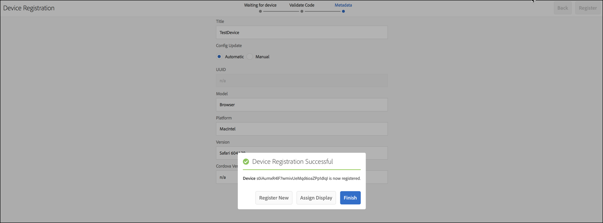
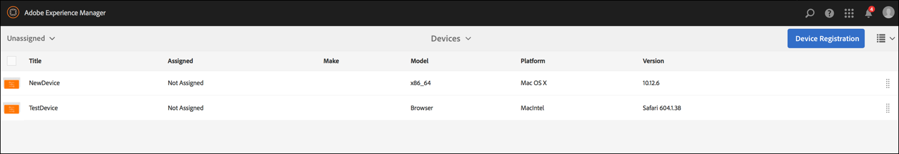
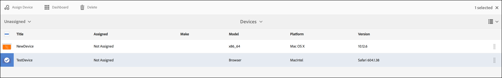
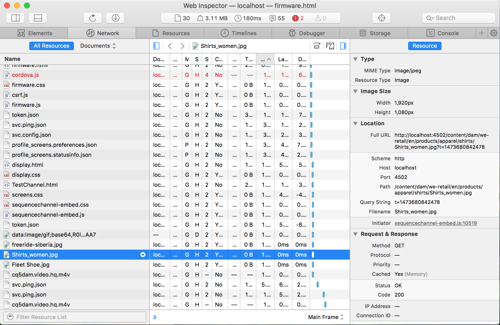
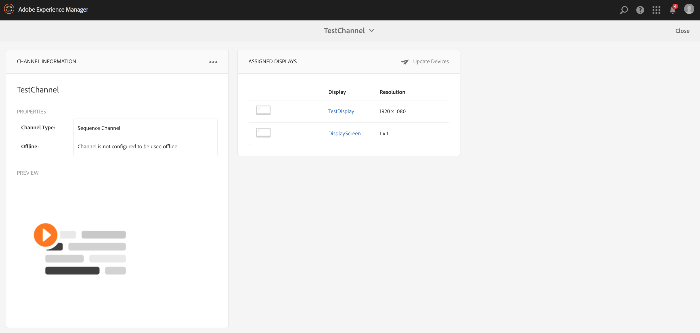
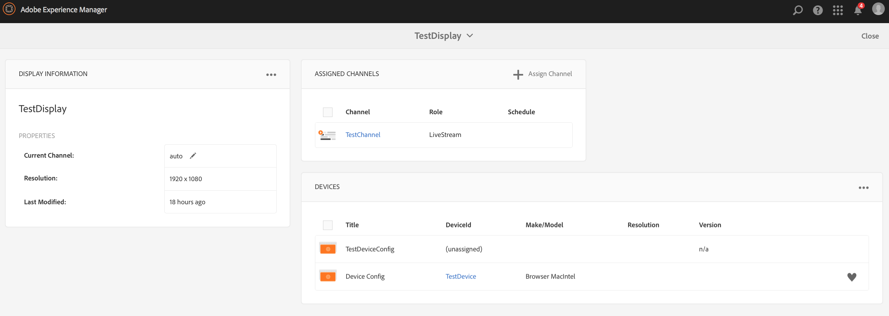

# 建立和管理即時副本 {#creating-and-managing-a-live-copy}

>[!IMPORTANT]
>此內容對AEM內部部署/AMS （AEM 6.5LTS和AEM 6.5）有效。 如需AEM as a Cloud Service Screens內容，請參閱[AEM as a Cloud Service指南](https://experienceleague.adobe.com/en/docs/experience-manager-cloud-service/content/screens-as-cloud-service/overview/introduction)。

本頁說明如何建立及管理管道的即時副本。

***即時副本***&#x200B;是特定網站內容的副本，其中與原始來源的即時關係得以維護。 此即時關係可讓即時副本從來源繼承內容和頁面屬性。

此頁面說明如何建立管道的即時副本、檢視屬性、檢查狀態，以及從管道將變更傳播至其即時副本。

## 建立即時副本 {#creating-a-live-copy}

請依照下列步驟，在您的專案資料夾中建立頻道的即時副本。

1. 按一下Adobe Experience Manager連結（左上方），然後按一下&#x200B;**Screens**。 或者，您可以直接前往： `http://localhost:4502/screens.html/content/screens`。

1. 導覽至Screens專案，然後按一下&#x200B;**管道**。
1. 按一下「**建立**」，然後按一下「**即時副本**」，您就可以建立頻道的即時副本。
1. 按一下目的地，然後按一下&#x200B;**下一步**。
1. 按一下即時副本的存放位置。
1. 在&#x200B;**建立即時副本**&#x200B;頁面中輸入&#x200B;**標題**&#x200B;和&#x200B;**名稱**。

1. 按一下&#x200B;**開啟**&#x200B;以檢視新即時副本的內容，或按一下&#x200B;**完成**&#x200B;以返回首頁面。

或者，您也可以參閱下列步驟，瞭解建立頻道新即時副本的視覺表示。

下列範例顯示為&#x200B;***閒置頻道***&#x200B;建立即時副本(***IdleLiveCopy***)，其目的地資料夾為&#x200B;***頻道***。

## 檢視即時副本管道的內容 {#viewing-content-of-the-live-copy-channel}

即時副本是現有的管道副本。

若要檢視即時副本的內容，請參閱下列步驟：

1. 導覽至Screens專案，然後按一下您最初建立即時副本的位置，如上節所示。 （在此，位置被選為&#x200B;**頻道**&#x200B;資料夾）

   

1. 按一下動作列中的&#x200B;**編輯**。

   

   >[!NOTE]
   >
   >檢視即時副本管道的內容時，您在功能表中檢視了一個額外的專案，名稱為&#x200B;**即時副本狀態**。 如需詳細資訊，請參閱下一節。

### 檢視即時副本的屬性 {#viewing-properties-of-a-live-copy}

您也可以檢視即時副本頻道的屬性。

1. 導覽至您的Live Copy頻道，然後按一下動作列中的&#x200B;**屬性**。

   

1. 按一下&#x200B;**即時副本**&#x200B;標籤，以便檢視您頻道的詳細資料。

   

### 即時副本狀態 {#live-copy-status}

模式&#x200B;**即時副本狀態** （如下圖所示）可讓您檢視頻道中所有資產的關係狀態。

1. 按一下&#x200B;**編輯**，您就可以選擇&#x200B;**即時副本狀態**。 您也可以檢視頻道內容與產生即時副本之原始頻道的關聯。

   

1. 按一下&#x200B;**即時副本狀態**，以便顯示預覽頁面。

   所有具有綠色邊框的資源會顯示內容繼承自原始通道。

   

### 中斷繼承 {#breaking-the-inheritance}

您也可以取消即時副本的繼承，讓內容獨立於原始分支。

下列範例顯示您在編輯模式中按一下影像，然後按一下右上方的&#x200B;**取消繼承**&#x200B;圖示。

### 將變更傳播至即時副本頻道 {#propagating-changes-to-the-live-copy-channel}

如果您在原始頻道中進行變更或更新，請將這些變更傳播到您的Live Copy頻道。

請依照下列步驟操作，以確保您的變更從原始頻道傳播到即時副本頻道：

1. 按一下原始頻道（***閒置頻道***），然後從動作列按一下&#x200B;**編輯**。

   

1. 編輯此管道內容。 例如，從此色版刪除影像。

   

1. 按一下頻道的即時副本(***IdleLiveCopy***)，然後從動作列按一下&#x200B;**編輯**。 請注意，您刪除的影像仍會顯示在即時副本中。

   若要傳播變更，請同步管道。

   

1. 若要將變更傳播至即時副本頻道，請導覽至AEM控制面板，按一下即時副本頻道，然後按一下動作列中的「**屬性**」。

   

1. 按一下&#x200B;**即時副本**&#x200B;索引標籤，然後從動作列按一下&#x200B;**同步**。

   

1. 按一下[同步]****，然後按一下[儲存並關閉]****&#x200B;以導覽回到AEM儀表板。

   

   請注意，影像現在也已從即時副本頻道中刪除。
