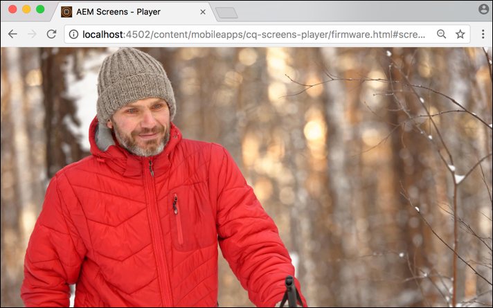

# 建立和管理Live Copy {#creating-and-managing-a-live-copy}

本頁面說明如何建立和管理管道的即時副本。

***即時副本***&#x200B;是與原始源保持即時關係的特定網站內容的副本。 此即時關係允許即時副本從源繼承內容和頁面屬性。

本頁面說明如何建立管道的即時副本、檢視屬性、檢查狀態，以及將變更從管道傳播至其即時副本。

## 建立即時副本{#creating-a-live-copy}

請依照下列步驟，在專案資料夾中建立管道的即時副本。

1. 選取Adobe Experience Manager連結（左上角），然後選取&#x200B;**Screens**。 或者，您也可以直接前往：`http://localhost:4502/screens.html/content/screens`。

1. 導覽至Screens專案，然後按一下&#x200B;**頻道**。
1. 按一下「**建立**」，然後選取「即時副本」以建立通道的即時副本。****

1. 選擇目標，然後按一下&#x200B;**Next**。
1. 選取即時副本將位於哪個位置。
1. 在&#x200B;**建立即時副本**&#x200B;頁面中輸入&#x200B;**Title**&#x200B;和&#x200B;**Name**。

1. 按一下&#x200B;**開啟**&#x200B;以檢視新即時副本的內容，或按一下&#x200B;**Done**&#x200B;以返回首頁面。

或者，請參閱下列步驟，以取得視覺化呈現，以建立管道的新即時副本。

以下示例說明為&#x200B;***空閒通道***&#x200B;建立目標資料夾為&#x200B;***通道***&#x200B;的即時副本(***IdleLiveCopy***)。

## 檢視即時副本頻道{#viewing-content-of-the-live-copy-channel}的內容

即時副本是已存在之管道的副本。

若要檢視即時副本的內容，請參閱下列步驟：

1. 導覽至Screens專案，然後按一下您原本建立即時副本的位置，如上節所示。 （此處，該位置被選擇為&#x200B;**通道**&#x200B;資料夾）

   

1. 按一下動作列中的「**編輯**」以檢視頻道中的內容。

   

   >[!NOTE]
   >
   >檢視即時副本頻道的內容時，您會在功能表中以&#x200B;**即時副本狀態**&#x200B;檢視額外項目。 如需詳細資訊，請參閱下方的一節。

### 查看Live Copy {#viewing-properties-of-a-live-copy}的屬性

此外，您也可以檢視即時副本管道的屬性。

1. 導覽至您的即時副本頻道，然後按一下動作列中的&#x200B;**屬性**。

   

1. 選取&#x200B;**即時副本**&#x200B;標籤以檢視通道的詳細資訊。

   

### 即時副本狀態 {#live-copy-status}

模式&#x200B;**即時副本狀態**（如下圖所示）可讓您檢視通道中所有資產的關係狀態。

1. 按一下&#x200B;**編輯**&#x200B;以選擇&#x200B;**即時副本狀態**&#x200B;並檢視頻道內容與原始頻道（從中產生即時副本）的關聯。

   

1. 選擇&#x200B;**即時複製狀態**&#x200B;以顯示預覽頁。

   所有具有綠色邊框的資源會顯示內容繼承自原始管道。

   

### 中斷繼承{#breaking-the-inheritance}

您也可以取消Live Copy的繼承，讓內容與原始分支無關。

以下示例顯示您在編輯模式下選擇影像，然後按一下右上角的取消繼承符號。

### 將更改傳播到Live Copy通道{#propagating-changes-to-the-live-copy-channel}

如果您在原始管道中進行變更/更新，您也需要將這些變更傳播至您的即時副本管道。

請依照下列步驟，確保您的變更從原始管道傳播至即時副本管道：

1. 選擇原始通道（***空閒通道***），然後從操作欄中按一下&#x200B;**編輯**。

   

1. 編輯此頻道內容。 例如，從此管道刪除影像。

   

1. 選取通道的即時副本(***IdleLiveCopy***)，然後從動作列按一下&#x200B;**Edit**。 您會發現您刪除的影像仍會顯示在即時副本中。

   若要傳播變更，您必須同步通道。

   

1. 若要將變更傳播至即時副本通道，請導覽至AEM控制面板並選取即時副本通道，然後按一下動作列中的&#x200B;**屬性**。

   

1. 選擇「Live Copy **」頁簽，然後從操作欄按一下「**&#x200B;同步&#x200B;**」。**

   

1. 按一下&#x200B;**Sync**&#x200B;以確認更改。 按一下「**儲存並關閉**」，導覽回AEM控制面板。

   

   您會發現影像現在也從即時副本頻道中刪除。
