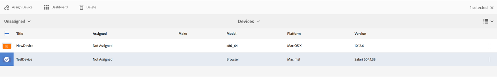

# 建立和管理即時副本 {#creating-and-managing-a-live-copy}

本頁說明如何建立及管理管道的即時副本。

A ***即時副本*** 是特定網站內容的復本，其中會維持與原始來源的即時關係。 此即時關係可讓即時副本從來源繼承內容和頁面屬性。

此頁面說明如何建立管道的即時副本、檢視屬性、檢查狀態，以及從管道將變更傳播至其即時副本。

## 建立即時副本 {#creating-a-live-copy}

請依照下列步驟，在您的專案資料夾中建立頻道的即時副本。

1. 選取Adobe Experience Manager連結（左上方），然後 **Screens**. 或者，您可以直接前往： `http://localhost:4502/screens.html/content/screens`.

1. 導覽至畫面專案，然後按一下 **頻道**.
1. 按一下 **建立** 並選取 **即時副本** 以便建立管道的即時副本。
1. 選取目的地並按一下 **下一個**.
1. 選取即時副本可以存放的位置。
1. 輸入 **標題** 和 **名稱** 在 **建立即時副本** 頁面。

1. 按一下 **開啟** 若要檢視新即時副本的內容，或 **完成** 以返回首頁面。

或者，您也可以參閱下列步驟，瞭解建立頻道新即時副本的視覺表示。

下列範例顯示如何建立即時副本(***IdleLiveCopy***)用於 ***閒置頻道*** 將目的地資料夾設為 ***頻道***.

## 檢視即時副本管道的內容 {#viewing-content-of-the-live-copy-channel}

即時副本是已存在的管道副本。

若要檢視即時副本的內容，請參閱下列步驟：

1. 導覽至Screens專案，然後按一下您最初建立即時副本的位置，如上節所示。 (在此，選擇位置為 **頻道** 資料夾)

   

1. 按一下 **編輯** 從動作列移除。

   

   >[!NOTE]
   >
   >檢視即時副本頻道的內容時，您在功能表中檢視額外的專案為 **即時副本狀態**. 如需更多詳細資訊，請參閱以下區段。

### 檢視即時副本的屬性 {#viewing-properties-of-a-live-copy}

您也可以檢視即時副本頻道的屬性。

1. 導覽至您的即時副本頻道，然後按一下 **屬性** 從動作列移除。

   

1. 選取 **即時副本** 標籤，以便檢視頻道的詳細資訊。

   

### 即時副本狀態 {#live-copy-status}

模式 **即時副本狀態**，如下圖所示，可讓您檢視頻道中所有資產的關係狀態。

1. 按一下 **編輯** 以便您選擇 **即時副本狀態** 和檢視您的頻道內容與原始頻道（產生即時副本的來源）的關聯。

   

1. 選取 **即時副本狀態** 以便顯示預覽頁面。

   所有具有綠色邊框的資源會顯示內容繼承自原始通道。

   

### 中斷繼承 {#breaking-the-inheritance}

您也可以取消即時副本的繼承，讓內容獨立於原始分支。

下列範例顯示您在編輯模式中選取影像，然後按一下右上角的取消繼承符號。

### 將變更傳播至即時副本頻道 {#propagating-changes-to-the-live-copy-channel}

如果您在原始頻道中進行變更/更新，則也必須將這些變更傳播至您的即時副本頻道。

請依照下列步驟操作，以確保您的變更從原始頻道傳播到即時副本頻道：

1. 選取原始通道(***閒置頻道***)並選取 **編輯** 從動作列移除。

   

1. 編輯此管道內容。 例如，從此色版刪除影像。

   

1. 選取頻道的即時副本(***IdleLiveCopy***)並選取 **編輯** 從動作列移除。 請注意，您刪除的影像仍會顯示在即時副本中。

   若要傳播變更，請同步管道。

   

1. 若要將變更傳播至即時副本頻道，請導覽至AEM控制面板並選取即時副本頻道，然後按一下 **屬性** 從動作列移除。

   

1. 選取 **即時副本** 標籤並選取 **同步** 從動作列移除。

   

1. 選取 **同步**，然後選取 **儲存並關閉** 導覽回AEM控制面板。

   

   請注意，影像現在也已從即時副本頻道中刪除。
