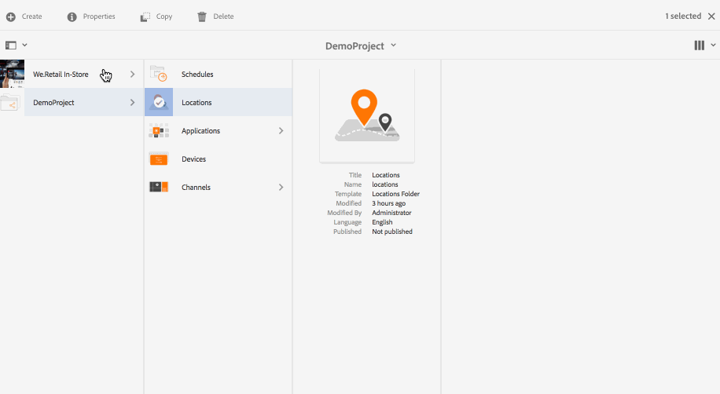

# 建立和管理位置 {#creating-and-managing-locations}

這些位置會根據各種畫面的位置來主控顯示器的設定。

本頁面顯示如何建立和管理Screens的位置。

**先決條件**:

* [設定和部署畫面](configuring-screens-introduction.md)
* [建立和管理Screens專案](creating-a-screens-project.md)
* [建立和管理管道](managing-channels.md)

## 建立新位置 {#creating-a-new-location}

在您為Screens建立專案後，請依照下列步驟為Screens專案建立新的位置：

1. 依序選取Adobe Experience Manager連結（左上角）和Screens。 或者，您也可以直接導覽至：`http://localhost:4502/screens.html/content/screens`。
1. 導覽至Screens專案，然後按一下&#x200B;**Locations**。
1. 按一下動作列中加號圖示旁的&#x200B;**建立**。 嚮導將開啟。
1. 從嚮導中選擇模板&#x200B;**Location**，然後按一下&#x200B;**Next**。

1. 輸入&#x200B;**標題和標籤**、**更多標題和說明**、**開/關時間**&#x200B;和&#x200B;**虛名URL**&#x200B;的屬性。

1. 按一下「**建立**」，該位置便會建立並新增至您的位置資料夾。

請參閱下列步驟，了解如何為AEM Screens專案建立新位置。 為了示範，新位置(SanJose)會建立在&#x200B;*DemoProject*&#x200B;下。

建立位置後，您必須為位置建立新的顯示。

### 編輯位置的屬性 {#editing-properties-for-a-location}

要編輯/訪問位置的屬性，請執行以下操作：

1. 選取位置。
1. 按一下動作列中的&#x200B;**屬性**。

#### 後續步驟 {#the-next-steps}

建立位置後，您必須為位置建立新的顯示。

如需詳細資訊，請參閱[建立和管理顯示](managing-displays.md) 。
