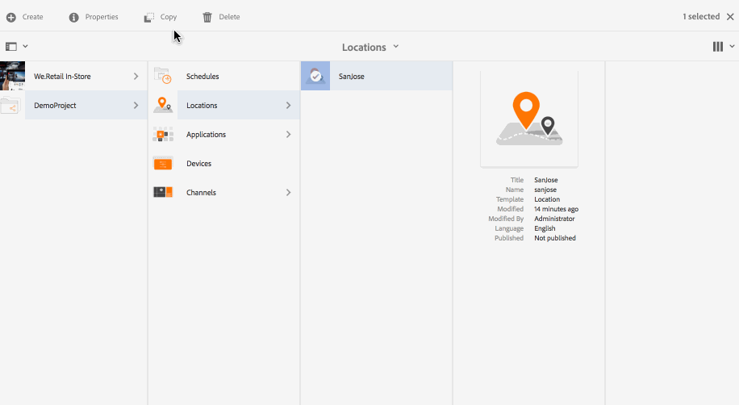

# 建立和管理位置 {#creating-and-managing-locations}

位置會根據各種熒幕的位置來主控顯示器的設定。

此頁面顯示建立及管理Screens的位置。

**先決條件**：

* [設定和部署Screens](configuring-screens-introduction.md)
* [建立和管理畫面專案](creating-a-screens-project.md)
* [建立和管理管道](managing-channels.md)

## 建立新位置 {#creating-a-new-location}

建立Screens專案後，請依照下列步驟建立Screens專案的位置：

1. 選取Adobe Experience Manager連結（左上方），然後選取Screens。 或者，您可以直接導覽至： `http://localhost:4502/screens.html/content/screens`.
1. 導覽至畫面專案，然後按一下 **位置**.
1. 按一下 **建立** 加號圖示旁。
1. 選取範本 **位置** 從精靈中並按一下 **下一個**.
1. 輸入以下專案的屬性： **標題和標籤**， **更多標題和說明**， **開啟/關閉時間**、和 **虛名URL**.
1. 按一下 **建立** 且位置會建立並新增至您的位置資料夾。

請參閱下列步驟，瞭解如何建立AEM Screens專案的位置。 為了示範，新位置(SanJose)建立於 *示範專案*.

建立位置後，請建立位置的顯示。

### 編輯位置的屬性 {#editing-properties-for-a-location}

若要編輯/存取位置的屬性：

1. 選取位置。
1. 按一下 **屬性** 從動作列移除。

#### 後續步驟 {#the-next-steps}

建立位置後，請建立位置的顯示。

另請參閱 [建立和管理顯示器](managing-displays.md).
