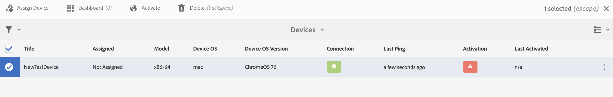

# 疑難排解裝置控制中心 {#troubleshooting-device-control-center}

您可以使用裝置控制面板，監控及疑難排解AEM Screens Player活動和裝置的效能。 此頁面提供如何監視和疑難排解Screens播放器和指派之裝置的感知效能問題的相關資訊。

## 從裝置控制中心進行監控和疑難排解 {#monitor-and-troubleshoot-from-device-control-center}

您可以使用Device Dashboard監控活動，進而疑難排解AEM Screens Player。

### 裝置控制面板 {#device-dashboard}

請依照下列步驟，導覽至裝置控制面板：

1. 從您的專案導覽至裝置控制面板，例如 ***測試專案*** > ***裝置***.

   按一下 **裝置** 和 **裝置管理員** 從動作列移除。

   

1. 清單會顯示已指派和未指派的裝置，如下圖所示。

   

1. 按一下裝置(**NewTestDevice**)並按一下 **儀表板** 從動作列移除。

   

1. 此頁面會顯示裝置資訊、活動，以及可讓您監視裝置活動和功能的裝置詳細資訊。

   

### 監視裝置活動 {#monitor-device-activity}

此 **活動** 面板會顯示您的AEM Screens Player最後一次Ping的時間戳記。 最後一個ping對應到裝置上次連線伺服器的時間。

此外，按一下 **收集記錄** 從的右上角 **活動** 面板以檢視播放器的記錄檔。

### 更新裝置詳細資料 {#update-device-details}

檢查 **裝置詳細資料** 面板，讓您檢視裝置IP、儲存空間使用量、韌體版本，以及裝置的播放器運作時間。

此外，按一下 **清除快取** 和 **更新** 以清除裝置的快取並更新 [韌體](screens-glossary.md) 版本。

此外，按一下 **...** 從右上角 **裝置詳細資料** 面板以重新啟動或重新整理播放器的狀態。

### 更新裝置資訊 {#update-device-information}

檢查 **裝置資訊** 面板。 您可以在此處檢視設定更新、裝置型號、裝置作業系統和殼層資訊。

此外，按一下(**...**)，以檢視屬性或更新裝置。

按一下 **屬性** 以便您檢視 **裝置屬性** 對話方塊。 您可以編輯裝置標題或選擇設定更新的選項，如下所示 **手動** 或 **自動**.

>[!NOTE]
>
>若要進一步瞭解與裝置的自動或手動更新相關聯的事件，請參閱區段 ***從裝置控制面板自動與手動更新*** 在 [管理管道](managing-channels.md).

### 檢視播放器熒幕擷圖 {#view-player-screenshot}

您可以從裝置檢視播放器熒幕擷圖 **播放器熒幕擷圖** 面板。

按一下(**...**)，並按一下 **重新整理熒幕擷圖** 以檢視執行中播放器的快照。

### 管理偏好設定 {#manage-preferences}

此 **偏好設定** 面板可讓使用者變更的偏好設定 **管理員UI**， **頻道切換器**、和 **遠端偵錯** 適用於裝置。

>[!NOTE]
>若要深入瞭解這些選項，請參閱 [AEM Screens Player](working-with-screens-player.md).

此外，按一下 **設定** 從右上角更新裝置偏好設定。 您可以更新下列偏好設定：

* **伺服器URL**
* **解析度**
* **重新開機排程**
* **最大數量 要保留的記錄檔**
* **記錄層級**

>[!NOTE]
>您可以按一下下列任一記錄層級：
>* **停用**
>* **偵錯**
>* **資訊**
>* **警告**
>* **錯誤**

## 疑難排解OSGi設定 {#troubleshoot-osgi-settings}

啟用空白反向連結以允許裝置將資料發佈至伺服器。 例如，如果停用空白反向連結屬性，裝置就無法張貼熒幕擷圖。

目前，其中部分功能僅適用於 *Apache Sling查閱者篩選器允許空白* 會在OSGi設定中啟用。 儀表板可能會顯示警告，指出安全性設定可能會使這些功能的部分功能無法運作。

請依照下列步驟，啟用Apache Sling查閱者篩選器允許空白

1. 瀏覽至 **Adobe Experience Manager Web主控台設定**，也就是 `https://localhost:4502/system/console/configMgr/org.apache.sling.security.impl.ReferrerFilter`.
1. 檢查 **allow.empty** 選項。
1. 按一下「**儲存**」。

### 建議 {#recommendations}

下節建議監控網路連結、伺服器和播放器，以瞭解運作狀況並對問題做出反應。

AEM提供下列專案的內建監控：

* *心率* 每5秒顯示一次，表示AEM Screens Player運作中。
* *熒幕擷圖* 從「播放器」，顯示在播放器上顯示的內容。
* 此 *AEM Screens播放器韌體* 版本已安裝在播放器上。
* *可用儲存空間* 在播放器上。

使用協力廠商軟體進行遠端監控的Recommendations：

* 播放器中的CPU使用量。
* 檢查AEM Screens Player程式是否正在執行。
* 遠端重新啟動/重新啟動播放器。
* 即時通知。

建議以可讓遠端登入診斷問題並重新啟動播放器的方式，部署播放器硬體及作業系統。

#### 其他資源 {#additional-resources}

另請參閱 [視訊播放設定及疑難排解](troubleshoot-videos.md) 如果您想要對頻道中播放的視訊進行除錯和疑難排解。
