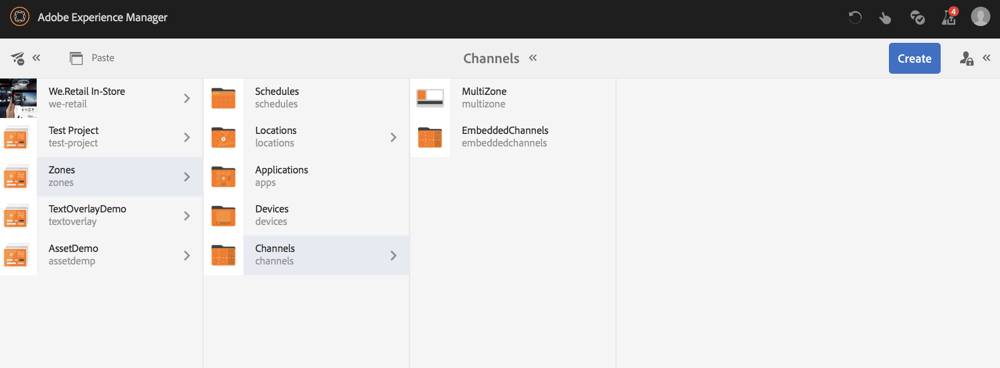

# 多區域配置 {#multi-zone-layout}

以下頁面說明多區域配置的使用方式，並涵蓋下列主題：

* 概觀
* 建立多區域配置
* 先決條件
* 在一或多個區域中使用單一Assets
* 在一或多個區域中使用循序內容

## 概觀 {#overview}

***多區域版面配置***&#x200B;可讓您建立多個區域內容，並使用可在單一畫面中結合的各種資產，例如視訊、影像和文字。 您可以提取影像、影片和文字，讓所有內容混合在一起，建立直覺的數位體驗。

根據專案需求，您有時需要在通道中擁有多個區域，並將它們編輯為一個完整的單位。 例如，具有相關社群媒體摘要的產品序列，在單一頻道上的三個獨立區域中執行。

>[!NOTE]
>在多區域管道中，由於潛在的衝突和意外行為，不建議進行資產層級排程。 如果資產層級排程是必要的，請建立個別的順序管道，並在該管道內套用排程邏輯。 接下來，將順序頻道嵌入到多區域頻道中。

### 先決條件 {#prerequisites}

開始實作此功能之前，請確定您具備下列概念知識：

* [建立AEM Screens專案](https://experienceleague.adobe.com/en/docs/experience-manager-screens/user-guide/authoring/setting-up-projects/creating-a-screens-project)
* [正在建立顯示區](https://experienceleague.adobe.com/en/docs/experience-manager-screens/user-guide/authoring/setting-up-projects/managing-displays)
* [將頻道指派給顯示區](/help/user-guide/channel-assignment.md)

## 建立多區域配置 {#creating-multi-zone-layout}

建立管道時，您可以使用不同的範本在您的管道中建立區域。 您可以新增單一影像、視訊或內嵌色版，讓多個資產可依序顯示。

**正在建立頻道**

1. 按一下Adobe Experience Manager連結（左上方），然後按一下&#x200B;**Screens**。 或者，您可以直接前往： `http://localhost:4502/screens.html/content/screens`。
1. 導覽至&#x200B;**頻道**&#x200B;資料夾，然後從動作列按一下&#x200B;**建立**。

1. 從&#x200B;**建立**&#x200B;精靈按一下&#x200B;**1x2拆分畫面頻道**。

1. 按一下[下一步]&#x200B;**&#x200B;**&#x200B;並輸入&#x200B;**標題**&#x200B;作為&#x200B;**MultiZone**。

1. 按一下&#x200B;**建立**&#x200B;以完成頻道建立。

### 在一或多個區域中使用單一Assets {#using-single-assets-in-one-or-more-zones}

您可以在所有個別區域中使用單一資產，例如影像或視訊。 請依照下列步驟實作：

1. **正在新增內容至頻道**

   1. 瀏覽至&#x200B;**區域** > **管道**> **多區域**。
   1. 按一下&#x200B;**MultiZone**&#x200B;頻道，然後從動作列按一下&#x200B;**編輯**。

1. **正在新增影像到頻道**

   若要在兩個區域播放單一影像或影片，只要將影像拖放至色版編輯器中的各個區域即可，如下圖所示：

   

### 在一或多個區域中使用循序內容 {#using-sequenced-content-in-one-or-more-zones}

如果您希望區域在不同區域中顯示一系列影像和視訊，請依照下列步驟瞭解詳細資訊。

1. **正在建立頻道資料夾**

   1. 瀏覽至&#x200B;**區域** > **多重區域** > **頻道**，然後從動作列按一下&#x200B;**建立**。
   1. 從&#x200B;**建立**&#x200B;精靈按一下&#x200B;**頻道資料夾**，然後按一下&#x200B;**下一步**。
   1. 輸入標題為&#x200B;**EmbeddedChannels**，然後按一下&#x200B;**建立**。

   

1. **新增兩個管道到管道資料夾**

   1. 瀏覽至&#x200B;**區域** > **管道** > **內嵌管道**，然後從動作列按一下&#x200B;**建立**。
   1. 從&#x200B;**建立**&#x200B;精靈按一下&#x200B;**順序頻道**&#x200B;以建立標題為&#x200B;**`Zone1`**&#x200B;的頻道。
   1. 按一下&#x200B;**`Zone1`**，然後按一下動作列中的&#x200B;**編輯**。
   1. 拖放一些影像到此色版。
   1. 同樣地，在&#x200B;**EmbeddedChannels**&#x200B;資料夾中建立另一個標題為&#x200B;**`Zone2`**&#x200B;的順序頻道。
   1. 將視訊拖放至此頻道。

   下圖顯示頻道&#x200B;**`Zone1`**&#x200B;和&#x200B;**`Zone2`**：

   

   新增到&#x200B;**`Zone1`**&#x200B;順序頻道的編輯器的影像如下所示：

   

   新增到&#x200B;**`Zone2`**&#x200B;順序頻道的編輯器的視訊如下所示：

   

1. **正在新增內嵌順序（元件）至主管道(MultiZone)**

   1. 瀏覽至&#x200B;**區域** > **管道** > **多區域**。
   1. 按一下動作列中的&#x200B;**編輯**。
   1. 將&#x200B;**內嵌順序**&#x200B;元件拖放至兩個區域。
   1. 按一下其中一個區域中的內嵌順序。
   1. 按一下編輯器中其中一個內嵌序列的&#x200B;**設定** （扳手）圖示。
   1. 按一下管道路徑，如&#x200B;**區域** > **管道** > **內嵌管道** > **`Zone1`**，如下圖所示。
   1. 同樣地，將&#x200B;**`Zone2`**&#x200B;新增到編輯器中的另一個內嵌順序元件。

      

### 建立位置和顯示 {#creating-location}

建立位置和顯示畫面，讓您在AEM Screens Player中檢視內容。

1. **正在建立位置**

   1. 導覽至&#x200B;**區域** > **位置**&#x200B;資料夾。
   1. 按一下&#x200B;**位置**&#x200B;資料夾，然後從動作列按一下&#x200B;**建立**。
   1. 從&#x200B;**建立**&#x200B;精靈按一下&#x200B;**位置**，然後按一下&#x200B;**下一步**。
   1. 輸入&#x200B;**標題**&#x200B;作為&#x200B;**SanJose**，然後按一下&#x200B;**建立**。

1. **正在建立顯示區**

   1. 導覽至&#x200B;**區域** > **位置**&#x200B;資料夾。
   1. 按一下&#x200B;**SanJose**&#x200B;位置，然後從動作列按一下&#x200B;**建立**。
   1. 從&#x200B;**建立**&#x200B;精靈按一下&#x200B;**顯示**，然後按一下&#x200B;**下一步**。
   1. 輸入&#x200B;**標題**&#x200B;作為&#x200B;**大廳**，然後按一下&#x200B;**建立**。

### 將色版指定給顯示區 {#channel-channel}

將頻道指派給顯示以檢視內容。 請依照下列步驟，將頻道指派給顯示器。

1. **指派頻道給顯示區**

   1. 瀏覽至&#x200B;**區域** > **位置** > **聖荷西**> **大廳**。
   1. 按一下&#x200B;**大廳**&#x200B;顯示，然後從動作列按一下&#x200B;**指派頻道**。
   1. 在&#x200B;**管道路徑**&#x200B;中輸入&#x200B;**MultiZone**&#x200B;管道的路徑。
   1. 將&#x200B;**支援的事件**&#x200B;設定為&#x200B;**初始載入**、**閒置畫面**&#x200B;和&#x200B;**計時器**。
   1. 按一下「**儲存**」。

      
   1. 同樣地，將其他兩個內嵌管道（**`Zone1`**&#x200B;和&#x200B;**`Zone2`**）指派給這個顯示器。
   1. 將這三個頻道指派給&#x200B;**大廳**&#x200B;顯示區後，您應該可以從顯示儀表板檢視指派的頻道。

      

      >[!IMPORTANT]
      >
      >將主要管道（在此例中為&#x200B;**MultiZone**）指派給顯示區之後，必須將其他兩個內嵌管道&#x200B;**`Zone1`**&#x200B;和&#x200B;**`Zone2`**&#x200B;也指派給相同的顯示區。

### 註冊裝置 {#registering-device}

當您設定好位置和顯示器後，請依照下列步驟註冊裝置，並將顯示器指定給裝置。

1. **正在登入裝置**

   1. 瀏覽至&#x200B;**區域** > **裝置**&#x200B;資料夾。
   1. 按一下&#x200B;**裝置**&#x200B;資料夾，然後從動作列按一下&#x200B;**裝置管理員**。
   1. 按一下&#x200B;**裝置註冊**，然後從清單中按一下擱置的裝置。

      >[!NOTE]
      > 裝置的標題必須符合&#x200B;**裝置註冊**&#x200B;索引標籤中顯示的裝置權杖（**權杖**&#x200B;欄位）。

   1. 如果標題符合裝置Token，請按一下裝置，然後按一下動作列中的&#x200B;**註冊裝置**。
   1. 如果註冊代碼符合Screens播放器&#x200B;**裝置註冊**&#x200B;標籤中的代碼，請按一下動作列中的&#x200B;**驗證**。

      
   1. 輸入&#x200B;**標題**&#x200B;作為&#x200B;**`Chrome-Device1`**，然後按一下&#x200B;**登入**。
   1. 按一下&#x200B;**指派顯示區**，然後按一下裝置設定的路徑。

   >[!NOTE]
   >如果您嘗試在Screens播放器中檢視內容，請務必針對指派給顯示的每個頻道，從頻道控制面板按一下「**更新離線內容**」。

### 檢視結果 {#viewing-the-result}

使用上述步驟實作多區域配置時，會顯示下列輸出。

請檢查Screens播放器，以便檢視在兩個不同區域中顯示內容的輸出。 左側和右側區域（兩者都會使用內嵌序列作為元件）。

左側區域是順序頻道，右側區域包含視訊。

