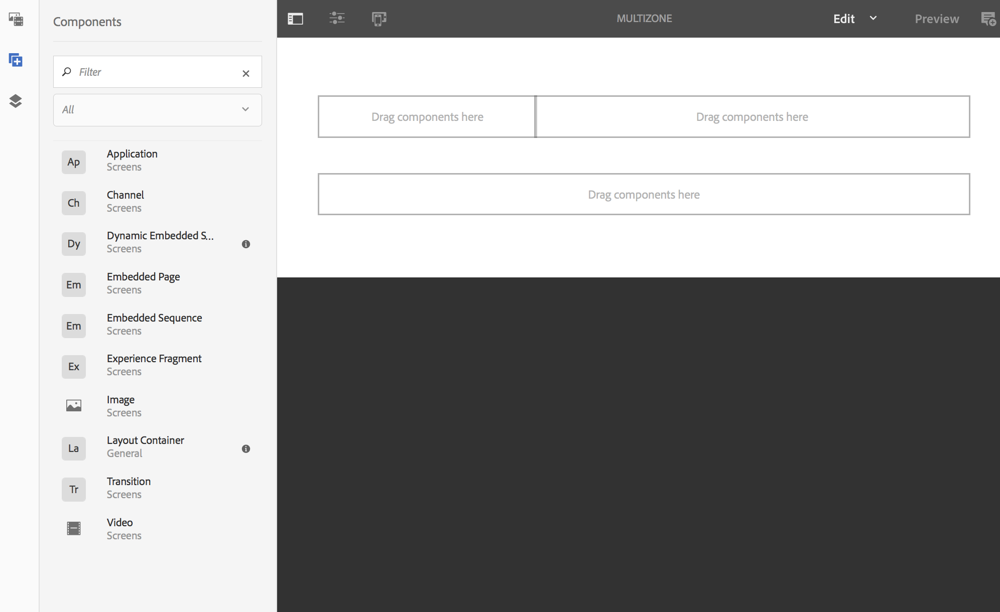
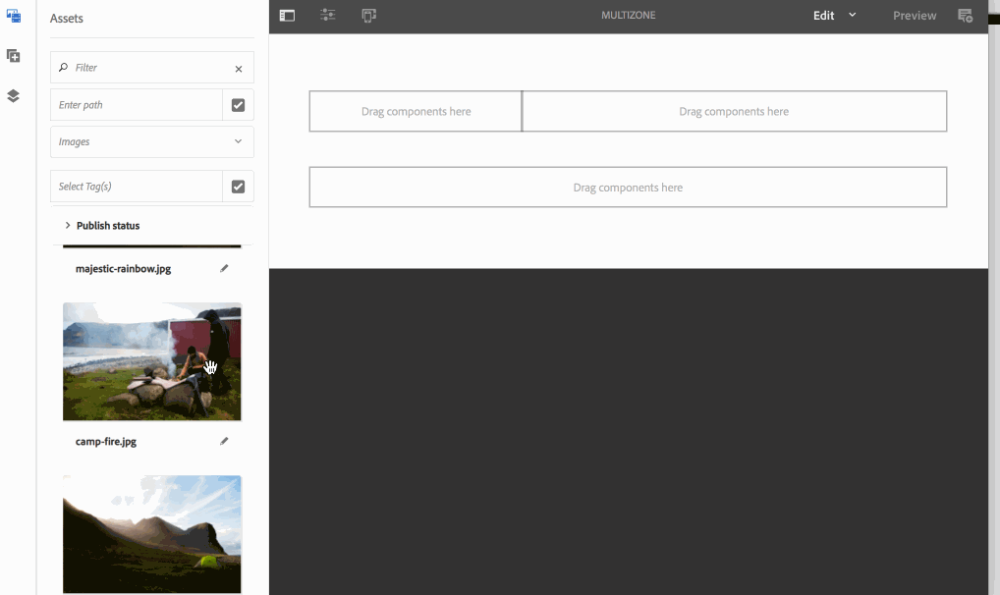
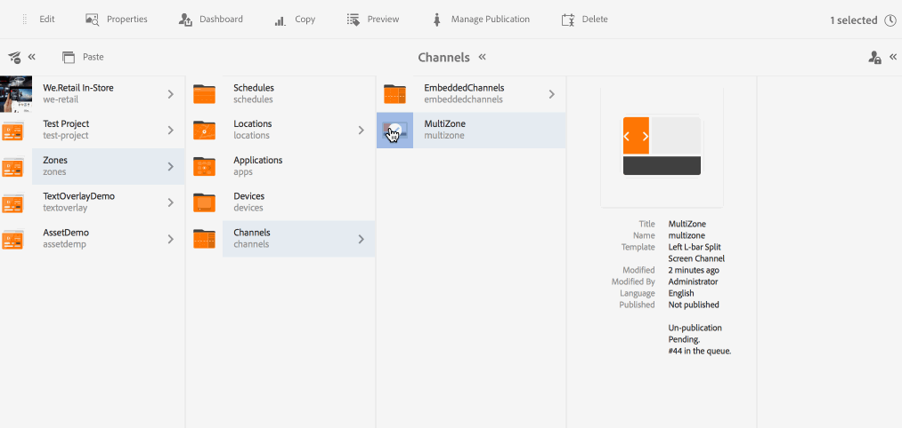

# 多區域版面 {#multi-zone-layout}

下頁說明多區域版面配置的使用，並涵蓋下列主題：

* 概覽
* 建立多區域版面
* 必備條件
* 在一或多個區域中使用單一資產
* 在一或多個區域中使用排序的內容

## 概覽 {#overview}

***多區域版面*** (Multi-zone Layout)可讓您建立多個區域內容，並使用多種資產，例如視訊、影像和文字，這些資產可結合在單一畫面中。 您可以拉進影像、視訊和文字，讓所有影像、視訊和文字融為一體，創造直覺式數位體驗。

根據專案需求，有時您需要一個通道中的多個區域，並將它們作為一個完整單元進行編輯。 例如，產品序列，其相關社交媒體摘要會在單一頻道的三個獨立區域中執行。

## 建立多區域版面 {#creating-multi-zone-layout}

建立渠道時，您可以使用不同的範本，以便在渠道中建立區域。 您可以新增單一影像、視訊或內嵌頻道，讓多個資產可以在序列中顯示。

### 必備條件 {#prerequisites}

開始實作此功能之前，請確定您已準備好專案，做為開始實作多區域版面的先決條件。 例如，

* 建立標題為「區域」的AEM Screens專 **案**
* 在「位置」下建立標 **題為**「多區域&#x200B;**」的顯示**

建立名為「區域中的 **MultiZone** 」 **專案的渠道** 。 請遵循下列步驟：

**建立渠道**

1. 依序選取Adobe Experience Manager連結（左上）和「畫 **面」**。 或者，您也可以直接前往： `http://localhost:4502/screens.html/content/screens`。
1. 導覽至「 **Channels** 」檔案夾，然後按 **一下動作列中的「** 建立」。

1. 從「 **建立精靈」中選取「左L列分割畫面色** 道」 **** 。

1. 按一下「 **Next** (下一步 **)」 ，然後將標題** 輸入為 **「** MultiZone（多區域）」。

1. 按一 **下「建立** 」以完成渠道建立。

### 在一或多個區域中使用單一資產 {#using-single-assets-in-one-or-more-zones}

您可以在所有三個不同的區域中使用單一資產，例如影像或視訊。 請依照下列步驟進行實施：

1. **新增內容至頻道**

   1. 導覽至 **Zones** —&gt; **Channels**—&gt;**MultiZone**。
   1. 選擇「 **MultiZone** 」(多區域 **)頻道，然後從操** 作欄按一下「編輯」以開啟編輯器。
   

1. **將影像新增至頻道**

   若要在所有三個區域中播放單一影像或視訊，只需在色版編輯器中拖放影像，如下所示。

   

### 在一或多個區域中使用排序的內容 {#using-sequenced-content-in-one-or-more-zones}

如果您希望區域在三個不同區域中顯示影像或內容的序列和靜態影像，請遵循以下步驟以獲得詳細資訊。

1. **建立渠道資料夾**

   1. 導航至「 **區域** 」 —&gt;「多 **區域** 」 —&gt;「通道」 **，然後從操****** 作欄中按一下「建立」。
   1. 從「建 **立」精靈中選取「頻道資料夾** 」，然後按一下「下 **一步******」。
   1. 輸入標題為 **EmbeddedChannels** ，然後單 **擊Create**。
   

1. **新增兩個渠道至渠道資料夾**

   1. 導覽至「 **Zones** —&gt; **Channels** —&gt; **EmbeddedChannels** 」 ，然後從操作欄 **** 中按一下「建立Create Channels」。
   1. 從「 **Create****** （建立）」嚮導中選擇「Sequence Channel（序列渠道）」以建立名為** Zone1**的渠道。
   1. 選擇 **Zone1** ，然後從操作欄 **中按一下Edit** （編輯）以開啟編輯器。
   1. 將幾張影像拖放至此頻道。
   同樣地，在EmbeddedChannels資料夾中建立另一個名 **為Zone2** 的 **序列渠道** 。

   

1. **將嵌入序列／元件添加到主通道（多區域）**

   1. 導覽至 **Zones** —&gt; **Channels** —&gt; **MultiZone**。
   1. 按一 **下動作列** 中的「編輯」以開啟編輯器。
   1. 將「嵌入序 **列」(Embedded Sequence** )元件拖放到兩個區域，如下圖所示。
   

1. **將內容新增至所有三個區域**

   1. 導覽至 **Zones** —&gt; **Channels** —&gt; **MultiZone**。
   1. 選擇其中一個區域中的嵌入序列。
   1. 按一 **下編輯器中** 其中一個內嵌序列的「設定（扳手）」圖示。
   1. 選擇通道路徑 **為Zones** —&gt; **Channels** —&gt; **EmbeddedChannels** —&gt; **** Zone1Zone，如下圖所示。
   同樣地，將 **Zone2添加到** editor中另一個嵌入序列元件。 此外，將影像新增至底部的第三個區域，如下所示。

   

#### 查看結果 {#viewing-the-result}

使用上述步驟實施多區域版面後，會顯示下列輸出，如下圖所示。

Screens Player中的下列輸出會在三個不同區域顯示內容。 左側和右側區域（兩者都使用內嵌序列做為元件）顯示影像順序，下方區域則顯示靜態影像。

