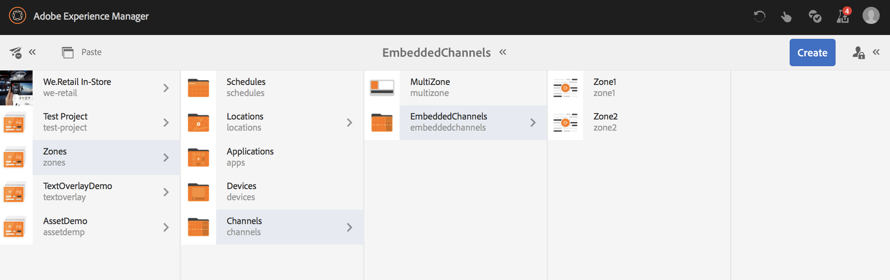

# 多區域配置 {#multi-zone-layout}

以下頁面說明多區域配置的使用方式，並涵蓋下列主題：

* 概觀
* 建立多區域配置
* 先決條件
* 在一或多個區域中使用單一資產
* 在一或多個區域中使用循序內容

## 概觀 {#overview}

***多區域配置*** 可讓您建立多個區域內容，並使用可在單一畫面中結合的各種資產，例如影片、影像和文字。 您可以提取影像、影片和文字，讓所有內容混合在一起，建立直覺的數位體驗。

根據專案需求，您有時需要在通道中擁有多個區域，並將它們編輯為一個完整的單位。 例如，具有相關社群媒體摘要的產品序列，在單一頻道上的三個獨立區域中執行。

### 先決條件 {#prerequisites}

開始實作此功能之前，請確定您具備下列概念知識：

* [建立AEM Screens專案](https://experienceleague.adobe.com/en/docs/experience-manager-screens/user-guide/authoring/setting-up-projects/creating-a-screens-project)
* [建立顯示](https://experienceleague.adobe.com/en/docs/experience-manager-screens/user-guide/authoring/setting-up-projects/managing-displays)
* [將頻道指派給顯示區](/help/user-guide/channel-assignment.md)

## 建立多區域配置 {#creating-multi-zone-layout}

建立管道時，您可以使用不同的範本在您的管道中建立區域。 您可以新增單一影像、視訊或內嵌色版，好讓多個資產可依序顯示。

**建立頻道**

1. 選取Adobe Experience Manager連結（左上方），然後 **Screens**. 或者，您可以直接前往： `http://localhost:4502/screens.html/content/screens`.
1. 瀏覽至 **頻道** 資料夾並按一下 **建立** 從動作列移除。

1. 選取 **1x2拆分畫面頻道** 從 **建立** 精靈。

1. 按一下 **下一個** 並輸入 **標題** 作為 **多區域**.

1. 按一下 **建立** 以完成管道建立。

### 在一或多個區域中使用單一資產 {#using-single-assets-in-one-or-more-zones}

您可以在所有個別區域中使用單一資產，例如影像或視訊。 請依照下列步驟實作：

1. **新增內容至頻道**

   1. 瀏覽至 **區域** > **頻道**> **多區域**.
   1. 選取 **多區域** 頻道與點按 **編輯** 從動作列移除。

1. **新增影像至色版**

   若要在兩個區域播放單一影像或影片，只要將影像拖放至色版編輯器中的各個區域即可，如下圖所示：

   

### 在一或多個區域中使用循序內容 {#using-sequenced-content-in-one-or-more-zones}

如果您希望區域在不同區域中顯示影像序列和視訊，請遵循下列步驟以取得詳細資訊。

1. **建立頻道資料夾**

   1. 瀏覽至 **區域** > **多區域** > **頻道** 並按一下 **建立** 從動作列移除。
   1. 選取 **頻道資料夾** 從 **建立** 精靈並按一下 **下一個**.
   1. 輸入標題為 **EmbeddedChannel** 並按一下 **建立**.

   

1. **新增兩個管道至管道資料夾**

   1. 瀏覽至 **區域** > **頻道** > **EmbeddedChannel** 並按一下 **建立** 從動作列移除。
   1. 選取 **順序頻道** 從 **建立** 精靈以建立標題為 **`Zone1`**.
   1. 選取 **`Zone1`** 並按一下 **編輯** 從動作列移除。
   1. 將數個影像拖放至此色版。
   1. 同樣地，建立另一個標題為的順序頻道 **`Zone2`** 在 **EmbeddedChannel** 資料夾。
   1. 將視訊拖放至此頻道。

   下圖顯示色版 **`Zone1`** 和 **`Zone2`**：

   

   新增到編輯器的影像 **`Zone1`** 順序頻道如下所示：

   

   將影片新增到的編輯器 **`Zone2`** 順序頻道如下所示：

   

1. **將內嵌順序（元件）新增至主管道(MultiZone)**

   1. 瀏覽至 **區域** > **頻道** > **多區域**.
   1. 按一下 **編輯** 從動作列移除。
   1. 拖放 **內嵌順序** 元件至兩個區域。
   1. 選取其中一個區域中的內嵌順序。
   1. 按一下 **設定** （扳手）圖示至編輯器中的其中一個內嵌序列。
   1. 選取管道路徑為 **區域** > **頻道** > **EmbeddedChannel** > **`Zone1`**，如下圖所示。
   1. 同樣地，新增 **`Zone2`** 至編輯器中的另一個內嵌序列元件。

      

### 建立位置和顯示 {#creating-location}

建立位置和顯示，以便在AEM Screens播放器中檢視內容。

1. **建立位置**

   1. 瀏覽至 **區域** > **位置** 資料夾。
   1. 選取 **位置** 資料夾並選取 **建立** 從動作列移除。
   1. 選取 **位置** 從 **建立** 精靈並選取 **下一個**.
   1. 輸入 **標題** 作為 **SanJose** 並選取 **建立**.

1. **建立顯示**

   1. 瀏覽至 **區域** > **位置** 資料夾。
   1. 選取 **SanJose** 位置並選取 **建立** 從動作列移除。
   1. 選取 **顯示** 從 **建立** 精靈並選取 **下一個**.
   1. 輸入 **標題** 作為 **大廳** 並選取 **建立**.

### 將色版指定給顯示區 {#channel-channel}

將頻道指派給顯示以檢視內容。 請依照下列步驟，將頻道指派給顯示器。

1. **將頻道指派給顯示區**

   1. 瀏覽至 **區域** > **位置** > **SanJose**> **大廳**.
   1. 選取 **大廳** 顯示並選取 **指派頻道** 從動作列移除。
   1. 輸入路徑 **多區域** 中的頻道 **頻道路徑**.
   1. 設定 **支援的事件** 作為 **初始載入**， **閒置畫面**、和 **計時器**.
   1. 選取「**儲存**」。

      
   1. 同樣地，您必須指派其他兩個內嵌管道(**`Zone1`** 和 **`Zone2`**)重新命名為。
   1. 將全部三個管道指派給 **大廳** 顯示，您應該能夠從「顯示」控制面板檢視指派的管道。

      

      >[!IMPORTANT]
      >
      >指派主要管道後(在此案例中， **多區域**)，則必須指派其他兩個內嵌管道 **`Zone1`** 和 **`Zone2`** 也顯示相同的畫面。

### 註冊裝置 {#registering-device}

當您設定好位置和顯示器後，請依照下列步驟註冊裝置，並將顯示器指定給裝置。

1. **註冊裝置**

   1. 瀏覽至 **區域** > **裝置** 資料夾。
   1. 選取 **裝置** 資料夾並選取 **裝置管理員** 從動作列移除。
   1. 選取 **裝置註冊** 並從清單中選取擱置中的裝置。

      >[!NOTE]
      > 裝置的標題必須符合裝置代號(**Token** 欄位)，顯示於 **裝置註冊** 標籤。

   1. 如果標題符合裝置Token，請選取裝置，然後選取 **註冊裝置** 從動作列移除。
   1. 如果註冊代碼與Screens播放器中的代碼相符 **裝置註冊** 索引標籤，選取 **驗證** 從動作列移除。
      
   1. 輸入 **標題** 作為 **`Chrome-Device1`** 並選取 **註冊**.
   1. 選取 **指派顯示區** 並選取裝置設定的路徑。

   >[!NOTE]
   >如果您嘗試在Screens播放器中檢視內容，請務必選取 **更新離線內容** 從「色版」控制面板中，指定給顯示的每個色版。

### 檢視結果 {#viewing-the-result}

使用上述步驟實作多區域配置時，會顯示下列輸出。

核取Screens播放器，以便檢視在兩個不同區域中顯示內容的輸出。 左側和右側區域（兩者都會使用內嵌序列作為元件）。

左側區域是順序頻道，右側區域包含視訊。

