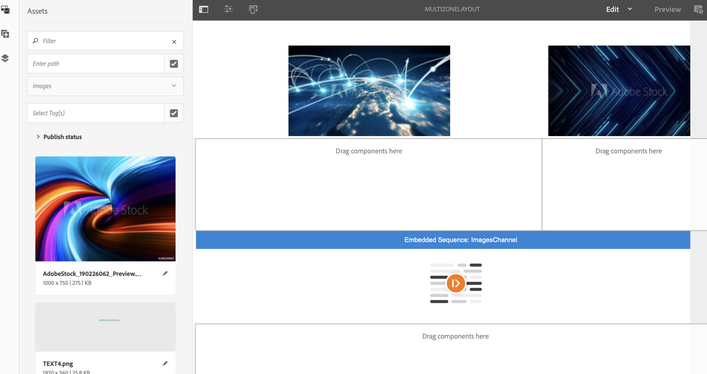
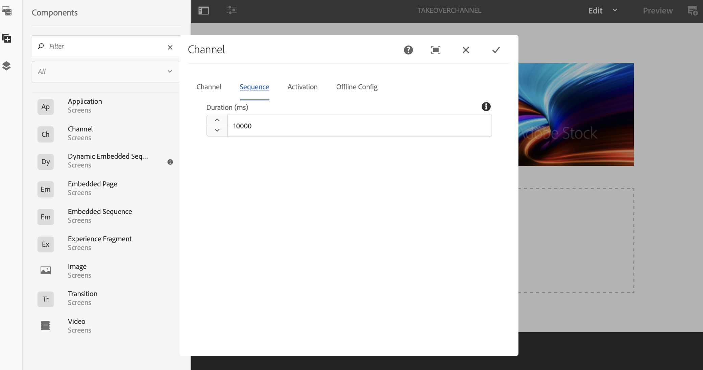

# 多區到單區過渡 {#multizone-to-singlezone-use-case}

## 用例說明 {#use-case-description}

本節介紹一個用例示例，重點介紹如何設定與單區域佈局通道交替的多區域佈局通道。 多區域通道具有影像/視頻資產排序，它顯示如何設定從多區域到單區域交替的項目，反之亦然。

### 先決條件 {#preconditions}

在開始此使用案例之前，請確保您瞭解如何：

* **[建立和管理渠道](managing-channels.md)**
* **[建立和管理位置](managing-locations.md)**
* **[建立和管理計畫](managing-schedules.md)**
* **[裝置註冊](device-registration.md)**

### 主要參與者 {#primary-actors}

內容作者

## 設定專案 {#setting-up-the-project}

按照以下步驟設定項目：

1. 建立名為的AEM Screens項目 **接管環**，如下所示。

   

1. **建立多區域螢幕通道**

   1. 選擇 **頻道** 資料夾，按一下 **建立** 的子菜單。
   1. 選擇 **左 — L條分屏通道** 建立標題為 **多區域佈局**。
   1. 將內容添加到頻道。 將資產拖放到每個區域。 以下示例顯示 **多區域佈局** 包括視頻、影像和文本標題（按嵌入序列）的頻道，如下所示。

   

   >[!NOTE]
   >
   >要瞭解有關在渠道中建立多區域佈局的詳細資訊，請參閱 [多區域佈局](multi-zone-layout-aem-screens.md)。

1. 建立另一個標題為 **接管渠道** 到 **頻道** 的子菜單。

   

1. 按一下 **編輯** 的子菜單。 添加 **頻道** 元件和要切換到的影像資產，如下圖所示：

   

1. 開啟「通道」元件的設定，並將其指向 **多區域佈局** 建立的頻道 *步驟2*。

   

1. 從 **序列** 欄位 **10000毫秒**。

   

1. 同樣，開啟映像（您添加的資產）的設定，並從 **序列** 欄位 **3000毫秒**。

   

## 檢查預覽 {#checking-the-preview}

您可以查看播放器中所需的輸出，或僅按一下 **預覽** 編輯。

輸出將演示多區域佈局如何 *10000毫秒* 然後切換到具有播放持續時間的單個區域佈局 *3000毫秒* 然後切換回多區域佈局。

>[!VIDEO](https://video.tv.adobe.com/v/30366)

>[!NOTE]
>
>您可以根據您的要求定制通道過渡（從多區域到單區域佈局或反之亦然）。
