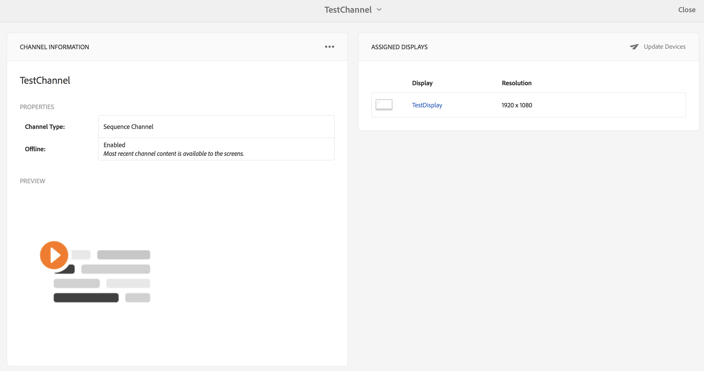

# 離線通道 {#offline-channels}

Screens播放器通過利用 ***內容同步*** 技術。

玩家使用本地http伺服器來為解壓縮內容提供服務。

將通道配置為運行時 *線上*，播放器通過訪問伺服器為通道資源提供服務AEM，但當通道配置為運行時 *離線*，播放器從本地http伺服器提供通道資源。

流程的工作流如下：

1. 分析所需頁
1. 收集所有相關資產
1. 將所有內容打包到zip檔案中
1. 下載ZIP並將其解壓到本地
1. 顯示內容的本地副本

## 更新處理程式 {#update-handlers}

的 ***內容同步*** 使用更新處理程式來分析和收集特定項目的所有必需頁和資產。 AEM Screens使用以下更新處理程式：

### 常用選項 {#common-options}

* *類型*:要使用的更新處理程式類型
* *路徑*:資源路徑
* *[目標根目錄]*:zip檔案中的目標資料夾

<table>
 <tbody>
  <tr>
   <td><strong>類型</strong></td> 
   <td><strong>說明</strong></td> 
   <td><strong>選項</strong></td> 
  </tr>
  <tr>
   <td>通道</td> 
   <td>收集頻道</td> 
   <td>擴展：資源的擴展以收集  [pathSuffix="]:要添加到通道路徑的尾碼  </td> 
  </tr>
  <tr>
   <td>客戶端庫</td> 
   <td>收集指定的客戶端庫</td> 
   <td>[擴展="]:可以是css或js，只收集前者，也只能收集後者</td> 
  </tr>
  <tr>
   <td>裝配</td> 
   <td>收集資產格式副本</td> 
   <td>[格式副本=[]]:要收集的格式副本清單。 預設為原始格式副本</td> 
  </tr>
  <tr>
   <td>複製</td> 
   <td>從路徑複製指定的結構</td> 
   <td> </td> 
  </tr>
 </tbody>
</table>

### 正在測試ContentSync配置 {#testing-contentsync-configuration}

按照以下步驟testContentSync配置：

1. 開啟 `https://localhost:4502/libs/cq/contentsync/content/console.html`
1. 在清單中選擇配置
1. 按一下清除快取
1. 按一下更新快取
1. 按一下「Download Full（下載完整）」
1. 解壓縮zip檔案
1. 在提取的資料夾中啟動本地伺服器
1. 開啟您的起始頁並檢查您的應用狀態

## 為通道啟用離線配置 {#enabling-offline-config-for-a-channel}

按照以下步驟為通道啟用離線配置：

1. Inspect頻道內容，並檢查是否從實例(聯AEM機)請求。

   

1. 導航到通道儀表板，然後按一下 **...** 的 **渠道資訊** 更改屬性的面板。

   

1. 導航到通道屬性，並確保在 **頻道** 頁籤。 按一下&#x200B;**「儲存並關閉」**。

   

   在將內容正確部署到設備之前，按一下 **更新離線內容**。

   

   的 **離線** 狀態 **屬性** 並相應更新。

   

1. Inspect頻道內容，並檢查是否從本地Player-Cache請求。

   

>[!NOTE]
>
>瞭解有關自定義離線資源處理程式的模板的詳細資訊以及 `pom.xml` 有關該特定項目，請參閱 [自定義處理程式模板](/help/user-guide/developing-custom-component-tutorial-develop.md#custom-handlers) 在 **為AEM Screens開發定制元件**。
