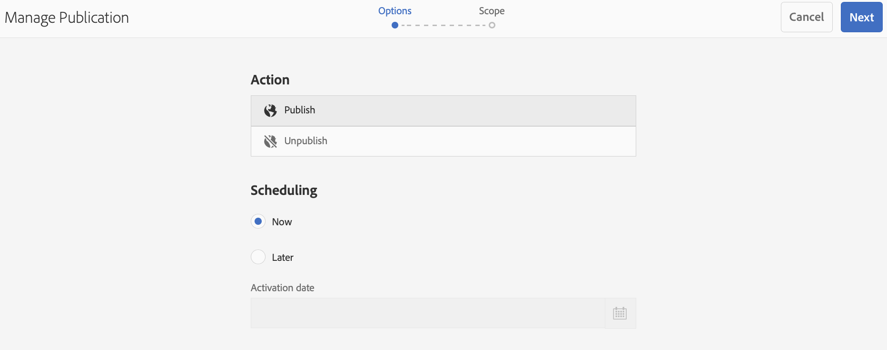

# 隨選內容更新 {#on-demand}

本節說明用於管理出版物的隨選內容。

## 管理出版物：將內容更新從作者傳送到Publish到裝置 {#managing-publication-delivering-content-updates-from-author-to-publish-to-device}

您可以從AEM Screens發佈和取消發佈內容。 「管理出版物」功能可讓您從作者傳送內容更新到發佈到裝置。 您可以為整個AEM Screens專案或僅限其中一個管道、位置、裝置、應用程式或排程發佈/取消發佈內容。

### 管理AEM Screens專案的出版物 {#managing-publication-for-an-aem-screens-project}

請依照下列步驟，針對AEM Screens專案，將內容更新從作者傳送至發佈裝置：

1. 導覽至您的AEM Screens專案。
1. 按一下動作列中的&#x200B;**管理出版物**，以便您將專案發佈到您的Publish執行個體。

   

1. **管理出版物**&#x200B;精靈開啟。 您可以按一下&#x200B;**動作**，也可以將發佈時間排程為現在或以後。 按一下「**下一步**」。

   

1. 核取此方塊，以便您從&#x200B;**`Manage Publication`**&#x200B;精靈按一下整個專案。

   

1. 按一下動作列中的「**+包含子系**」，並取消勾選所有選項，讓您可以發佈專案中的所有模組，然後按一下「**新增**」進行發佈。

   >[!NOTE]
   >
   >依預設，所有方塊都會勾選，您必須手動取消勾選方塊以發佈專案中的所有模組。

   

   **瞭解[包含子系]對話方塊**

   上述步驟說明如何發佈整個內容。 如果您想要使用其他三個可用的替代方案，則必須核取該特定選項。
例如，下列影像顯示如何只管理和更新專案中已修改的頁面：
   

   請依照下列說明操作，以瞭解可用的選項：

   1. **僅包含直接子系**：
此選項可讓您僅管理專案結構中子節點的更新。
   1. **僅包含修改過的頁面**：
此選項可讓您僅管理在專案結構中發現變更之專案的已修改頁面的更新。
   1. **僅包含已發佈的頁面**：
此選項可讓您僅管理對之前已發佈頁面的更新。

1. 從&#x200B;**`Manage Publication wizard`**，按一下&#x200B;**Publish**。

   

   >[!NOTE]
   >
   >請等候幾秒鐘/分鐘，讓內容可到達發佈執行個體。
   >
   >
   >    1. 如果專案中沒有變更，且&#x200B;**更新離線內容**&#x200B;沒有任何內容，工作流程將無法運作。
   >    1. 在管理發布工作流程中選取&#x200B;**Publish**&#x200B;按鈕後，如果作者未完成復寫程式（內容仍在上傳至發佈執行個體），工作流程將無法運作。

   >[!CAUTION]
   >作為內容建立者，如果您想要檢視附加至作者執行個體的裝置中的變更，請從頻道控制面板或選取專案按一下「**更新離線內容**」。 在此情況下，離線內容的更新只會在Author例項中執行。

1. 導覽至專案，然後按一下動作列中的&#x200B;**更新離線內容**。 這個動作會將相同的命令轉送給發佈執行個體，以便離線的ZIP也能在Publish執行個體上建立。

   

   >[!NOTE]
   >
   >完成管理發布工作流程後，如果播放器指向Author例項，則觸發author中的更新離線內容。 這樣做會在作者執行個體上離線建立更新。

   >[!CAUTION]
   >
   >如果您已將播放器註冊到作者伺服器，則在Author例項中觸發更新離線內容。 已註冊至發佈執行個體的播放器不需要更新離線內容。

### 管理管道的出版物 {#managing-publication-for-a-channel}

請依照下列步驟，針對AEM Screens專案中的管道，從「作者> Publish >裝置」傳送內容更新：

>[!NOTE]
>
>只有在管道發生變更時，才按照本節操作。 如果之前更新離線內容後管道沒有任何變更，則個別管道的管理發布工作流程將無法運作。

1. 導覽至您的AEM Screens專案，然後按一下頻道。
1. 按一下動作列中的&#x200B;**管理出版物**，以便您將頻道發佈到您的Publish執行個體。

   

1. **管理出版物**&#x200B;精靈開啟。 您可以按一下&#x200B;**動作**，也可以將發佈時間排程為現在或以後。 按一下「**下一步**」。

   

1. 從&#x200B;**`Manage Publication`**&#x200B;精靈按一下&#x200B;**Publish**。

   

   >[!NOTE]
   >
   >請等候幾秒鐘/分鐘，讓內容可到達發佈執行個體。

1. 在頻道儀表板中觸發&#x200B;**更新離線內容**&#x200B;只會將離線內容推送到作者執行個體，而不會推送到發佈執行個體。 步驟1至4是將離線內容推送至Publish例項。

   

   >[!CAUTION]
   >
   >Publish會先觸發，接著觸發上述步驟中概述的更新離線內容。

### 頻道與裝置重新指派： {#channel-and-device-re-assignment}

如果您已重新指定裝置，請在裝置重新指定至新顯示後，發佈初始顯示和新顯示。

同樣地，如果您已重新指定管道，一旦管道重新指定給新顯示時，請發佈初始顯示和新顯示。
