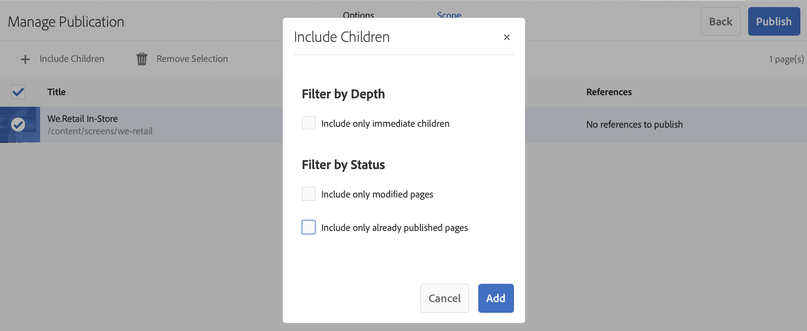

# 按需內容更新 {#on-demand}

本節介紹管理發布的按需內容。

## 管理發布：將內容更新從作者傳送到設備 {#managing-publication-delivering-content-updates-from-author-to-publish-to-device}

您可以發佈和取消發佈來自AEM Screens的內容。 「管理發布」功能允許您將內容更新從作者傳送到設備。 您可以發佈/取消發佈整個AEM Screens項目的內容，或僅發佈渠道、位置、設備、應用程式或計畫之一的內容。

### 管理AEM Screens項目的出版物 {#managing-publication-for-an-aem-screens-project}

按照以下步驟將內容更新從作者傳送到發佈到AEM Screens項目的設備：

1. 導航到您的AEM Screens項目。
1. 按一下 **管理發布** 的子菜單。

   

1. 的 **管理發布** 的子菜單。 可以選擇 **操作** 並計畫發佈時間，以便現在或以後。 按一下&#x200B;**下一步**。

   

1. 選中該框以從中選擇整個項目 **管理發布** 的子菜單。

   

1. 按一下 **+包括子項** 從操作欄中，取消選中所有選項以發佈項目中的所有模組，然後按一下 **添加** 的子菜單。

   >[!NOTE]
   >
   >預設情況下，將選中所有框，您必須手動取消選中這些框以發佈項目中的所有模組。

   

   **「瞭解包括子項」對話框**

   上述步驟顯示了如何發佈整個內容。 如果您希望使用其他三種可用選項，則必須檢查該特定選項。
例如，以下影像允許您僅管理和更新項目中已修改的頁面：
   

   請按照以下說明了解可用選項：

   1. **僅包括直接子項**:此選項允許您僅管理對項目結構中子節點的更新。
   1. **僅包括已修改的頁面**:此選項允許您僅管理對項目的已修改頁面的更新，其中在項目結構中找到更改。
   1. **僅包括已發佈的頁面**:此選項僅允許管理以前發佈的頁面的更新。

1. 按一下 **發佈** 從 **管理發布嚮導。**

   

   >[!NOTE]
   >
   >等待幾秒鐘/分鐘，以便內容到達發佈實例。
   >
   >
   >    1. 如果項目中沒有更改，且沒有 **更新離線內容**。
   >    1. 如果作者未完成複製過程（內容仍在上載到發佈實例），則在按一下 **發佈** 按鈕。

   >[!CAUTION]
   >如果作為作者或內容建立者，您希望查看附加到作者實例的設備中的更改，請按一下 **更新離線內容** 或通過選擇項目。 在這種情況下，只在作者實例中執行更新離線內容。

1. 導航到項目並按一下 **更新離線內容** 按鈕。 此操作將轉發同一命令以發佈實例，以便在發佈實例上也建立離線zip。

   

   >[!NOTE]
   >
   >完成管理發布工作流後，如果有播放器指向作者實例，則必須觸發作者中的更新離線內容，這將在作者實例上建立離線更新。

   >[!CAUTION]
   >
   >如果播放器已註冊到作者伺服器，則必須在作者實例中觸發更新離線內容。 註冊到發佈實例的播放器不需要更新離線內容。

### 管理渠道的發佈 {#managing-publication-for-a-channel}

按照以下步驟將內容更新從作者發佈到「AEM Screens項目」中渠道的設備：

>[!NOTE]
>
>僅當通道中有更改時，才應遵循本節。 如果在上次更新離線內容後某個渠道沒有任何更改，則單個渠道的管理發布工作流將無法工作。

1. 導航到「螢幕」項目並選擇頻道。
1. 按一下 **管理發布** 的子菜單。

   

1. 的 **管理發布** 的子菜單。 可以選擇 **操作** 並計畫發佈時間，以便現在或以後。 按一下&#x200B;**下一步**。

   

1. 按一下 **發佈** 從 **管理發布嚮導。**

   

   >[!NOTE]
   >
   >等待幾秒鐘/分鐘，以便內容到達發佈實例。

1. 觸發器 **更新離線內容** 在channel儀表板中，將只將離線內容推送到作者實例，而不是發佈實例。 步驟1-4用於將離線內容推送到發佈實例。

   

   >[!CAUTION]
   >
   >您必須先發佈，然後觸發更新離線內容，如前面步驟中所概述的。

### 通道和設備重新分配： {#channel-and-device-re-assignment}

如果已重新分配了設備，則必須在將設備重新分配到新顯示器後，同時發佈初始顯示和新顯示。

同樣，如果重新分配了通道，則必須在將通道重新分配給新顯示後，同時發佈初始顯示和新顯示。
