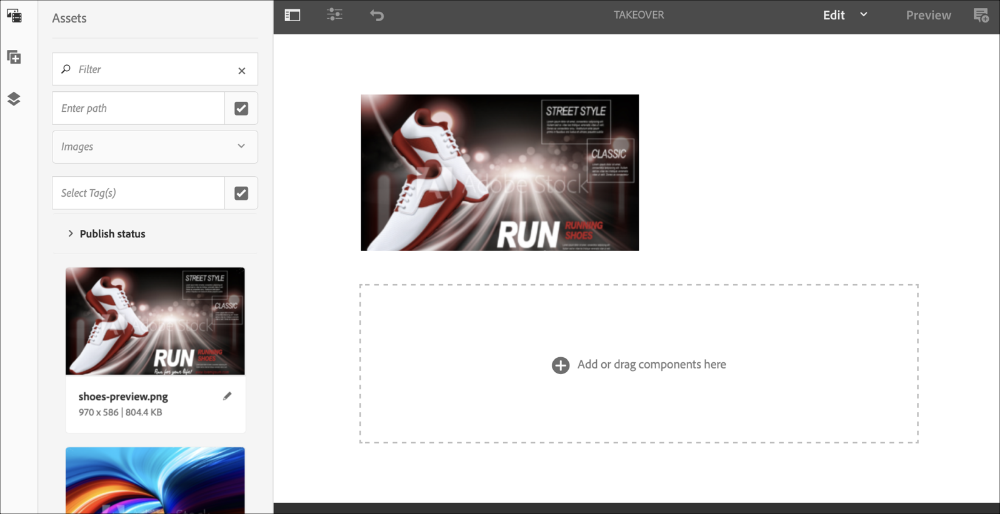
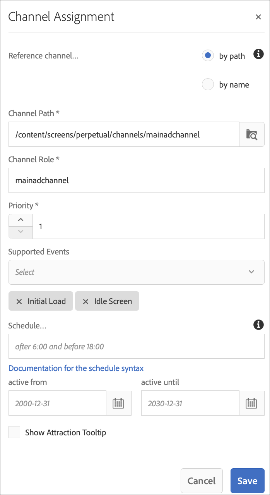

# 永久接管管道 {#perpetual-takeover-channel}

>[!IMPORTANT]
>此內容對AEM內部部署/AMS （AEM 6.5LTS和AEM 6.5）有效。 如需AEM as a Cloud Service Screens內容，請參閱[AEM as a Cloud Service指南](https://experienceleague.adobe.com/en/docs/experience-manager-cloud-service/content/screens-as-cloud-service/overview/introduction)。

以下頁面將展示一個使用案例，著重於設定專案，說明如何建立會在特定日期及時間持續播放的永久TakeOver管道。

## 使用案例說明 {#use-case-description}

此使用案例說明如何為顯示或顯示群組建立&#x200B;*從正常播放頻道中接管*的頻道。接管會持續在特定日期和時間。
例如，有一個永久TakeOver頻道，每個星期五從上午9:00到上午10:00播放。在此期間，不應播放其他頻道。下列範例示範如何建立永久接管管道，讓內容可在每週三下午2:00到下午4:00播放兩小時。

### 先決條件 {#preconditions}

開始此使用案例前，請確定您瞭解如何：

* **[建立和管理頻道](managing-channels.md)**
* **[建立和管理位置](managing-locations.md)**
* **[建立和管理排程](managing-schedules.md)**
* **[裝置註冊](device-registration.md)**

### 主要執行者 {#primary-actors}

內容作者

## 設定專案 {#setting-up-the-project}

請依照下列步驟設定專案：

**設定頻道和顯示器**

1. 建立標題為&#x200B;**PerpetualTakeOver**&#x200B;的AEM Screens專案，如下所示。

   

1. 在&#x200B;**管道**&#x200B;資料夾中建立&#x200B;**MainAdChannel**。

   

1. 按一下&#x200B;**MainAdChannel**，然後從動作列按一下&#x200B;**編輯**。 將部分資產（影像、影片、內嵌順序）拖放至您的頻道。

   

   >[!NOTE]
   >此範例中的&#x200B;**MainAdChannel**&#x200B;示範連續播放內容的順序頻道。

1. 建立接管&#x200B;**MainAdChannel**&#x200B;內容的&#x200B;**TakeOver**&#x200B;頻道，並在每個星期三下午2:00到下午4:00播放。

1. 按一下&#x200B;**TakeOver**，然後從動作列按一下&#x200B;**編輯**。 將部分資產拖放至您的頻道。 下列範例將展示新增至此頻道的單一區域影像。

   

1. 設定管道的位置和顯示。 例如，已為此專案設定下列位置&#x200B;**MainLobby**&#x200B;和顯示區&#x200B;**MainLobbyDisplay**。

   

**指派頻道給顯示區**

1. 從&#x200B;**位置**&#x200B;資料夾按一下顯示區&#x200B;**MainLobbyDisplay**。 按一下動作列中的&#x200B;**指派頻道**，以開啟&#x200B;**頻道指派**&#x200B;對話方塊。

   >[!NOTE]
   >若要瞭解如何將頻道指派給顯示器，請參閱&#x200B;**[頻道指派](channel-assignment.md)**。

1. 從&#x200B;**頻道指派**&#x200B;對話方塊填入欄位（**頻道路徑**、**優先順序**&#x200B;和&#x200B;**支援的事件**），然後按一下&#x200B;**儲存**&#x200B;以指派&#x200B;**MainAdChannel**&#x200B;到您的顯示器。

   * **頻道路徑**：按一下&#x200B;**MainAdChannel**&#x200B;頻道的路徑
   * **優先順序**：將此頻道的優先順序設為1。
   * **支援的事件**：按一下&#x200B;**初始載入**&#x200B;和&#x200B;**閒置畫面**。

   

1. 從&#x200B;**位置**&#x200B;資料夾按一下顯示&#x200B;**TakeOver**。 按一下動作列中的&#x200B;**指派管道**，您就可以指派接管管道。

1. 在排程的時間將&#x200B;**TakeOver**&#x200B;頻道指派給您的顯示器。 然後，從&#x200B;**頻道指定任務**&#x200B;對話方塊填入下列欄位，並選取&#x200B;**儲存**：

   * **管道路徑**：按一下&#x200B;**TakeOver**&#x200B;管道的路徑
   * **優先順序**：將此頻道的優先順序設定為大於&#x200B;**MainAdChannel**。 例如，在此範例中設定的優先順序為8。
   * **支援的事件**：按一下&#x200B;**閒置畫面**&#x200B;和&#x200B;**計時器**。
   * **排程**：輸入要讓此頻道在顯示上執行的排程文字。 此範例中提到的&#x200B;**排程**&#x200B;中的文字是&#x200B;*在14:00之後的星期三，以及16:00*&#x200B;之前的星期三。

     >[!NOTE]
     >若要深入瞭解可新增至&#x200B;**排程**&#x200B;的運算式，請參閱下方的[範例運算式](#example-expressions)一節。
   * **從**&#x200B;開始啟用：開始日期和時間。
   * **啟用到**：結束日期和時間。

     例如，**排程**&#x200B;和&#x200B;**中的文字從**&#x200B;和&#x200B;**作用中到**&#x200B;的日期和時間允許內容從每週三下午2:00播放到下午4:00。

     

     從&#x200B;**TakeOver** > **位置** > **MainLobby** > **MainLobbyDisplay**&#x200B;瀏覽至顯示區，然後從動作列按一下&#x200B;**儀表板**，以檢視指派的管道及其優先順序，如下所示。

     >[!NOTE]
     >強制將接管管道的優先順序設定為最高。

     
現在，**TakeOver**&#x200B;頻道會在每週三下午2:00接管&#x200B;**MainAdChannel**&#x200B;兩個小時到下午4:00，並從2020年1月9日至2020年1月31日播放其內容。

## 範例運算式 {#example-expressions}

下表總結一些範例運算式，您可以在將頻道指派給顯示時將其新增到排程。

| **運算式** | **解釋** |
|---|---|
| 上午8:00之前 | 頻道每天上午8:00點之前播放 |
| 下午2:00之後 | 頻道每天下午2:00點後播放 |
| 在12:15之後和12:45之前 | 頻道每天下午12:15點後播放30分鐘 |
| 在12:15之前，也在12:45之後 | 頻道在每日下午12:15之前播放，然後在下午12:45之後播放。 |
| 下午2:00之後的1月第一天，亦即1月的第二天，以及1月第三天凌晨3:00之前。 | 頻道於2001年1月1日下午2:00之後開始播放，並持續播放1月2日的一整天，直到2003年1月3日上午3:00 |
| 下午2:00後1月1-2日以及1月2-3日上午3:00之前 | 頻道在2001年1月下午2:00之後開始播放，繼續播放至2002年1月凌晨3:00，然後在2002年1月下午2:00再次開始播放，並繼續播放至2003年1月凌晨3:00 |

>[!NOTE]
>
>您也可以使用&#x200B;_軍用時間_&#x200B;記號(14:00)，而非&#x200B;*A.M./P.M.* （下午2:00）。
