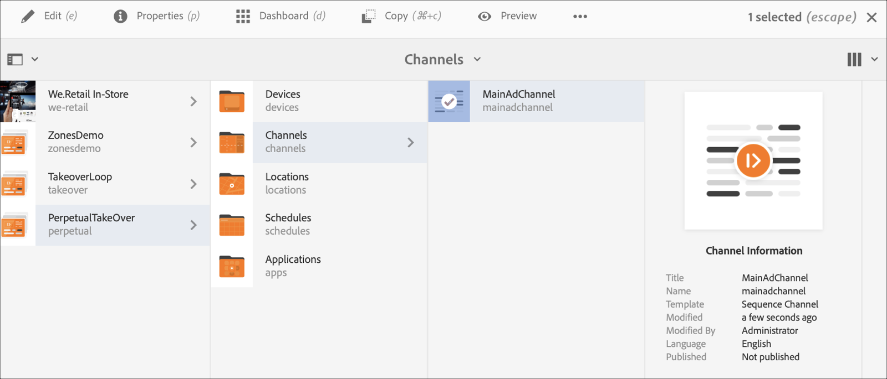

# 永久接管通道{#perpetual-takeover-channel}

以下頁面將展示一個使用案例，著重於設定專案，以建立持續播放特定時間和特定日期的永久取用管道。

## 使用案例說明{#use-case-description}

本使用案例說明如何建立從正常播放的頻道接管&#x200B;*以用於顯示或顯示群組的頻道。*收購將持續一天一個時間。
例如，有一個Perpetual TakeOver管道，每週五從上午9:00至上午10:00播放。 在此期間，不應播放其他管道。 下列範例將展示如何建立永久接管管道，播放內容可讓內容每週三從下午2:00至下午4:00播放2小時。

### 先決條件 {#preconditions}

開始此使用案例前，請務必了解如何：

* **[建立和管理管道](managing-channels.md)**
* **[建立和管理位置](managing-locations.md)**
* **[建立和管理排程](managing-schedules.md)**
* **[裝置註冊](device-registration.md)**

### 主要參與者{#primary-actors}

內容作者

## 設定項目{#setting-up-the-project}

請依照下列步驟來設定專案：

**設定頻道和顯示**

1. 建立標題為&#x200B;**PerpetualTakeOver**&#x200B;的AEM Screens專案，如下所示。

   

1. 在&#x200B;**Channels**&#x200B;資料夾中建立&#x200B;**MainAdChannel**。

   

1. 選擇&#x200B;**MainAdChannel**，然後從操作欄按一下&#x200B;**Edit**。 將某些資產（影像、影片、內嵌序列）拖放至管道。

   

   >[!NOTE]
   >此範例中的&#x200B;**MainAdChannel**&#x200B;示範連續播放內容的序列頻道。

1. 建立&#x200B;**TakeOver**&#x200B;管道，該管道接管&#x200B;**MainAdChannel**&#x200B;中的內容，並將於每星期三下午2:00至4:00播放。

1. 選擇&#x200B;**TakeOver**，然後從操作欄按一下&#x200B;**Edit**。 將一些資產拖放至管道。 下列範例將展示新增至此管道的單一區域影像。

   

1. 設定頻道的位置和顯示。 例如，為此項目設定了以下位置&#x200B;**MainLobby**&#x200B;和display **MainLobbyDisplay**。

   

**為顯示指定通道**

1. 從&#x200B;**Locations**&#x200B;資料夾中選擇顯示&#x200B;**MainLobbyDisplay**。 按一下操作欄中的&#x200B;**分配通道**&#x200B;以開啟&#x200B;**通道分配**&#x200B;對話框。

   >[!NOTE]
   >要了解如何為顯示器分配通道，請參閱&#x200B;**[通道分配](channel-assignment.md)**。

1. 從&#x200B;**通道分配**&#x200B;對話框填入欄位（**通道路徑**、**優先順序**&#x200B;和&#x200B;**支援的事件**），然後按一下&#x200B;**保存**&#x200B;將&#x200B;**主AdChannel**&#x200B;分配給您的顯示器。

   * **通道路徑**:選取MainAdChannel的路 **** 徑
   * **優先順序**:將此通道的優先順序設定為1。
   * **支援的事件**:選擇「 **初始** 載入 **和空閒」螢幕**。

   

1. 從&#x200B;**Locations**&#x200B;資料夾中選擇顯示&#x200B;**TakeOver**。 按一下動作列中的&#x200B;**指定管道** ，以指定接管管道。

1. 要按計畫時間將&#x200B;**TakeOver**&#x200B;通道分配給您的顯示，並從&#x200B;**通道分配**&#x200B;對話框填入以下欄位，然後按一下&#x200B;**保存**:

   * **通道路徑**:選取TakeOverchannel的路 **** 徑
   * **優先順序**:將此管道的優先順序設定為大於 **MainAdChannel**。例如，此範例中設定的優先順序為8。
   * **支援的事件**:選取「 **空閒** 螢幕 **和計時器**」。
   * **排程**:輸入要此通道運行顯示的計畫的文本。此範例中提及的&#x200B;**Schedule**&#x200B;中的文字為&#x200B;*，星期三在14:00之後和16:00*&#x200B;之前。

      >[!NOTE]
      >若要進一步了解可新增至&#x200B;**Schedule**&#x200B;的運算式，請參閱下方的[範例運算式](#example-expressions)區段。
   * **從**:開始日期和時間。
   * **作用中直到**:結束日期和時間。

      例如，**Schedule**&#x200B;和&#x200B;**active from**&#x200B;和&#x200B;**active直到**&#x200B;日期和時間中的文本允許內容每星期三從下午2:00到下午4:00播放。

      

      從&#x200B;**TakeOver** —> **Locations** —> **MainLobby** —> **MainLobbyDisplay**&#x200B;導航到顯示，然後從操作欄按一下&#x200B;**Dashboard**&#x200B;查看指定的通道及其優先順序，如下所示。

      >[!NOTE]
      >強制將接管管道的優先順序設定為最高。

      
assetNow, TakeOverchannel **** 將在每週三下午2:00接 **** 管MainAdChannel，直到下午4:00，並從2020年1月09日到2020年1月31日播放其內容。

## 運算式範例{#example-expressions}

下表總結了一些示例表達式，在為顯示器分配通道時，可將這些表達式添加到調度中。

| **運算式** | **解釋** |
|---|---|
| 早上8點 | 每天上午8:00前播放頻道 |
| 下午2:00後 | 頻道每天下午2:00後播放 |
| 12:15後和12:45前 | 頻道每天中午12:15後播放30分鐘 |
| 12:15之前也是12:45之後 | 頻道每天中午12:15之前播放，然後在中午12:45之後播放 |
| 1月1日後2點也是1月2日，也是1月3日前3點 | 頻道在1月1日下午2點後開始播放，1月2日全天持續播放，直到1月3日凌晨3點 |
| 1月1-2日（1月1-2日）晚上2:00，也是1月2-3日(3:00)前 | channel在1月1日下午2:00後開始播放，持續播放到1月2日凌晨3:00，然後在1月2日下午2:00再次開始，持續播放到1月3日凌晨3:00 |

>[!NOTE]
>
>您也可以使用&#x200B;_軍事時間_&#x200B;標籤法（即14:00），而非&#x200B;*am/pm*&#x200B;標籤法（即下午2:00）。
