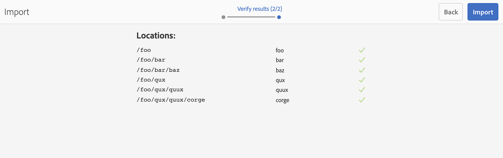

# 從檔案新增專案匯入工具 {#new-project-importer-from-file}

本節說明如何從CSV/XLS試算表大量匯入一組位置至您的AEM Screens專案。

## 簡介 {#introduction}

如果您是第一次在組織中設定AEM Screens專案，也要建立所有位置。 如果您的專案涉及許多位置，則會導致繁瑣的工作，包括在UI中選取和等待許多專案。

此功能的目標是減少設定專案所需的時間，進而解決預算問題。

藉由讓作者提供試算表作為輸入檔案，並讓系統自動在後端建立位置樹，此功能：

* *取得比透過UI手動選取更好的效能*
* *讓客戶從自己的系統匯出位置，並直接在AEM中輕鬆匯入*

在初始專案設定期間或將現有AEM Screens擴充到新位置時，此程式可節省時間和金錢。

## 架構概述 {#architectural-overview}

下圖顯示Project Importer功能的架構概觀：

### 資料模型 {#data-model}

專案匯入工具的資料模型說明如下：

>[!NOTE]
>
>目前版本僅支援匯入位置。

| **屬性** | **說明** |
|---|---|
| ***`path {string*}`*** | 位置的資源路徑 |
| ***`[./jcr:title] {string*}`*** | 要使用的範本名稱（即&#x200B;*熒幕/核心/範本/位置*&#x200B;的位置） |
| ***`template {string}`*** | 用於頁面的選用標題 |
| ***`[./jcr:description] {string}`*** | 用於頁面的選擇性說明 |

因此，試算表(CSV/XLS)檔案需要下列欄：

* **路徑{string}** — 要匯入的位置的路徑，其中路徑的根是專案的位置資料夾（也就是說，*`/foo`*&#x200B;已匯入至&#x200B;*`/content/screens/<project>/locations/foo`*）
* **範本{string}** — 用於新位置的範本，目前唯一允許值為「location」，但此值已擴充至未來的所有Screens範本（`display`、`sequencechannel`等）
* **[。/*] {string}** — 要設定在位置上的任何選擇性屬性（即，`./jcr:title`、`./jcr:description`、`./foo, ./bar`）。 目前的版本不允許篩選。

>[!NOTE]
>
>不符合上述條件的任何欄都會被忽略。 例如，如果您的工作表(CSV/XLS)檔案中除了&#x200B;**path**、**template**、**title**&#x200B;和&#x200B;**description**&#x200B;以外還定義了任何其他欄，則會忽略這些欄位。 此外，**專案匯入工具**&#x200B;不會驗證這些用於將專案匯入至AEM Screens專案的其他欄位。

## 使用專案匯入工具 {#using-project-importer}

下節將說明如何在AEM Screens專案中使用專案匯入工具。

>[!CAUTION]
>
>限制:
>
>* 目前版本不支援CSV/XLS/XLSX副檔名以外的檔案。
>* 對於匯入的檔案和任何以「」開頭的檔案，不存在屬性篩選。「/」已匯入。
>

### 先決條件 {#prerequisites}

* 建立標題為&#x200B;**DemoProjectImport**&#x200B;的專案

* 使用您必須匯入的範例CSV或Excel檔案。

如需示範用途，您可以從下節下載Excel檔案。

[取得檔案](assets/minimal-file.xls)

### 匯入具有最少必填欄位的檔案 {#importing-the-file-with-minimum-required-fields}

請依照下列步驟，將檔案匯入至具有最少必要欄位的位置資料夾：

>[!NOTE]
>
>下列範例顯示匯入專案所需的最少四個欄位：

1. 導覽至您的AEM Screens專案(**DemoProjectImport**)。

   

1. 按一下專案，**&#x200B; DemoProjectImporter &#x200B;**>**&#x200B;從側邊列建立&#x200B;**>**&#x200B;匯入位置**。

   

1. 顯示&#x200B;**匯入**&#x200B;精靈。 按一下含有位置的專案檔案，或按一下您從&#x200B;*先決條件*&#x200B;區段下載的檔案(***minimal-file.xls***)。

   選取檔案後，按一下[下一步] **&#x200B;**。

   

1. 從[匯入]精靈確認檔案（位置）的內容，然後按一下[匯入]。**&#x200B;**

   

1. 因此，您現在可以檢視匯入專案的所有位置。

   
