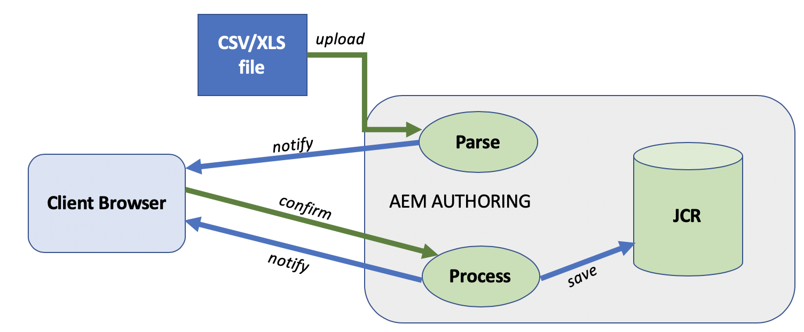

# 從檔案新增專案匯入工具 {#new-project-importer-from-file}

本節說明如何從CSV/XLS試算表大量匯入一組位置至您的AEM Screens專案。

## 簡介 {#introduction}

設定AEM Screens專案時，如果是在組織中第一次，您也需要建立所有位置。 如果您的專案涉及大量位置，則會導致繁瑣的任務，包括在UI中多次點按和等待。

此功能的目標是減少設定專案所需的時間，進而解決預算問題。

藉由讓作者提供試算表作為輸入檔案，並讓系統自動在後端建立位置樹，此功能：

* *相較於透過UI手動點按，成效大幅提升*
* *可讓客戶從自己的系統匯出位置，並輕鬆地直接在AEM中匯入*

在初始專案設定期間或將現有AEM Screens擴充至新位置時，這既可節省時間又可節省資金。

## 架構概述 {#architectural-overview}

下圖顯示Project Importer功能的架構概觀：

### 資料模型 {#data-model}

專案匯入工具的資料模型說明如下：

>[!NOTE]
>
>目前版本僅支援匯入位置。

| **屬性** | **說明** |
|---|---|
| ***路徑{string*}** | 位置的資源路徑 |
| ***[。/jcr：title] {string*}** | 要使用的範本名稱(即位置 *screens/core/templates/location*) |
| ***範本{string}*** | 用於頁面的選用標題 |
| ***[。/jcr：description] {string}*** | 用於頁面的選擇性說明 |

試算表(CSV/XLS)檔案，因此需要下列欄：

* **路徑{string}** 要匯入的位置的路徑，其中路徑的根是專案的位置資料夾(即 */foo* 將會匯入至 */content/screens/&lt;project>/locations/foo*)

* **範本{string}** 用於新位置的範本，目前唯一允許值為「location」，但未來將擴充至所有Screens範本（「display」、「sequencechannel」等）
* **[。/*] {string}** 任何要在位置上設定的選用屬性(即。/jcr:title, ./jcr：description， 。/foo， 。/橫條圖). 目前的版本目前不允許篩選

>[!NOTE]
>
>不符合上述條件的任何欄都將被忽略。 例如，如果您在工作表(CSV/XLS)檔案中定義了任何其他欄， **路徑**，**範本**，**標題**、和 **說明** 在您的檔案中，這些欄位將被忽略，並且 **專案匯入工具** 將不會驗證這些額外的欄位，以便將您的專案匯入至AEM Screens專案。

## 使用專案匯入工具 {#using-project-importer}

下節將說明如何在AEM Screens專案中使用Project Importer。

>[!CAUTION]
>
>限制:
>
>* 目前版本不支援CSV/XLS/XLSX副檔名以外的檔案。
>* 對於匯入的檔案和任何以「」開頭的檔案，不存在屬性的篩選條件。「/」將會匯入。
>

### 必備條件 {#prerequisites}

* 建立標題為的新專案 **DemoProjectImport**

* 使用您需要匯入的範例CSV或Excel檔案。

如需示範，您可以從下節下載Excel檔案。

[取得檔案](assets/minimal-file.xls)

### 匯入具有最少必填欄位的檔案 {#importing-the-file-with-minimum-required-fields}

請依照下列步驟，將檔案匯入至具有最少必要欄位的「位置」資料夾：

>[!NOTE]
>
>以下範例示範匯入專案所需的最少四個欄位：

1. 導覽至您的AEM Screens專案(**DemoProjectImport**)。

   

1. 選取專案，**DemoProjectImporter **—>** 建立 **—>** 匯入位置**從側邊列。

   

1. 此 **匯入** 精靈開啟。 選取您專案中擁有的位置檔案，或選取檔案(***最小檔案.xls***)從「 」下載 *必要條件* 區段。

   選取檔案後，按一下 **下一個**.

   

1. 從「匯入」精靈中驗證檔案內容（位置），然後按一下 **匯入**.

   

1. 因此，您現在將能夠檢視匯入至專案的所有位置。

   
