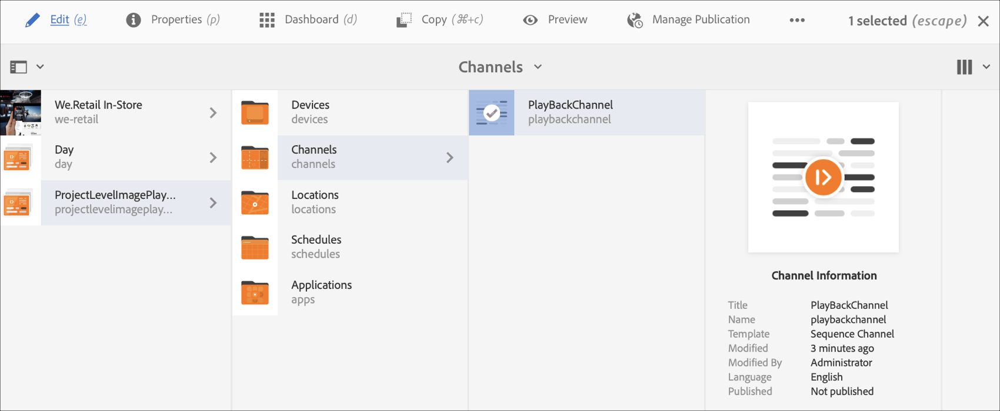

# 專案層級影像播放持續時間 {#project-level-image-playback}

## 概觀 {#overview}

此功能可讓您在專案層級定義影像播放持續時間。 所有影像都會依預設繼承此播放持續時間。 如果在專案層級未定義持續時間，則會繼續預設8秒的播放。

### 先決條件 {#prerequisites}

使用此功能之前，請將專案設定為開始實作此功能的先決條件。 例如，

1. 建立AEM Screens專案（在此範例中為&#x200B;**ProjectLevelPlayback**）。
1. 在&#x200B;**頻道**&#x200B;資料夾下，將順序頻道建立為&#x200B;**PlayBackChannel**。
1. 將內容新增至&#x200B;**PlayBackChannel**。

   

   例如，下列影像展示新增至&#x200B;**PlayBackChannel**&#x200B;編輯器的影像：

   

## 編輯專案層級影像播放持續時間指派 {#editing-project-level-image-playback-duration-assignment}

以下章節說明如何在AEM Screens專案中編輯內容的播放持續時間。

### 在專案層級更新影像的播放持續時間 {#updating-the-playback-duration-for-images-in-a-project}

>[!NOTE]
>
>如果您想要更新影像或頻道層級的播放持續時間，請參閱[頻道層級的影像播放持續時間](channel-level-image-playback.md)。

請依照下列步驟瞭解如何更新專案層級的影像播放持續時間：

1. 導覽至您的專案&#x200B;**ProjectLevelPlayback**，然後按一下動作列中的&#x200B;**屬性**。
   

1. 按一下色版中的所有影像，然後按一下左上方的扳手圖示（如下圖所示），即可開啟「色版層級設定」對話方塊。

   

1. **頁面**&#x200B;對話方塊開啟。

   >[!NOTE]
   >
   >根據預設，頻道中的影像會設定為8秒的播放持續時間，而視訊會以其預設持續時間播放。

   

   編輯&#x200B;**持續時間**，從8000 （毫秒）到3000 （毫秒），即3秒。 選取&#x200B;**頁面**&#x200B;對話方塊右上方的核取記號，以儲存您的變更。

   

### 檢視結果 {#viewing-the-result}

在您更新頻道播放持續時間（在此範例中是三個影像）後，請注意影像現在會播放3秒而非8秒（預設值）。

