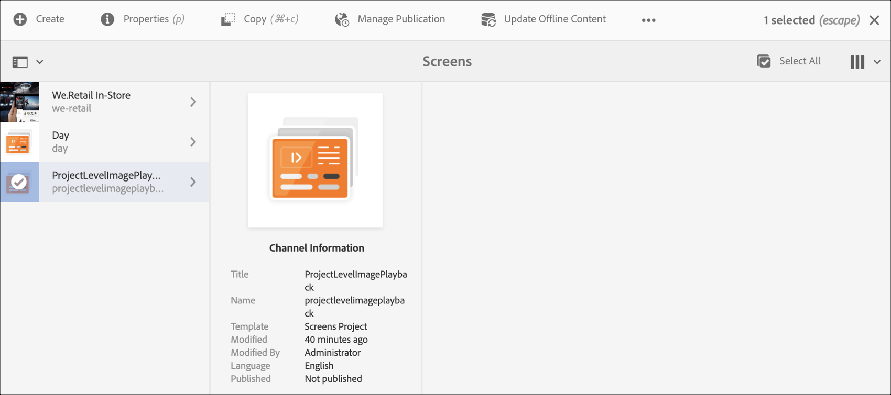

# 專案層級影像播放持續時間{#project-level-image-playback}

## 概覽 {#overview}

此功能可讓您定義專案層級的影像播放期間。 依預設，所有影像都會繼承此播放期間。 如果專案層級未定義持續時間，則會繼續8秒的預設播放。

### 必備條件 {#prerequisites}

使用此功能之前，請務必將專案設定為開始實作此功能的先決條件。 例如，

1. 建立AEM Screens專案（在此範例中， **ProjectLevelPlayback**）

1. 在&#x200B;**Channels**&#x200B;資料夾下，將序列通道建立為&#x200B;**PlayBackChannel**

1. 將內容新增至&#x200B;**PlayBackChannel**

   

   例如，下列影像將展示新增至&#x200B;**PlayBackChannel**&#x200B;編輯器的影像：

   

## 編輯項目級別影像播放持續時間分配{#editing-project-level-image-playback-duration-assignment}

下節說明如何編輯AEM Screens專案中內容的播放期間。

### 更新專案層級{#updating-the-playback-duration-for-images-in-a-project}的影像播放期間

>[!NOTE]
>
>如果要更新影像或頻道層級播放持續時間，請參閱[頻道層級影像播放持續時間](channel-level-image-playback.md)。

請依照下列步驟了解如何更新專案層級的影像播放持續時間：

1. 導覽至您的專案&#x200B;**ProjectLevelPlayback**，然後按一下動作列中的&#x200B;**屬性**。
   

1. 選取通道中的所有影像，然後按一下左上角的扳手圖示（如下圖所示），以開啟「通道層級設定」對話方塊。

   

1. **** 頁面對話方塊開啟。

   >[!NOTE]
   >
   >依預設，頻道中的影像會設為8秒的播放持續時間，而視訊會以其預設持續時間長度播放。

   

   編輯從8000(ms)到3000(ms)（即3秒）的&#x200B;**持續時間**。 按一下&#x200B;**Page**&#x200B;對話方塊右上角的勾選記號，儲存您的變更。

   

### 查看結果{#viewing-the-result}

更新頻道播放持續時間（在此範例中為全部三個影像）後，您會發現影像現在會播放3秒，而非8秒（預設值）。

