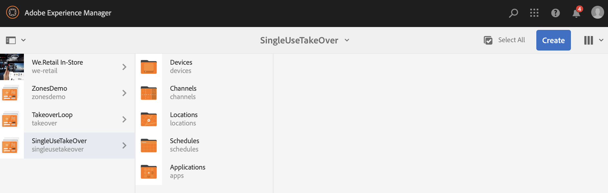

# 單次使用接管管道 {#single-use-takeover-channel}

以下頁面將展示使用案例，著重於設定專案，說明如何建立在特定時間播放一次的Single TakeOver管道。

## 使用案例說明 {#use-case-description}

此使用案例說明如何為顯示或顯示群組建立&#x200B;*從正常播放頻道中接管*&#x200B;的頻道。 接管只會發生一次，並持續一段特定時間。

例如，在星期五上午9:00到上午10:00，只會播放單一接管管道。在此期間，不應播放其他頻道。 在這段時間之前和之後，不播放單次使用接管頻道。 下列範例將示範如何建立單一接管管道，讓內容在12月31日凌晨12:00前播放2分鐘到凌晨12:01。

### 先決條件 {#preconditions}

開始此使用案例前，請確定您瞭解如何：

* **[建立和管理頻道](managing-channels.md)**
* **[建立和管理位置](managing-locations.md)**
* **[建立和管理排程](managing-schedules.md)**
* **[裝置註冊](device-registration.md)**

### 主要執行者 {#primary-actors}

內容作者

## 設定專案 {#setting-up-the-project}

請依照下列步驟設定專案：

**設定頻道和顯示器**

1. 建立標題為&#x200B;**SingleUseTakeOver**&#x200B;的AEM Screens專案，如下所示。

   

1. 在&#x200B;**管道**&#x200B;資料夾中建立&#x200B;**MainAdChannel**。

   

1. 按一下&#x200B;**MainAdChannel**，然後從動作列按一下&#x200B;**編輯**。 將部分資產（影像、影片、內嵌順序）拖放至您的頻道。

   

   >[!NOTE]
   >此範例中的&#x200B;**MainAdChannel**&#x200B;示範連續播放內容的順序頻道。

   

1. 建立接管&#x200B;**MainAdChannel**&#x200B;中內容且僅播放特定日期和時間的&#x200B;**TakeOver**&#x200B;頻道。

1. 按一下&#x200B;**TakeOver**，然後從動作列按一下&#x200B;**編輯**。 將部分資產拖放至您的頻道。 下列範例將展示新增至此頻道的單一區域影像。

   

1. 設定管道的位置和顯示。 例如，已為此專案設定下列&#x200B;**大廳**&#x200B;位置和&#x200B;**MainLobbyDisplay**&#x200B;顯示。

   

**指派頻道給顯示區**

1. 從&#x200B;**位置**&#x200B;資料夾按一下顯示區&#x200B;**MainLobbyDisplay**。 按一下動作列中的&#x200B;**指派頻道**。

   

   >[!NOTE]
   >若要瞭解如何將頻道指派給顯示器，請參閱&#x200B;**[頻道指派](channel-assignment.md)**。

1. 從&#x200B;**頻道指派**&#x200B;對話方塊填入欄位（**頻道路徑**、**優先順序**&#x200B;和&#x200B;**支援的事件**），然後按一下&#x200B;**儲存**。 您現在已將&#x200B;**MainAdChannel**&#x200B;指派給您的顯示器。

   

1. 從&#x200B;**位置**&#x200B;資料夾按一下顯示&#x200B;**TakeOver**。 按一下動作列中的&#x200B;**指派管道**，以便您指派單一使用的接管管道。

1. 在排程的時間將&#x200B;**TakeOver**&#x200B;頻道指派給您的顯示器，並從&#x200B;**頻道指派**&#x200B;對話方塊填入下列欄位，然後按一下&#x200B;**儲存**：

   * **管道路徑**：按一下TakeOver管道的路徑
   * **優先順序**：將此頻道的優先順序設定為大於&#x200B;**MainAdChannel**。 例如，在此範例中設定的優先順序為8。

     >[!NOTE]
     >優先順序可以是高於正常播放頻道優先順序值的任何值。
   * **支援的事件**：按一下&#x200B;**閒置畫面**&#x200B;和&#x200B;**計時器**。
   * **排程**：輸入要讓此頻道在顯示上執行的排程文字。 例如，此處的文字可讓內容在12月31日凌晨12:00前播放2分鐘到凌晨12:01。
此範例中提到的&#x200B;**排程**&#x200B;中的文字是&#x200B;*，其日期是12月31日的23:58之後，也是1月的1日00.01*。

     

     從&#x200B;**SingleUseTakeOver** > **位置** > **大廳** > **MainLobbyDisplay**&#x200B;瀏覽到顯示器。 按一下動作列中的&#x200B;**儀表板**，即可檢視已指派的管道及其優先順序，如下所示。

     >[!NOTE]
     >強制將接管管道的優先順序設定為最高。

     

>[!NOTE]
>
>最佳實務是在播放後刪除「單次使用TakeOver」管道。
