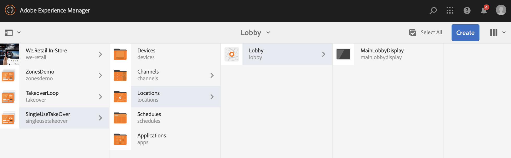

# 單次使用TakeOver通道{#single-use-takeover-channel}

以下頁面將展示一個使用案例，著重於設定專案，以建立在特定時間只播放一次的「單次取用」管道。

## 使用案例說明{#use-case-description}

本使用案例說明如何建立從正常播放的頻道接管&#x200B;*以用於顯示或顯示群組的頻道。*收購只會在特定時間發生一次。
例如，有一個Single TakeOver管道在星期五上午9:00至上午10:00播放。 在此期間，不應播放其他管道。 在此之前和之後，單一使用接管管道將不會播放。 下列範例將展示單一接管管道的建立，所播放的內容可在12月31日凌晨12:00至凌晨12:01之前播放2分鐘。

### 先決條件 {#preconditions}

開始此使用案例前，請務必了解如何：

* **[建立和管理管道](managing-channels.md)**
* **[建立和管理位置](managing-locations.md)**
* **[建立和管理排程](managing-schedules.md)**
* **[裝置註冊](device-registration.md)**

### 主要參與者{#primary-actors}

內容作者

## 設定項目{#setting-up-the-project}

請依照下列步驟來設定專案：

**設定頻道和顯示**

1. 建立標題為&#x200B;**SingleUseTakeOver**&#x200B;的AEM Screens專案，如下所示。

   

1. 在&#x200B;**Channels**&#x200B;資料夾中建立&#x200B;**MainAdChannel**。

   

1. 選擇&#x200B;**MainAdChannel**，然後從操作欄按一下&#x200B;**Edit**。 將某些資產（影像、影片、內嵌序列）拖放至管道。

   

   >[!NOTE]
   >此範例中的&#x200B;**MainAdChannel**&#x200B;示範連續播放內容的序列頻道。

   

1. 建立&#x200B;**TakeOver**&#x200B;管道，該管道接管&#x200B;**MainAdChannel**&#x200B;中的內容，且僅在特定日期和時間播放。

1. 選擇&#x200B;**TakeOver**，然後從操作欄按一下&#x200B;**Edit**。 將一些資產拖放至管道。 下列範例將展示新增至此管道的單一區域影像。

   

1. 設定頻道的位置和顯示。 例如，為此項目設定了以下位置&#x200B;**Lobby**&#x200B;並顯示&#x200B;**MainLobbyDisplay**。

   

**為顯示指定通道**

1. 從&#x200B;**Locations**&#x200B;資料夾中選擇顯示&#x200B;**MainLobbyDisplay**。 按一下動作列中的「**指派管道**」 。

   

   >[!NOTE]
   >要了解如何為顯示器分配通道，請參閱&#x200B;**[通道分配](channel-assignment.md)**。

1. 從&#x200B;**通道分配**&#x200B;對話框填入欄位（**通道路徑**、**優先順序**&#x200B;和&#x200B;**支援的事件**），然後按一下&#x200B;**保存**。 您現在已將&#x200B;**MainAdChannel**&#x200B;指派給您的顯示。

   

1. 從&#x200B;**Locations**&#x200B;資料夾中選擇顯示&#x200B;**TakeOver**。 按一下操作欄中的「**指定通道**」 ，以指定單一使用接管通道。

1. 要按計畫時間將&#x200B;**TakeOver**&#x200B;通道分配給您的顯示，並從&#x200B;**通道分配**&#x200B;對話框填入以下欄位，然後按一下&#x200B;**保存**:

   * **通道路徑**:選擇TakeOver通道的路徑
   * **優先順序**:將此管道的優先順序設定為大於 **MainAdChannel**。例如，此範例中設定的優先順序為8。

      >[!NOTE]
      >優先順序可以是高於正常播放管道之優先順序值的任何值。
   * **支援的事件**:選取「 **空閒** 螢幕 **和計時器**」。
   * **排程**:輸入要此通道運行顯示的計畫的文本。例如，此處的文字可讓內容在12月31日凌晨12:00之前播放2分鐘，直到凌晨12:01。
此範例中提及的**Schedule**&#x200B;中的文字為&#x200B;*，在12月31日的23:58之後，也在1月1日的00.01*&#x200B;之前。

      

      從&#x200B;**SingleUseTakeOver** —> **Locations** —> **Lobby** —> **MainLobbyDisplay**&#x200B;導航到顯示，然後按一下操作欄中的&#x200B;**Dashboard**&#x200B;查看已分配的通道及其優先順序，如下所示。

      >[!NOTE]
      >強制將接管管道的優先順序設定為最高。

      

>[!NOTE]
>
>最佳實務是在播放後刪除單次使用TakeOver管道。