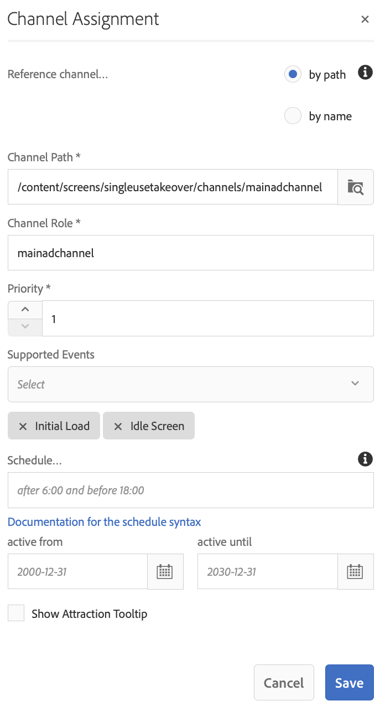

# 一次性TakeOver通道 {#single-use-takeover-channel}

以下頁面展示了一個使用案例，重點介紹如何建立在特定時間只播放一次的一次TakeOver渠道的項目。

## 用例說明 {#use-case-description}

此使用案例說明了如何建立 *接管* 顯示器或一組顯示器的正常播放頻道。 接管將僅在特定時間進行一次。
例如，有一個Single TakeOver頻道，該頻道在星期五上午9點到上午10點播放。 在此期間，不應播放其他頻道。 在此之前和之後，單次使用接管通道將不會播放。 下面的示例演示了如何建立一個單一的接管頻道，該頻道將允許內容在12月31日凌晨12:00到12:01之前播放2分鐘。

### 先決條件 {#preconditions}

在開始此使用案例之前，請確保您瞭解如何：

* **[建立和管理渠道](managing-channels.md)**
* **[建立和管理位置](managing-locations.md)**
* **[建立和管理計畫](managing-schedules.md)**
* **[裝置註冊](device-registration.md)**

### 主要參與者 {#primary-actors}

內容作者

## 設定專案 {#setting-up-the-project}

按照以下步驟設定項目：

**設定通道和顯示**

1. 建立標題為的AEM Screens項目 **一次性使用接管**，如下所示。

   

1. 建立 **主AdChannel** 的 **頻道** 的子菜單。

   

1. 選擇 **主AdChannel** 按一下 **編輯** 按鈕。 將某些資產（影像、視頻、嵌入序列）拖放到您的頻道。

   

   >[!NOTE]
   >的 **主AdChannel** 在本示例中演示了連續播放內容的序列通道。

   

1. 建立 **接管** 接管中內容的渠道 **主AdChannel** 只會在特定的日子和時間玩。

1. 選擇 **接管** 按一下 **編輯** 按鈕。 將一些資產拖放到您的頻道。 以下示例顯示了添加到此通道中的單個區域映像。

   

1. 設定頻道的位置和顯示。 例如，以下位置 **大堂** 顯示 **主廳顯示** 為此項目設定。

   

**為顯示器分配通道**

1. 選擇顯示 **主廳顯示** 從 **位置** 的子菜單。 按一下 **分配通道** 按鈕。

   

   >[!NOTE]
   >要瞭解如何為顯示器分配通道，請參閱 **[渠道分配](channel-assignment.md)**。

1. 填充欄位(**通道路徑**。 **優先順序**, **支援的事件**) **渠道分配** 對話框，按一下 **保存**。 您現在已分配 **主AdChannel** 顯示。

   

1. 選擇顯示 **接管** 從 **位置** 的子菜單。 按一下 **分配通道** 從操作欄中指定單一使用接管通道。

1. 分配 **接管** 顯示器，並從 **渠道分配** 對話框，按一下 **保存**:

   * **通道路徑**:選擇TakeOver通道的路徑
   * **優先順序**:將此通道的優先順序設定為大於 **主AdChannel**。 例如，本示例中的優先順序集為8。

      >[!NOTE]
      >優先順序可以是高於正常播放通道的優先順序值的任何值。
   * **支援的事件**:選擇 **空閒螢幕** 和 **計時器**。
   * **計畫**:輸入希望此通道運行顯示的計畫的文本。 例如，此處的文本允許內容在12月31日凌晨12點到12點01分之前播放2分鐘。
中的文本 **計畫** 在本例中提到 *12月31日後23時58分，也是1月1日00時01分*。

      

      導航到顯示位置 **一次性使用接管** —> **位置** —> **大堂** —> **主廳顯示** 按一下 **儀表板** 從操作欄查看已分配的通道及其優先順序，如下所示。

      >[!NOTE]
      >必須將接管渠道的優先順序設定為最高。

      

>[!NOTE]
>
>一旦播放，最好刪除「一次性使用接管」渠道。
