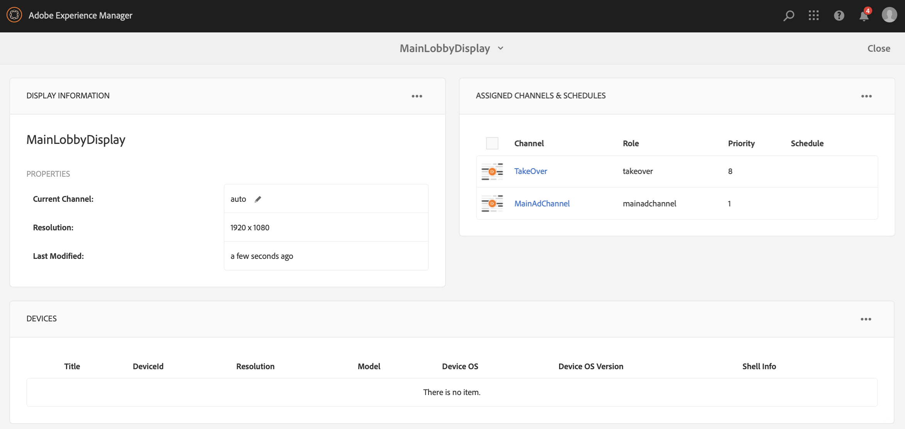

# 單次使用接管管道 {#single-use-takeover-channel}

以下頁面將展示使用案例，著重於設定專案，說明如何建立在特定時間播放一次的Single TakeOver管道。

## 使用案例說明 {#use-case-description}

此使用案例說明如何建立符合以下條件的管道 *接管* 顯示區或顯示區組的正常播放頻道。 接管只會發生一次，並持續一段特定時間。

例如，在星期五上午9:00到上午10:00，只會播放單一接管管道。在此期間，不應播放其他頻道。 在這段時間之前和之後，不播放單次使用接管頻道。 下列範例將示範如何建立單一接管管道，讓內容在12月31日凌晨12:00前播放2分鐘到凌晨12:01。

### 先決條件 {#preconditions}

開始此使用案例前，請確定您瞭解如何：

* **[建立和管理頻道](managing-channels.md)**
* **[建立和管理位置](managing-locations.md)**
* **[建立和管理時程表](managing-schedules.md)**
* **[裝置註冊](device-registration.md)**

### 主要執行者 {#primary-actors}

內容作者

## 設定專案 {#setting-up-the-project}

請依照下列步驟設定專案：

**設定色版和顯示**

1. 建立標題為的AEM Screens專案 **SingleUseTover**，如下所示。

   

1. 建立 **MainAdChannel** 在 **頻道** 資料夾。

   

1. 按一下 **MainAdChannel** 並按一下 **編輯** 從動作列移除。 將部分資產（影像、影片、內嵌順序）拖放至您的頻道。

   

   >[!NOTE]
   >此 **MainAdChannel** 在此範例中，會示範持續播放內容的順序頻道。

   

1. 建立 **接管** 接收內容的頻道 **MainAdChannel** 和只會播放特定日期和時間。

1. 按一下 **接管** 並按一下 **編輯** 從動作列移除。 將部分資產拖放至您的頻道。 下列範例將展示新增至此頻道的單一區域影像。

   

1. 設定管道的位置和顯示。 例如，下列專案 **大廳** 位置和 **MainLobbyDisplay** 已為此專案設定顯示。

   

**將頻道指派給顯示區**

1. 按一下顯示 **MainLobbyDisplay** 從 **位置** 資料夾。 按一下 **指派頻道** 從動作列移除。

   

   >[!NOTE]
   >若要瞭解如何將頻道指派給顯示區，請參閱 **[頻道指定任務](channel-assignment.md)**.

1. 填入欄位(**頻道路徑**， **優先順序**、和 **支援的事件**)從 **頻道指定任務** 對話方塊並按一下 **儲存**. 您現在已指派 **MainAdChannel** 至您的顯示區。

   

1. 按一下顯示 **接管** 從 **位置** 資料夾。 按一下 **指派頻道** 從動作列指派單次使用接管管道。

1. 指派 **接管** 在排程的時間進入您的顯示區，並填入以下欄位： **頻道指定任務** 對話方塊並按一下 **儲存**：

   * **頻道路徑**：按一下接管管道的路徑
   * **優先順序**：將此管道的優先順序設定為大於 **MainAdChannel**. 例如，在此範例中設定的優先順序為8。

     >[!NOTE]
     >優先順序可以是高於正常播放頻道優先順序值的任何值。
   * **支援的事件**：按一下 **閒置畫面** 和 **計時器**.
   * **排程**：輸入您想要此頻道在顯示上執行的排程文字。 例如，此處的文字可讓內容在12月31日凌晨12:00前播放2分鐘到凌晨12:01。此文字在 **排程** 本範例中提及的是 *12月31日23:58之後以及1月1日00.01之前*.

     

     瀏覽至顯示區，從 **SingleUseTover** > **位置** > **大廳** > **MainLobbyDisplay**. 按一下 **儀表板** ，以便您檢視指派的管道及其優先順序，如下所示。

     >[!NOTE]
     >強制將接管管道的優先順序設定為最高。

     

>[!NOTE]
>
>最佳實務是在播放後刪除「單次使用TakeOver」管道。
