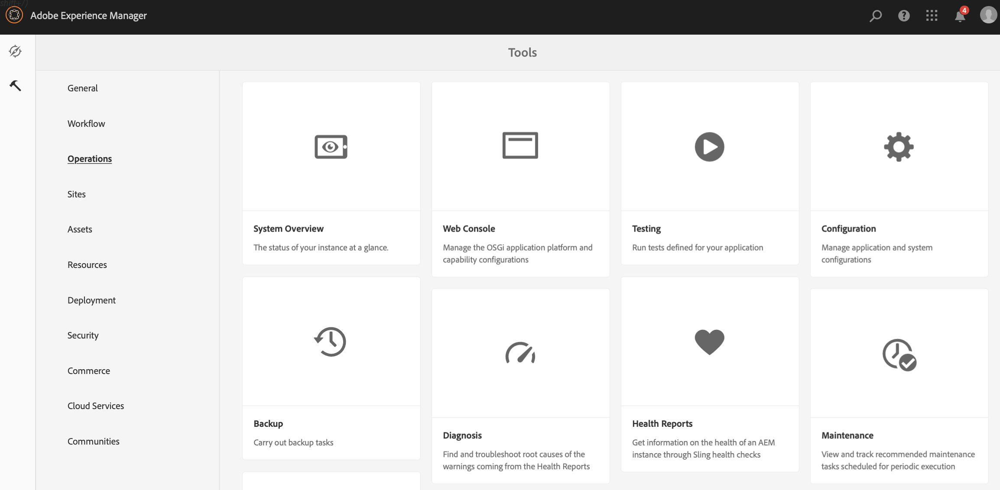

# 從ContentSync轉換為SmartSync {#transitioning-from-contentsync-to-smartsync}

>[!IMPORTANT]
>此內容對AEM內部部署/AMS （AEM 6.5LTS和AEM 6.5）有效。 如需AEM as a Cloud Service Screens內容，請參閱[AEM as a Cloud Service指南](https://experienceleague.adobe.com/zh-hant/docs/experience-manager-cloud-service/content/screens-as-cloud-service/overview/introduction)。

本節提供SmartSync功能的概觀，並說明如何最小化伺服器負載/儲存及網路流量，以降低成本。

## 概觀 {#overview}

SmartSync是AEM Screens使用的最新機制。 這是目前快取離線頻道，並將這些頻道傳送給播放器的方法的替代方案。

它會在伺服器端和使用者端執行。

**在伺服器端**

* 管道的內容（包括資產）已在&#x200B;*`/var/contentsync`*&#x200B;中快取。
* 快取會透過描述顯示可用內容的資訊清單向播放器公開。

使用者端&#x200B;**上的**

* 播放器會根據上述產生的資訊清單更新其內容。

### 使用SmartSync的優點 {#benefits-of-using-smartsync}

SmartSync功能可為您的AEM Screens專案提供下列幾項優點：

* 大幅降低網路流量與伺服器端儲存需求。
* 只有在資產遺失或變更時，播放器才會智慧地下載資產。
* 伺服器端和使用者端儲存最佳化。

>[!NOTE]
>
>Adobe建議您對AEM Screens專案使用SmartSync。

## 從ContentSync移轉至SmartSync {#migrating-from-contentsync-to-smartsync}

>[!NOTE]
>
>如果您已安裝AEM 6.3 Feature Pack 5和AEM 6.4 Feature Pack 3，則可啟用資產的SmartSync以改善磁碟空間使用量。 若要啟用SmartSync，請遵循以下章節，從ContentSync轉換到SmartSync，進而啟用SmartSync。
>
>Screens Player可搭配AEM 6.4.3 FP3支援的伺服器使用SmartSync。
>
>檢視[AEM Screens播放器下載](https://download.macromedia.com/screens/)以下載最新的播放器。 下表說明每個平台所需的最低播放器版本：

| **平台** | **最低支援的播放器版本** |
|---|---|
| ™ | 3.3.72 |
| Chrome作業系統 | 1.0.136 |
| Windows | 1.0.136 |

請依照下列步驟，從ContentSync轉換為SmartSync：

1. 從ContentSync移轉至SmartSync需要先清除ContentSync快取，才能啟用SmartSync。

   使用連結&#x200B;***https://localhost:4502/libs/cq/contentsync/content/console.html***&#x200B;從您的執行個體瀏覽至ContentSync主控台，然後按一下&#x200B;**清除快取**，如下圖所示：

   

   >[!CAUTION]
   >
   >第一次使用SmartSync前，必須先清除所有內容快取。

1. 透過Adobe Experience Manager執行個體>槌子圖示> **作業** > **Web主控台**，瀏覽至&#x200B;**AEM Web主控台設定**。

   

1. **Adobe Experience Manager Web主控台組態**&#x200B;開啟。 搜尋&#x200B;*offlinecontentservice*。

   若要搜尋&#x200B;**Screens離線內容服務**&#x200B;屬性，請按&#x200B;**Command+F**&#x200B;搜尋&#x200B;**Mac**，然後按&#x200B;**Control+F**&#x200B;搜尋&#x200B;**Windows**。

   

1. 按一下「儲存」**&#x200B;**&#x200B;以啟用&#x200B;**Screens Offline Content Services**&#x200B;屬性，因此使用AEM Screens的SmartSync。
1. 啟用SmartSync後，請瀏覽至您的專案，然後按一下&#x200B;**更新離線內容** *（從動作列），*，如下圖所示。

   
