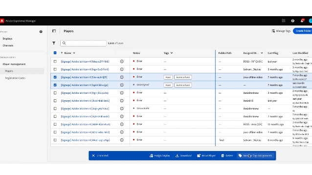

# 在Screens Cloud上標籤 {#tagging-on-Screens-Cloud}

>[!CAUTION]
>
>此 **標籤** 只有為您的租使用者啟用此功能時，才可使用。 請聯絡AEM Screens工程以將其啟用。

## 簡介 {#introduction}

使用者可以在Screens Cloud上建立標籤，並使用它們來分類顯示器和播放器。

## 建立和管理標籤 {#create-and-manage-tags}

.

使用相同的動作選單重新命名標籤或刪除標籤。

>[!NOTE]
> 
> 標籤名稱只能包含字母、數字、破折號和底線。 名稱的開頭和結尾只能是字母或數字。
> 租使用者共允許500個標籤

## 管理標籤指派 {#manage-tags-assignments}

在「顯示和播放器」上使用建立的標籤。 您最多可以使用30個標籤來標籤一個。

.

## 依標籤篩選 {#filter-by-tags}

選取標籤以篩選顯示區或播放器清單。

.

>[!NOTE]
> 
> 在Screens Cloud上定義的標籤與AEM中定義的標籤無關/同步。
> 
