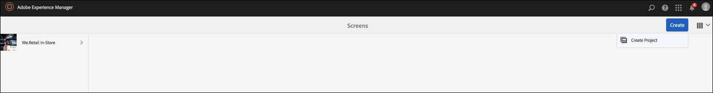

# 視訊播放設定及疑難排解 {#video-playback-configuration-and-troubleshooting}

上傳影片至DAM並將其新增至您的頻道時，您可能會遇到影片無法在AEM Screens Player中播放的問題。

以下章節說明如何在您的頻道中針對播放視訊進行除錯和疑難排解。

## DAM轉譯 {#dam-renditions}

上傳視訊至管道後，AEM應開始為其建立一些轉譯。 您可以在「資產」下檢視您的影片。

若要觀看影片：

1. 導覽至您的影片，例如 `http://localhost:4502/assets.html/content/dam/we-retail/en/videos`.
1. 按一下視訊並展開左上角功能表，然後按一下 **轉譯**.

應該有不同的轉譯（MP4或M4V）。

如果沒有轉譯，請確定您已在執行AEM的作業系統上安裝ffmpeg。

>[!CAUTION]
>
>如果沒有轉譯，請確定您已在執行AEM的作業系統上安裝ffmpeg。
>
>按一下 [此處](https://www.ffmpeg.org/download.html) 以安裝ffmpeg。

## 視訊資產 {#video-assets}

如果您在視訊底下沒有看到來源屬性，可能是視訊沒有獲得轉解碼。 如果視訊正確轉碼，就會顯示在控制面板中，如下所示：

檢查是否已安裝ffmpeg以及視訊設定檔。

### 正在檢查視訊設定檔 {#checking-video-profile}

1. 導覽至 **視訊設定檔**，也就是 `http://localhost:4502/etc/dam/video.html` 並按一下 **上傳測試視訊**.

   

1. 上傳測試視訊並按一下 **確定** 以便您開始轉碼。

   如果轉碼後的視訊失敗，請展開ffmpeg輸出來瞭解ffmpeg主控台輸出中的任何錯誤。

   

   此外，如果視訊轉碼成功，也可以下載轉碼檔案。

   

   >[!NOTE]
   >
   >在新增視訊到任何頻道之前，請務必提供足夠的時間讓視訊轉碼（應該顯示新標籤而不是處理）。

### 使用視訊元件檢查設定檔 {#checking-profile-with-a-video-component}

如果視訊元件未正確設定，請檢查頁面設計中的設定檔清單。

1. 導覽至您的頻道，然後按一下 **設計** 模式。

   

1. 按一下視訊並開啟 **編輯** 對話方塊。 開啟 **設定檔** 標籤。

   >[!NOTE]
   >按一下不同的設定檔（至少應有「高品質H.264」設定檔）。

### 在網頁播放器中檢查視訊 {#checking-the-video-in-the-web-player}

使用 **網頁播放器** `http://localhost:4502/content/mobileapps/cq-screens-player/firmware.html/content/screens/we-retail/locations/demo/flagship/single/device0` 驗證瀏覽器（Chrome和Safari）中的播放。 Chrome可在Android™裝置上使用，而Safari可在OS X和iOS瀏覽器上使用。

如果影片無法在Safari上執行，則無法在OS X和iOS播放器中執行。 這可能是編碼問題，因此必須對視訊重新編碼。

若要使用DAM工作流程來建立FullHD轉譯，請執行以下操作：

1. 導覽至 *工作流程模型管理員* 即 `http://localhost:4502/libs/cq/workflow/admin/console/content/models.html/etc/workflow/models`.
1. 按一下 **畫面更新資產** 模型。
1. 按一下 **開始工作流程** 從動作列移除。
1. 從 **執行工作流程** 對話方塊中，按一下 **裝載**.
1. 按一下 **執行**.

>[!NOTE]
>
>允許一些時間建立轉譯，但在幾秒/分鐘後（取決於視訊大小），請在Safari上重新載入網頁播放器。

#### 疑難排解自動播放原則標幟 {#troubleshooting-autoplay-policy-flag}

如果AEM Screens Player擷取視訊但未顯示，請對「自動播放原則」標幟進行疑難排解。

請依照下列步驟，針對Google的自動播放原則標幟問題進行疑難排解：

1. 瀏覽至 ***chrome://flags/#autoplay-policy***
1. 變更 **自動播放原則** 從 **預設** 至 **不需要使用者手勢**

1. 重新啟動網頁瀏覽器並更新播放器

>[!NOTE]
>
>若要進一步瞭解在Chrome中使用新自動播放原則提供良好使用者體驗的最佳實務，請參閱以下檔案： *自動播放原則變更* 在 `https://developers.google.com/web/updates/2017/09/autoplay-policy-changes#webaudio`.

### 跨多個播放器同步視訊 {#syncing-video-across-multiple-players}

若要跨多部裝置同步播放視訊，您應該對視訊所屬的順序使用絕對策略。

#### 要求 {#requirements}

* 相同的2+個播放器
* 理想上類似的硬體
* 相同的網路拓撲（播放器會連線至與其內部系統時鐘一致的NTP伺服器）

#### 設定絕對策略 {#setting-up-the-absolute-strategy}

絕對策略：

* 計算錨記時間（當天午夜）。
* 計算序列的持續時間（其所有專案的持續時間總和）。
* 在任何時間點，它會透過解決序列_remaining_time = (current_time - anchor_time) % sequence_duration來計算目前應該播放哪個專案以及下一個專案。

請依照下列步驟設定絕對策略：

1. 導覽至您的管道作者，然後按一下順序元件，如下圖所示。
1. 開啟其設定對話方塊。
1. 編輯 **策略** 並新增絕對。

   

   >[!NOTE]
   >播放器的作業系統必須有相同的時鐘。

**在OS X上對齊時鐘** 請依照下列步驟在OS X上對齊時鐘：

1. 開啟 **日期與時間** 每個OS X盒的偏好設定
1. 檢查 **自動設定日期和時間**
1. 在下拉式清單中貼上值0.pool.ntp.org、1.pool.ntp.org、2.pool.ntp.org、3.pool.ntp.org、time.apple.com或直接執行 *sudo ntpdate -u -v 0.pool.ntp.org*
1. 啟動2個以上的播放器

播放器開始新的對齊順序可能需要一些時間。
