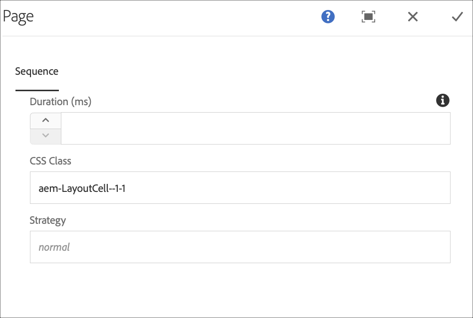

# 命令同步 {#command-sync}

以下頁面說明如何使用「命令同步」。 Command Sync允許跨不同播放器同步處理播放。 播放器可播放不同內容，但每個資產需要相同的持續時間。

>[!IMPORTANT]
>
>此功能不支援內嵌序列、動態內嵌序列、應用程式通道或轉接。

## 概觀 {#overview}

數位招牌解決方案需要支援視訊牆壁和同步播放，以支援新年倒數或分割為可在多個熒幕播放的大型視訊等情境，這也是Command Sync發揮作用的地方。

若要使用Command Sync，單一播放器可充當 *主要* 並傳送指令，而所有其他播放器則充當 *使用者端* 並在收到指令時播放。

此 *主要* 即將開始播放專案時，會傳送命令給所有已註冊的使用者端。 此專案的裝載可以是要播放專案的索引及/或要播放的元素的外部HTML。

## 實作命令同步 {#using-command-sync}

下節說明如何在AEM Screens專案中使用「Command Sync」。

>[!NOTE]
>
>若要進行同步播放，所有硬體裝置都必須具備相同的硬體規格，而且最好是相同的作業系統。 不建議在不同的硬體與作業系統之間同步處理。

### 設定專案 {#setting-up}

在使用Command Sync功能之前，請確定您擁有專案和通道，其中包含專案設定的內容。

1. 以下範例示範專案 **CommandSyncDemo** 和順序頻道 **頻道大廳**.

   

   >[!NOTE]
   >
   >若要瞭解如何建立管道或新增內容至管道，請參閱 [建立和管理管道](/help/user-guide/managing-channels.md)

   此頻道包含下列內容，如下圖所示。

   

1. 建立位置 **大廳** 並隨後顯示標題為 **LobbyDisplay** 在 **位置** 資料夾，如下圖所示。
   

1. 指派管道， **頻道大廳** 至您的 **LobbyDisplay**. 您現在可以從顯示控制面板檢視指派給顯示的管道。
   

   >[!NOTE]
   >
   >若要瞭解如何將頻道指派給顯示區，請參閱 [建立和管理顯示器](/help/user-guide/managing-displays.md).

1. 瀏覽至 **裝置** 資料夾並按一下 **裝置管理員** 以註冊裝置。

   

   >[!NOTE]
   >
   >若要瞭解如何註冊裝置，請參閱 [裝置註冊](/help/user-guide/device-registration.md)

1. 為了示範之用，此範例將Chrome裝置和Windows Player顯示為兩個獨立的裝置。 兩個裝置都指向相同的顯示器。
   

### 更新頻道設定

1. 瀏覽至 **頻道大廳** 並按一下 **編輯** 以更新頻道設定。

1. 選取整個通道，如下圖所示。
   

1. 按一下扳手圖示以開啟 **頁面** 對話方塊。
   

1. 輸入 *已同步* 中的關鍵字 **策略** 欄位。

   

### 設定主要 {#setting-up-primary}

1. 從以下位置導覽至顯示控制面板： **CommandSyncDemo** > **位置**  > **大廳** > **LobbyDisplay** 並按一下 **儀表板** 從動作列移除。
您會在中看到兩部裝置（chrome和windows player） **裝置** 面板，如下圖所示。
   

1. 從 **裝置** 面板，選取要設定為主要裝置的裝置。 下列範例示範如何將Chrome裝置設為主要裝置。 按一下 **設為主要裝置**.

   

1. 在中輸入IP位址 **設為主要裝置** 並按一下 **儲存**.

   

>[!NOTE]
>
>您可以將多個裝置設定為主要裝置。

### 正在與主要播放器同步 {#sync-up-primary}

1. 將Chrome裝置設定為主要裝置後，您就可以同步處理其他裝置（在此例中為Windows Player），以便與主要裝置同步。
從中選擇其他裝置（在此例中為Windows Player） **裝置** 面板，然後按一下 **同步處理至主要裝置**，如下圖所示。

   

1. 從清單中選取裝置，然後按一下 **儲存**.

   >[注意：]
   > 此 **同步處理至主要裝置** 對話方塊會顯示主要裝置清單。 您可以選取想要的偏好設定之一。

1. 裝置（Windows播放器）同步至主要播放器（Chrome播放器）後，您會在中看到裝置同步 **裝置** 面板。

   

### 正在與主要播放器取消同步 {#desync-up-primary}

將一或多個裝置同步至主要裝置後，您就可以從該裝置解除同步指派。

>[!NOTE]
>
>如果您取消同步處理主要裝置，它也會取消連結與該主要裝置相關聯的所有使用者端裝置。

若要從主要裝置移除同步處理，請遵循下列步驟：

1. 導覽至 **裝置** 面板並選取裝置。

1. 按一下 **取消同步處理裝置** 將使用者端與主要裝置解除同步。

   

1. 按一下 **確認** 將選取的裝置從主要裝置取消同步。

   >[注意：]
   > 如果您選取主要裝置並使用「解除同步」選項，則所有連線至主要裝置的裝置將會在單一步驟中解除同步。
