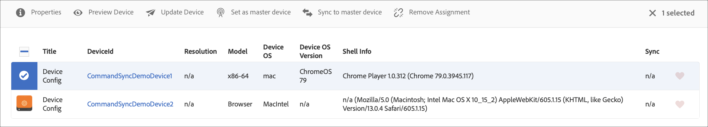

# 命令同步 {#command-sync}

以下頁介紹如何使用命令同步。 Command sync允許在不同播放器間同步播放。 玩家可以播放不同的內容，但每個資產需要有相同的持續時間。

## 概覽 {#overview}

數位標牌解決方案需要支援視訊牆和同步播放，以支援例如新年計數或大型視訊片段以在多個螢幕上播放等場景，而內容同步就是在這裡開始播放。

若要使用「命令同步」，一個播放器充當 *主* 、傳送命令，而所有其他播放器則當它們收到命令 *時* ，充當用戶端並播放。 當主 *程式* (Master)要開始播放項目時，會向所有註冊的客戶端發送命令。 此項目的裝載可以是要播放的項目的索引和／或要播放的元素的外部html。

## 實作命令同步 {#using-command-sync}

下節說明如何在AEM Screens專案中使用「命令同步」。

### 設定專案 {#setting-up}

在使用「命令同步」功能之前，請確定您有專案和頻道，並為專案設定內容。

1. 下列範例將展示名為 **CommandSyncDemo的示範專案** ，以及序列頻道 **ChannelLobby**。

   

   >[!NOTE]
   >
   >如要瞭解如何建立頻道或新增內容至頻道，請參閱建立 [和管理頻道](/help/user-guide/managing-channels.md)

   頻道包含下列內容，如下圖所示。

   

1. 在「位置」資料 **夾中** ，建立顯示，如下圖所示。
   

1. 將channelLobby指 **派給您的** LobbyDisplay ****。
   

   >[!NOTE]
   >
   >若要瞭解如何指派渠道給顯示，請參閱建立 [和管理顯示](/help/user-guide/managing-displays.md)

1. 導覽至「 **裝置** 」檔案夾，然後從動作列按 **一下「裝置管理員** 」以註冊裝置。

   

   >[!NOTE]
   >
   >若要瞭解如何指派渠道給顯示，請參閱建立 [和管理顯示](/help/user-guide/managing-displays.md)

1. 為進行示範，此範例會將chrome裝置和網頁播放器分別展示為兩種裝置。 這兩個裝置都指向相同的顯示。
   

### 設定主版 {#setting-up-master}

1. 從 **CommandSyncDemo** —> **Locations** —> **Lobby** — **Lobby** **** DisplayBar導覽至顯示操控板，從操控板上的Click Addrobard從操作欄中導航。
您將在「裝置」面板中看到兩種裝置( **chrome和web player** )，如下圖所示。

   

1. 從「裝 **置** 」面板中，選取您要設為主版的裝置。 下列範例示範將Chrome裝置設為主版。 按一下「 **設為主裝置」**。

   

1. 在「設為主設備」 **中輸入IP地址** ，然後按一下「 **保存」**。

   

### 與Master同步 {#sync-up-master}

1. 將Chrome裝置設為主版後，您就可以同步其他裝置以與主版同步。
從「設備」面板中選擇其 **它設備** ，然後按一下「同步到主設備 ****」，如下圖所示。

1. 從清單中選擇設備，然後按一下「 **保存**」。

1. 導覽至網 [頁播放器](http://localhost:4502/screens/player.html)。

