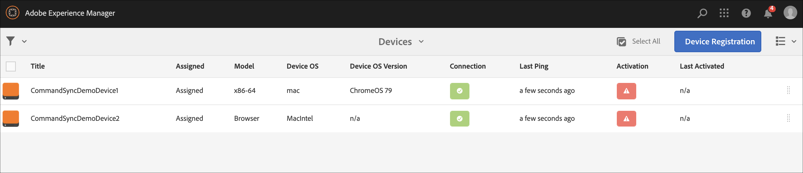

# 命令同步 {#command-sync}

以下頁面說明如何使用「命令同步」。 Command Sync允許跨不同播放器同步處理播放。 播放器可播放不同內容，但每個資產必須具有相同的持續時間。

>[!IMPORTANT]
>
>此功能不支援內嵌序列、動態內嵌序列、應用程式通道或轉接。

## 概觀 {#overview}

數位看板解決方案必須支援視訊牆面與同步播放。 如果您嘗試支援新年倒數或大型影片片段在多個熒幕播放等情境，則此情境為真。 在這些情況下，「命令同步」就會發揮作用。

若要使用Command Sync，一個播放器會當作&#x200B;*主要*&#x200B;並傳送命令，而所有其他播放器則當其收到命令時會當作&#x200B;*使用者端*&#x200B;並播放。

*primary*&#x200B;即將開始播放專案時，會傳送命令給所有已註冊的使用者端。 此動作的裝載可以是要播放專案的索引、要播放的元素的外部HTML，或兩者皆有。

## 實作命令同步 {#using-command-sync}

下節說明如何在AEM Screens專案中使用「Command Sync」。

>[!NOTE]
>
>若要進行同步播放，所有硬體裝置都必須具備相同的硬體規格，而且最好是相同的作業系統。 不建議在不同的硬體與作業系統之間同步處理。

### 設定專案 {#setting-up}

使用「命令同步」功能之前，請確定您擁有專案和管道，且管道中有專案設定的內容。

1. 下列範例展示名為&#x200B;**CommandSyncDemo**&#x200B;的示範專案和序列頻道&#x200B;**ChannelLobby**。

   

   >[!NOTE]
   >
   >若要瞭解如何建立管道或將內容新增至管道，請參閱[建立和管理管道](/help/user-guide/managing-channels.md)

   此頻道包含下列內容，如下圖所示。

   

1. 建立位置&#x200B;**大廳**，然後在&#x200B;**位置**&#x200B;資料夾中建立標題為&#x200B;**大廳顯示**&#x200B;的顯示，如下圖所示。
   

1. 將頻道&#x200B;**ChannelLobby**&#x200B;指派給您的&#x200B;**LobbyDisplay**。 您現在可以從顯示控制面板檢視指派給顯示的管道。
   

   >[!NOTE]
   >
   >若要瞭解如何將頻道指派給顯示器，請參閱[建立和管理顯示器](/help/user-guide/managing-displays.md)。

1. 瀏覽至&#x200B;**裝置**&#x200B;資料夾。
1. 按一下動作列中的&#x200B;**裝置管理員**。

   

   >[!NOTE]
   >
   >若要瞭解如何註冊裝置，請參閱[裝置註冊](/help/user-guide/device-registration.md)

1. 為了示範，此範例會將Chrome裝置和Windows Player顯示為兩個不同的裝置。 兩個裝置都指向相同的顯示器。
   

### 更新頻道設定

1. 瀏覽至&#x200B;**ChannelLobby**。
1. 按一下動作列中的&#x200B;**編輯**。
1. 按一下整個通道，如下圖所示。
   

1. 按一下扳手圖示。
   

1. 在&#x200B;**頁面**&#x200B;對話方塊中，在&#x200B;**策略**&#x200B;欄位中輸入&#x200B;*同步的*關鍵字。
   

### 設定主要 {#setting-up-primary}

1. 從&#x200B;**CommandSyncDemo** > **位置** > **大廳** > **大廳顯示**&#x200B;瀏覽至顯示儀表板。 然後，從動作列按一下&#x200B;**儀表板**。
請注意&#x200B;**裝置**&#x200B;面板中的兩個裝置(Chrome和Windows Player)，如下列所示：
   

1. 從&#x200B;**裝置**&#x200B;面板，按一下您要設定為主要裝置的裝置。 下列範例示範如何將Chrome裝置設定為主要裝置。 按一下&#x200B;**設定為主要裝置**。

   

1. 在&#x200B;**設定為主要裝置**&#x200B;中輸入IP位址，然後按一下&#x200B;**儲存**。

   

>[!NOTE]
>
>您可以將多個裝置設定為主要裝置。

### 正在與主要播放器同步 {#sync-up-primary}

1. 將Chrome裝置設為主要裝置後，請同步處理其他裝置（在此例中為Windows Player），以便與主要裝置同步。
從&#x200B;**裝置**&#x200B;面板按一下其他裝置（在此例中是Windows Player），然後按一下&#x200B;**同步處理至主要裝置**。

   

1. 從清單中按一下裝置，然後按一下&#x200B;**儲存**。

   >[附註：]
   > **同步處理至主要裝置**&#x200B;對話方塊會顯示主要裝置清單。 選取偏好的專案。

1. 當裝置(Windows Player)同步處理至主要裝置(Chrome Player)時，您可以在&#x200B;**裝置**&#x200B;面板中看到該裝置已同步處理。

   

### 正在與主要播放器取消同步 {#desync-up-primary}

將一或多個裝置同步至主要裝置後，即可從該裝置解除同步指派。

>[!NOTE]
>
>如果您取消同步處理主要裝置，它也會取消連結與該主要裝置相關聯的所有使用者端裝置。

若要從主要裝置移除同步處理，請遵循下列步驟：

1. 瀏覽至&#x200B;**裝置**&#x200B;面板，然後按一下裝置。

1. 按一下[取消同步處理裝置]&#x200B;**&#x200B;**，即可從主要裝置取消同步處理使用者端。

   

1. 按一下&#x200B;**確認**，將選取的裝置從主要裝置取消同步。

   >[附註：]
   > 如果您按一下主要裝置並使用「取消同步」選項，則所有連線至主要裝置的裝置都會在單一步驟中取消同步。
