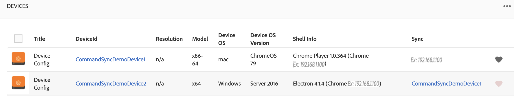

# 命令同步{#command-sync}

以下頁介紹如何使用命令同步。 命令同步允許在不同播放器之間同步播放。 播放器可以播放不同的內容，但每個資產需要有相同的持續時間。

>[!IMPORTANT]
>
>此功能不支援內嵌序列、動態內嵌序列、應用程式通道或轉變。

## 概覽 {#overview}

數位看板解決方案需要支援視訊牆和同步播放，以支援新年計數或大型視訊切割到多個螢幕來播放等情況，而命令同步就是在這裡開始發揮作用的。

要使用命令同步，一個播放器充當&#x200B;*master*&#x200B;併發送命令，而所有其他播放器充當&#x200B;*clients*&#x200B;並在它們收到命令時播放。

當&#x200B;*master*&#x200B;要開始播放項時，它會向所有註冊的客戶端發送命令。 此項目的有效負載可以是要播放之項目的索引和/或要播放之元素的外部html。

## 實現命令同步{#using-command-sync}

以下章節說明如何在AEM Screens專案中使用命令同步。

>[!NOTE]
>
>對於同步播放，要求所有硬體設備具有相同的硬體規範，最好是相同的作業系統。 不建議在不同的硬體和作業系統之間同步。

### 設定項目{#setting-up}

使用「命令同步」功能之前，請確保您有項目和通道，其中已為項目設定了內容。

1. 以下示例將展示名為&#x200B;**CommandSyncDemo**&#x200B;的演示項目和序列通道&#x200B;**ChannelLobby**。

   

   >[!NOTE]
   >
   >若要了解如何建立頻道或將內容新增至頻道，請參閱[建立和管理頻道](/help/user-guide/managing-channels.md)

   管道包含下列內容，如下圖所示。

   

1. 建立位置&#x200B;**Lobby**，隨後在&#x200B;**Locations**&#x200B;資料夾中建立標題為&#x200B;**LobbyDisplay**的顯示，如下圖所示。
   

1. 將通道&#x200B;**ChannelLobby**&#x200B;分配給您的&#x200B;**LobbyDisplay**。 您現在可以從顯示控制面板檢視指派給顯示的管道。
   

   >[!NOTE]
   >
   >要了解如何將通道分配給顯示器，請參閱[建立和管理顯示器](/help/user-guide/managing-displays.md)。

1. 導覽至&#x200B;**Devices**&#x200B;資料夾，然後按一下動作列中的&#x200B;**Device Manager**&#x200B;以註冊裝置。

   

   >[!NOTE]
   >
   >要了解如何註冊設備，請參閱[設備註冊](/help/user-guide/device-registration.md)

1. 為了示範，此範例將Chrome裝置和Windows播放器示範為兩個不同的裝置。 這兩個裝置都指向相同的顯示器。
   

### 更新通道設定

1. 導覽至&#x200B;**ChannelLobby**，然後按一下動作列中的&#x200B;**Edit**&#x200B;以更新通道設定。

1. 選取整個通道，如下圖所示。
   

1. 按一下扳手圖示以開啟&#x200B;**Page**對話方塊。
   

1. 在&#x200B;**Strategy**&#x200B;欄位中輸入&#x200B;*synced*&#x200B;關鍵字。

   

### 設定主{#setting-up-master}

1. 從&#x200B;**CommandSyncDemo** —> **Locations** —> **Lobby** —> **LobbyDisplay**&#x200B;導覽至顯示控制面板，然後按一下動作列中的&#x200B;**Dashboard**。
您會在**DEVICES**面板中看到兩部裝置（chrome和windows player），如下圖所示。
   

1. 從&#x200B;**DEVICES**&#x200B;面板中，選擇要設定為主設備的設備。 下列範例示範如何將Chrome裝置設為主版。 按一下「**設定為主設備**」。

   

1. 在&#x200B;**Set as master device**&#x200B;中輸入IP地址，然後按一下&#x200B;**Save**。

   

>[!NOTE]
>
>您可以將多個裝置設定為主版。

### 與主版{#sync-up-master}同步

1. 將Chrome裝置設為主版後，您就可以同步其他裝置（在此例中是Windows播放器）以與主版同步。
從**DEVICES**&#x200B;面板中選擇其他設備（在本例中為windows player），然後按一下&#x200B;**同步到主設備**，如下圖所示。

   

1. 從清單中選擇設備，然後按一下&#x200B;**保存**。

   >[注意:]
   > **同步到主設備**&#x200B;對話框將顯示主設備清單。 您可以選取想要的偏好設定。

1. 將裝置（Windows播放器）同步至主版（Chrome播放器）後，您會在&#x200B;**DEVICES**&#x200B;面板中看到同步的裝置。

   

### 與主版{#desync-up-master}取消同步

將設備或設備同步到主設備後，可以從該設備取消同步分配。

>[!NOTE]
>
>如果取消同步主設備，它還會取消與該主設備關聯的所有客戶端設備的連結。

若要從主裝置移除同步，請執行下列步驟：

1. 導覽至&#x200B;**DEVICES**&#x200B;面板，然後選取裝置。

1. 按一下&#x200B;**Desync device(s)**&#x200B;以從主設備取消同步客戶端。

   

1. 按一下&#x200B;**確認**&#x200B;以從主版中取消同步所選設備。

   >[注意:]
   > 如果您選擇主設備並使用取消同步選項，則與主設備連接的所有設備將在一個步驟中取消同步。
