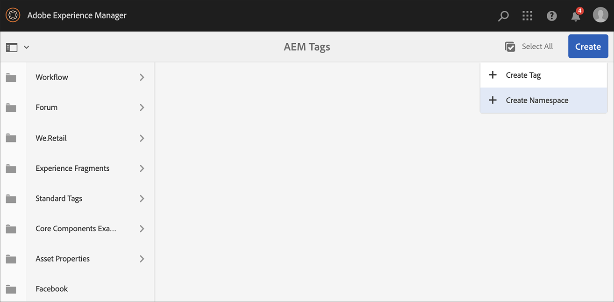

# AEM Screens中的語音辨識 {#voice-recognition}

>[!IMPORTANT]
>
>**重要的隱私權資訊**
>
>使用語音辨識功能時，請遵循您所在地區適用的所有法律和道德准則。 這些准則包括但不限於向使用者提供播放器正在使用語音辨識的可見通知)。 Adobe不會接收、儲存或處理任何語音相關資訊。 AEM Screens播放器使用內建在瀏覽引擎中的標準網頁語音API。 在幕後，此API會將您語音的波形傳送至Google的伺服器，以便從語音轉換為文字。 播放器會比對文字與設定的關鍵字。
>
>如需詳細資訊，請參閱[網頁語音API上的Google隱私權白皮書](https://www.google.com/chrome/privacy/whitepaper.html#speech)。

語音辨識功能可讓AEM Screens頻道在語音互動驅動下變更內容。

內容作者可以將顯示器設定為啟用語音。 此功能的目的是讓客戶使用語音作為與顯示器互動的方法。 類似的使用案例包括在商店尋找產品推薦、在用餐者和餐廳訂購功能表專案。 此功能可增加使用者的協助工具，並大幅提升客戶體驗。

>[!NOTE]
>播放器硬體必須支援語音輸入，例如麥克風。

## 實作語音辨識 {#implementing}

>[!IMPORTANT]
> 語音辨識功能僅適用於Chrome作業系統和Windows播放器。

若要在您的AEM Screens專案中實作語音辨識，請啟用顯示器的語音辨識，並將每個頻道與唯一標籤建立關聯，以觸發頻道轉換。

下節說明如何在AEM Screens專案中啟用和使用語音辨識功能。

## 以全熒幕或拆分畫面頻道切換檢視內容 {#sequence-channel}

在使用語音辨識功能之前，請確定您擁有專案和頻道，其中包含專案設定的內容。

1. 下列範例展示名為&#x200B;**VoiceDemo**&#x200B;的示範專案，以及三個順序頻道&#x200B;**Main**、**ColdSinks**&#x200B;和&#x200B;**HotInveals**，如下圖所示。

   

   >[!NOTE]
   >
   >若要瞭解如何建立管道或將內容新增至管道，請參閱[建立和管理管道](/help/user-guide/managing-channels.md)

   或，

   您可以建立三個順序頻道&#x200B;**主要**、**冷飲**&#x200B;和&#x200B;**熱飲**，以及一個更多1x2分割Screens頻道&#x200B;**分割畫面**，如下圖所示。

   

1. 導覽至每個管道並新增內容。 例如，瀏覽至&#x200B;**VoiceDemo** > **頻道** > **Main**，然後按一下頻道。 按一下動作列中的[編輯&#x200B;****]，然後依照您的需求新增內容（影像/影片）。 同樣地，新增內容至&#x200B;**ColdInvests**&#x200B;和&#x200B;**HotInvests**&#x200B;頻道。

   管道現在包含資產（影像），如下圖所示。

   **主要**：

   

   **冷飲**：

   

   **熱飲**：

   

   如果您將「分割Screens」管道新增至專案，請導覽至&#x200B;**分割畫面**&#x200B;並拖放兩個內嵌序列。 新增路徑至&#x200B;**ColdInvests**&#x200B;和&#x200B;**HotInvests**頻道，如下圖所示。
   

### 設定管道標籤 {#setting-tags}

新增內容至管道後，請導覽至每個管道，並新增可觸發語音識別的適當標籤。

請依照下列步驟，將標籤新增至您的頻道：

1. 導覽至每個管道並新增內容。 例如，瀏覽至&#x200B;**VoiceDemo** > **頻道** > **Main**，然後按一下頻道。

1. 按一下動作列中的&#x200B;**屬性**。

   

1. 導覽至「**基本知識**」標籤，然後按一下「**標籤**」欄位中的現有標籤或建立現有標籤。

   您可以輸入標籤的新名稱來建立標籤，然後按下`return`鍵，如下圖所示：

   

   或，

   您也可以預先從專案的AEM例項建立標籤，並加以選取。 遵循[建立標籤](#creating-tags)中說明的步驟之後，您可以從位置按一下標籤並將其新增至您的頻道，如下圖所示：

   

1. 同樣地，將標題為&#x200B;**Hot**&#x200B;的標籤新增至&#x200B;**HotThrouks**&#x200B;頻道。

1. 如果您使用分割Screens管道，請將標籤（**hot**&#x200B;和&#x200B;**cold**）新增至&#x200B;**SplitScreen**&#x200B;管道屬性，如下圖所示。

   

1. 完成時，按一下&#x200B;**儲存並關閉**。

### 建立標記 {#creating-tags}

請依照下列步驟建立標籤：

1. 導覽至您的AEM執行個體。

1. 按一下工具圖示> **標籤**。
   

1. 按一下&#x200B;**建立** > **建立名稱空間**。
   

1. 輸入專案名稱，例如&#x200B;**VoiceDemo**，然後按一下&#x200B;**建立**。

1. 按一下&#x200B;**VoiceDemo**&#x200B;專案，然後從動作列按一下&#x200B;**建立標籤**。
   

1. 輸入您的標籤名稱，然後按一下&#x200B;**提交**。
   

現在，您可以在AEM Screens專案中使用這些標籤。

### 將頻道指定到顯示器並啟用語音辨識 {#channel-assignment}

1. 在&#x200B;**位置**&#x200B;資料夾中建立顯示，如下圖所示。

   

   >[!NOTE]
   >若要瞭解如何將頻道指派給顯示器，請參閱[建立和管理顯示器](/help/user-guide/managing-displays.md)。

1. 將頻道&#x200B;**主要**、**冷飲**&#x200B;和&#x200B;**熱飲**&#x200B;指派給您的&#x200B;**大廳顯示**。 此外，如果您在專案中使用&#x200B;**SplitScreen**&#x200B;頻道，請務必將其也指派給顯示器。

   >[!NOTE]
   >如果您已建立拆分畫面頻道，請將&#x200B;**SplitScreen**&#x200B;頻道也指派給您的顯示器。

1. 為每個色版設定下列屬性，同時指派色版。

   | **頻道名稱** | **優先順序** | **支援的事件** |
   |---|---|---|
   | 主要 | 2 | 初始載入、閒置畫面、計時器 |
   | 熱飲 | 1 | 使用者互動 |
   | 冷飲 | 1 | 使用者互動 |
   | SplitScreen | 1 | 使用者互動 |

   >[!NOTE]
   >
   >若要瞭解如何將頻道指派給顯示器，請參閱[建立和管理顯示器](/help/user-guide/managing-displays.md)。

1. 將頻道指派給顯示區之後，請導覽至&#x200B;**LobbyDisplay**，然後按一下該顯示區。 按一下動作列中的&#x200B;**屬性**。

1. 導覽至&#x200B;**顯示**&#x200B;標籤，並啟用&#x200B;**內容**&#x200B;下的&#x200B;**啟用語音**&#x200B;選項。

   

   >[!IMPORTANT]
   >必須從顯示器啟用語音辨識功能。

### 在Chrome播放器中檢視內容 {#viewing-content}

完成上述步驟後，您可以註冊Chrome裝置以檢視輸出。

>[!NOTE]
>請參閱[裝置註冊](device-registration.md)。

序列頻道&#x200B;**的**&#x200B;所需輸出

**主要**&#x200B;頻道正在播放其內容。 但是，當您使用關鍵字&#x200B;**熱飲**&#x200B;的文字時，例如&#x200B;*我想喝熱飲*，頻道就會開始播放&#x200B;**熱飲**&#x200B;頻道的內容。

同樣地，如果您使用具有關鍵字&#x200B;**cold**&#x200B;的字詞，例如&#x200B;*我想要冷飲*，則頻道會開始播放&#x200B;**ColdInvests**&#x200B;頻道的內容。

分割Screens頻道的&#x200B;**所需輸出**

**主要**&#x200B;頻道正在播放其內容。 不過，當您同時使用關鍵字&#x200B;**hot**&#x200B;和&#x200B;**cold**&#x200B;的文字時，例如&#x200B;*我想檢視熱飲和冷飲的功能表*，頻道會播放&#x200B;**SplitScreen**&#x200B;頻道的內容。 如果您說&#x200B;*回到主功能表*，它將會回復到&#x200B;**Main**&#x200B;頻道。
