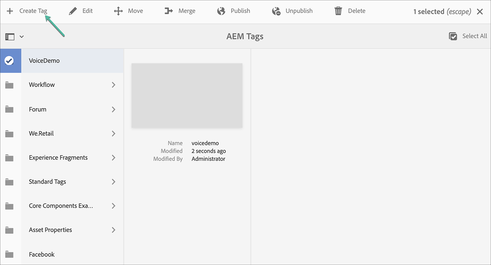

# AEM Screens語音識別 {#voice-recognition}

>[!IMPORTANT]
>
>**重要隱私資訊**
>
>使用語音識別功能時，請遵循您所在區域的所有適用法律和道德准則（包括但不限於向最終用戶提供玩家正在使用語音識別的可見通知）。 Adobe Inc...不接收、儲存或處理任何與語音相關的資訊。 AEM Screens玩家使用內置在瀏覽引擎中的標準網路語音API。 在幕後，此API將您的語音波形發送到Google的伺服器，以便從語音轉換為文本，並且此文本由播放器與配置的關鍵字進行匹配。
>
>請參閱 [GoogleWeb語音API隱私白皮書](https://www.google.com/chrome/privacy/whitepaper.html#speech) 的子菜單。

語音識別特徵允許由語音交互驅動的AEM Screens頻道中的內容改變。

內容作者可以將顯示器配置為啟用語音。 此功能的目的是允許客戶利用語音作為與顯示器交互的方法。 一些類似的使用案例包括在商店中查找產品推薦、在用餐者和餐廳訂購菜單項目。 此功能提高了用戶的可訪問性，並可大大增強客戶體驗。

>[!NOTE]
>播放器硬體必須支援語音輸入，如麥克風。

## 實現語音識別 {#implementing}

>[!IMPORTANT]
> 語音識別功能僅在Chrome作業系統和Windows播放器上提供。

要在AEM Screens項目中實現語音識別，必須啟用「顯示」的語音識別，並將每個頻道與唯一標籤關聯以觸發頻道轉換。

以下部分介紹如何在AEM Screens項目中啟用和使用語音識別功能。

## 在全屏或分屏通道交換機中查看內容 {#sequence-channel}

使用語音識別功能之前，請確保您有一個項目和一個頻道，該頻道為項目設定了內容。

1. 以下示例展示了一個名為 **語音演示** 三個序列頻道 **主**。 **冷飲**, **熱飲**，如下圖所示。

   

   >[!NOTE]
   >
   >要瞭解如何建立頻道或向頻道添加內容，請參閱 [建立和管理渠道](/help/user-guide/managing-channels.md)

   或,

   可以建立三個序列通道 **主**。 **冷飲**, **熱飲**，以及一個額外的1x2分屏通道 **拆分螢幕** 如下圖所示。

   

1. 導航到每個頻道並添加內容。 例如，導航到 **語音演示** —> **頻道** —> **主** 選擇頻道。 按一下 **編輯** 按需開啟編輯器並添加內容（影像/視頻）。 同樣，將內容添加到兩者 **冷飲** 和 **熱飲** 頻道。

   這些渠道現在包含資產（影像），如下圖所示。

   **主要**:

   

   **冷飲**:

   

   **熱飲**:

   

   如果已將「拆分螢幕」通道添加到項目，請導航至 **拆分螢幕** 拖放兩個嵌入序列，並將路徑添加到 **冷飲** 和 **熱飲** 如下圖所示。
   

### 設定通道標籤 {#setting-tags}

在向頻道添加內容後，您需要導航到每個頻道並添加相應的標籤以觸發語音識別。

按照以下步驟將標籤添加到您的頻道：

1. 導航到每個頻道並添加內容。 例如，導航到 **語音演示** —> **頻道** —> **主** 選擇頻道。

1. 按一下 **屬性** 按鈕。

   

1. 導航到 **基礎** 頁籤，然後從 **標籤** 或新建一個。

   可以通過鍵入新標籤名稱並點擊建立新標籤 `return` 鍵，如下圖所示：

   

   或,

   您還可以預先從實例中為AEM項目建立標籤，然後選擇這些標籤。 執行中介紹的步驟後 [建立標籤](#creating-tags)，可以從位置選擇標籤並將其添加到通道中，如下圖所示：

   

1. 同樣，添加標題為 **熱** 到 **熱飲** 頻道。

1. 如果使用「拆分螢幕」通道，請添加兩個標籤(**熱** 和 **冷**) **拆分螢幕** 通道屬性，如下圖所示。

   

1. 按一下 **保存並關閉** 等你完成。

### 建立標籤 {#creating-tags}

按照以下步驟建立標籤：

1. 導航到實AEM例。

1. 按一下「工具」表徵圖 — > **標籤**。
   

1. 按一下 **建立** —> **建立命名空間**。
   

1. 輸入項目名稱，例如， **語音演示** 按一下 **建立**。

1. 選擇 **語音演示** 按一下 **建立標籤** 按鈕。
   

1. 輸入標籤名稱，然後按一下 **提交**。
   

現在，你可以在AEM Screens項目中使用這些標籤。

### 為顯示器分配通道並啟用語音識別 {#channel-assignment}

1. 在 **位置** 資料夾，如下圖所示。

   

   >[!NOTE]
   >要瞭解如何為顯示器分配通道，請參閱 [建立和管理顯示](/help/user-guide/managing-displays.md)。

1. 分配通道 **主**。 **冷飲**, **熱飲** 到 **大廳顯示**。 此外，如果您使用 **拆分螢幕** 通道，確保將其分配給顯示。

   >[!NOTE]
   >如果已建立拆分螢幕通道，請指定 **拆分螢幕** 通道到顯示器。

1. 為每個通道設定以下屬性，同時指定通道。

   | **頻道名稱** | **優先順序** | **支援的事件** |
   |---|---|---|
   | 主要 | 2 | 初始載入、空閒螢幕、計時器 |
   | 熱飲 | 1 | 使用者互動 |
   | 冷飲 | 1 | 使用者互動 |
   | 拆分螢幕 | 1 | 使用者互動 |

   >[!NOTE]
   >
   >要瞭解如何為顯示器分配通道，請參閱 [建立和管理顯示](/help/user-guide/managing-displays.md)。

1. 將通道分配給顯示器後，導航至 **大廳顯示** ，然後選擇顯示。 選擇 **屬性** 按鈕。

1. 導航到 **顯示** 頁籤 **已啟用語音** 選項 **內容**。

   

   >[!IMPORTANT]
   >必須從顯示器啟用語音識別功能。

### 在Chrome播放器中查看內容 {#viewing-content}

完成上述步驟後，您可以註冊chrome設備以查看輸出。

>[!NOTE]
>請參閱 [設備註冊](device-registration.md) 學習如何在AEM Screens玩家上註冊設備。

**序列通道所需輸出**

的 **主** 頻道播放其內容，但當您使用帶關鍵字的詞 **熱** 例如 *我想喝杯熱飲*，頻道開始播放 **熱飲** 頻道。

同樣，如果您使用帶關鍵字的單詞 **冷** 例如 *我想吃點冷的*，頻道開始播放 **冷飲** 頻道。

**拆分螢幕通道所需的輸出**

的 **主** 頻道播放其內容，但當您使用帶關鍵字的詞 **熱** 和 **冷** 一起 *我想看熱和冷飲的菜單*，頻道開始播放 **拆分螢幕** 頻道。 如果你說 *返回主菜單*&#x200B;然後切換回主通道。
