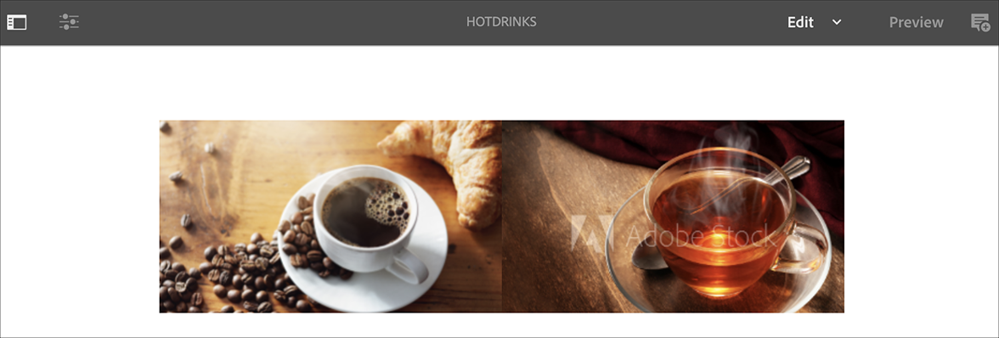

# AEM Screens中的語音辨識 {#voice-recognition}

>[!IMPORTANT]
>
>**重要隱私權資訊**
>
>使用語音辨識功能時，請遵循您所在地區適用的所有法律和道德准則（包括但不限於向使用者提供播放器正在使用語音辨識的可見通知）。 Adobe不會接收、儲存或處理任何語音相關資訊。 AEM Screens播放器使用內建在瀏覽引擎中的標準網頁語音API。 在幕後，此API會將您語音的波形傳送至Google的伺服器，以進行從語音到文字的轉換，而此文字會由播放器根據設定的關鍵字進行比對。
>
>另請參閱 [網頁語音API的Google隱私權白皮書](https://www.google.com/chrome/privacy/whitepaper.html#speech) 以取得更多詳細資料。

語音辨識功能可讓AEM Screens頻道在語音互動驅動下變更內容。

內容作者可以將顯示器設定為啟用語音。 此功能的目的是讓客戶使用語音作為與顯示器互動的方法。 類似的使用案例包括在商店尋找產品推薦、在用餐者和餐廳訂購功能表專案。 此功能可增加使用者的協助工具，並大幅提升客戶體驗。

>[!NOTE]
>播放器硬體必須支援語音輸入，例如麥克風。

## 實作語音辨識 {#implementing}

>[!IMPORTANT]
> 語音辨識功能僅適用於Chrome作業系統和Windows播放器。

若要在您的AEM Screens專案中實作語音辨識，請啟用顯示器的語音辨識，並將每個頻道與唯一標籤建立關聯，以觸發頻道轉換。

下節說明如何在AEM Screens專案中啟用和使用語音辨識功能。

## 以全熒幕或拆分畫面頻道切換檢視內容 {#sequence-channel}

在使用語音辨識功能之前，請確定您擁有專案和頻道，其中包含專案設定的內容。

1. 以下範例示範專案 **VoiceDemo** 和三個順序頻道 **主要**， **冷飲**、和 **熱飲**，如下圖所示。

   

   >[!NOTE]
   >
   >若要瞭解如何建立管道或新增內容至管道，請參閱 [建立和管理管道](/help/user-guide/managing-channels.md)

   或，

   您可以建立三個順序色版 **主要**， **冷飲**、和 **熱飲**，以及一個以上的1x2拆分畫面頻道 **SplitScreen** 如下圖所示。

   

1. 導覽至每個管道並新增內容。 例如，導覽至 **VoiceDemo** > **頻道** > **主要** 並按一下頻道。 按一下 **編輯** 之後，根據您的需求新增內容（影像/影片）。 同樣地，將內容新增至兩者 **冷飲** 和 **熱飲** 頻道。

   管道現在包含資產（影像），如下圖所示。

   **主要**：

   

   **冷飲**：

   

   **熱飲**：

   

   如果您已將拆分畫面頻道新增到專案，請瀏覽至 **SplitScreen** 並拖放兩個內嵌序列並將路徑新增至 **冷飲** 和 **熱飲** 頻道，如下圖所示。
   

### 設定管道標籤 {#setting-tags}

新增內容至管道後，請導覽至每個管道，並新增可觸發語音識別的適當標籤。

請依照下列步驟，將標籤新增至您的頻道：

1. 導覽至每個管道並新增內容。 例如，導覽至 **VoiceDemo** > **頻道** > **主要** 並按一下頻道。

1. 按一下 **屬性** 從動作列移除。

   

1. 導覽至 **基本知識** 標籤，然後按一下中的現有標籤 **標籤** 欄位，或建立一個。

   您可以輸入標籤的新名稱來建立標籤，然後點選 `return` 鍵，如下圖所示：

   

   或，

   您也可以預先從專案的AEM例項建立標籤，然後按一下這些標籤。 依照中說明的步驟操作後， [建立標籤](#creating-tags)，您可以按一下位置中的標籤，並將其新增至您的頻道，如下圖所示：

   

1. 同樣地，新增標題為 **熱** 至 **熱飲** 頻道。

1. 如果您使用「拆分畫面」頻道，請新增兩個標籤(**熱** 和 **冷**)到 **SplitScreen** 頻道屬性，如下圖所示。

   

1. 按一下 **儲存並關閉** 完成後。

### 建立標記 {#creating-tags}

請依照下列步驟建立標籤：

1. 導覽至您的AEM執行個體。

1. 按一下「工具」圖示> **標籤**.
   

1. 按一下 **建立** > **建立名稱空間**.
   

1. 輸入專案名稱，例如 **VoiceDemo** 並按一下 **建立**.

1. 按一下 **VoiceDemo** 專案並按一下 **建立標籤** 從動作列移除。
   

1. 輸入標簽名稱，然後按一下 **提交**.
   

現在，您可以在AEM Screens專案中使用這些標籤。

### 將頻道指定到顯示器並啟用語音辨識 {#channel-assignment}

1. 在中建立顯示區 **位置** 資料夾，如下圖所示。

   

   >[!NOTE]
   >若要瞭解如何將頻道指派給顯示區，請參閱 [建立和管理顯示器](/help/user-guide/managing-displays.md).

1. 指派管道 **主要**， **冷飲**、和 **熱飲** 至您的 **LobbyDisplay**. 此外，如果您使用 **SplitScreen** 您專案的管道，請確定您也將其指派給顯示區。

   >[!NOTE]
   >如果您已建立拆分畫面頻道，請指派 **SplitScreen** 通道也連線到您的顯示器。

1. 為每個色版設定下列屬性，同時指派色版。

   | **頻道名稱** | **優先順序** | **支援的事件** |
   |---|---|---|
   | 主要 | 2 | 初始載入、閒置畫面、計時器 |
   | 熱飲 | 1 | 使用者互動 |
   | 冷飲 | 1 | 使用者互動 |
   | SplitScreen | 1 | 使用者互動 |

   >[!NOTE]
   >
   >若要瞭解如何將頻道指派給顯示區，請參閱 [建立和管理顯示器](/help/user-guide/managing-displays.md).

1. 將管道指派給顯示區後，導覽至 **LobbyDisplay** 並按一下顯示。 按一下 **屬性** 從動作列移除。

1. 導覽至 **顯示** 標籤並啟用 **啟用語音** 下的選項 **內容**.

   

   >[!IMPORTANT]
   >必須從顯示器啟用語音辨識功能。

### 在Chrome播放器中檢視內容 {#viewing-content}

完成上述步驟後，您可以註冊Chrome裝置以檢視輸出。

>[!NOTE]
>另請參閱 [裝置註冊](device-registration.md).

**順序頻道的所需輸出**

此 **主要** 頻道正在播放其內容，但當您使用具有關鍵字的字詞時 **熱** 例如 *我想要一杯熱飲*，頻道會開始播放 **熱飲** 頻道。

同樣地，如果您使用具有關鍵字的文字 **冷** 例如 *我想喝點冷飲*，頻道會開始播放 **冷飲** 頻道。

**分割畫面頻道的所需輸出**

此 **主要** 頻道正在播放其內容。 不過，當您使用含關鍵字的字詞時 **熱** 和 **冷** 一起使用，例如 *我想看看熱飲和冷飲的選單*，則頻道播放 **SplitScreen** 頻道。 如果您說 *返回主功能表*，它還原為 **主要** 頻道。
