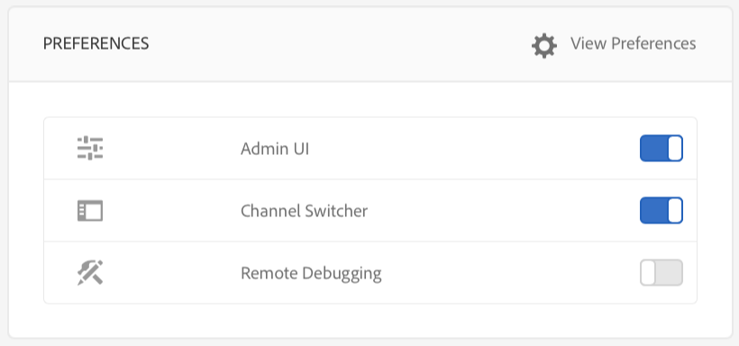

# 使用AEM Screens Player

您可以在AEM Screens Player上管理頻道內容和其他設定。

>[!NOTE]
>
>按下&#x200B;***Ctrl+Cmd+F***，即可結束OS X AEM Screens Player的全熒幕模式。

將管道指派給顯示區後，AEM Screens Player就會顯示內容。 您可以使用管理員UI的偏好設定（從控制面板）或播放器本身來設定播放器的設定。

## 使用裝置控制面板 {#using-the-device-dashboard}

您可以從裝置控制面板設定裝置的偏好設定，您可以透過AEM編寫執行個體來存取。

1. 從您的專案導覽至裝置儀表板，例如，***測試專案*** > ***裝置***。

   從動作列按一下&#x200B;**裝置**&#x200B;和&#x200B;**裝置管理員**。

   

1. 按一下裝置，即可開啟裝置控制面板。

   

1. 檢查&#x200B;**偏好設定**&#x200B;面板。 您可以從這兩個選項為您的播放器啟用或停用&#x200B;**管理UI**&#x200B;和&#x200B;**頻道切換器**。

   

### 管理員UI {#the-admin-ui}

從偏好設定面板啟用&#x200B;**管理員UI**，可讓使用者從Screens Player開啟管理員設定。 此外，如果您從裝置控制面板停用此選項，使用者將無法從播放器開啟Admin UI 。

若要從Screens Player檢視Admin UI，請在觸控式AEM Screens Player上按一下左上角以開啟「管理員」功能表，或使用滑鼠來開啟。 完成註冊並載入管道後，資訊便會顯示。

>[!NOTE]
>
>您也可以檢視AEM Screens Player應用程式運作時間，以檢查應用程式運作狀態。

#### 存取組態功能表選項 {#configuration-options}

如果您按一下側邊功能表中的&#x200B;**組態**&#x200B;選項，可以更新您的組態，如下圖所示：

「組態」功能表可讓您修改下列設定：

* 從這個對話方塊將&#x200B;**韌體**、**喜好設定**&#x200B;或&#x200B;**重設為Factory**。

* 在&#x200B;**最大數量中，指定您要為AEM Screens Player保留的最大記錄檔數量。 要保留的記錄檔**。

* 啟用或停用Screens播放器的&#x200B;**管理功能表**、**頻道切換器**&#x200B;和&#x200B;**活動UI**。

  如果從&#x200B;**設定**&#x200B;功能表啟用&#x200B;**活動UI**，AEM Screens Player會在播放器的右上角顯示&#x200B;*播放器活動通知*，如下圖所示。

  

>[!NOTE]
>
>**更新韌體**&#x200B;選項僅適用於Cordova，例如Android™播放器。

>[!NOTE]
>
>建議在生產部署中停用&#x200B;**管理UI**。

#### 存取內容快取功能表選項 {#content-cache-options}

您可以從AEM Screens Player的管理員UI中清除管道和應用程式的快取。

從側邊欄按一下&#x200B;**內容快取**，以便您可以更新快取。

### 頻道切換器 {#the-channel-switcher}

從偏好設定面板啟用&#x200B;**頻道切換器**，可讓使用者從Screens Player開啟頻道選擇設定。

此外，如果您從裝置控制面板停用此選項，使用者將無法從Screens Player控制頻道偏好設定。

您可以從Screens Player切換並控制頻道的設定。

若要從播放器檢視頻道切換程式，請長按左下角，開啟可切換頻道和其他功能的頻道切換程式。

>[!NOTE]
>
>您也可以在Screens播放器中啟用或停用播放器的管理功能表及頻道切換器。
>
>(請參閱下節所述的&#x200B;*變更Screens Player的偏好設定*)。

### 從AEM Screens播放器管理偏好設定

您也可以從播放器本身變更管理員UI和頻道切換器的設定。

若要變更播放器的偏好設定：

1. 長按閒置頻道左上角以開啟「管理」面板。
1. 從左側動作功能表瀏覽至&#x200B;**組態**。
1. 啟用或停用&#x200B;**管理員UI**&#x200B;或&#x200B;**頻道切換器**&#x200B;的設定。

## 疑難排解AEM Screens Player

您可以針對AEM Screens Player （硬體和軟體）相關的各種問題進行疑難排解：

| **個問題** | **建議** |
|---|---|
| 播放器儲存空間已滿 | 消除不必要的檔案 |
| 播放器網路中斷 | 使用Cat-5或Cat-6纜。 若使用Wifi，請縮短路由器與播放器裝置的距離 |
| AEM Screens Player當機 | 建議使用監視程式應用程式，以確保AEM Screens Player一律執行 |
| AEM Screens Player遺失設定 | 檢查與AEM伺服器的連線 |
| AEM Screens Player不會在播放器重新啟動或重新開機後自動啟動 | 檢查作業系統啟動資料夾或初始化程式 |
| AEM Screens Player顯示錯誤或舊內容 | 檢查網路連線 |

### AEM Screens Player更新

AEM Screens Player有兩種型別的更新：

| **方法** | **詳細資料** | **經由遠端** | **自動化** | **0停機時間** |
|---|---|---|---|---|
| 韌體更新 | 透過遠端指令套用至現有的已安裝播放器。 更新後，播放器會自動重新載入現有的內容。 | 是 | 自訂 | 幾乎 — 1-3秒 |
| 播放器殼層更新 | 部署在播放器上的新可執行檔。 此功能需要您在播放器上遠端複製新的二進位檔，並停止目前執行的專案，然後啟動新版本。 它可能需要再次下載套件的預先載入。 | 是（透過遠端shell） | 自訂 | 否 |

## 播放器裝置的硬體選擇准則 {#hardware-selection-guidelines-for-player-device}

>[!NOTE]
>
>**已棄用：**&#x200B;此硬體選擇指引已棄用，不應用於新部署。 硬體規格與建議應由合格的AV整合商根據您的特定部署需求與使用案例提供。

下節提供Screens專案的硬體選擇准則：

* 電腦播放器及顯示面板或投影機的&#x200B;***Commercial***&#x200B;或&#x200B;***Industrial***&#x200B;等級的元件，一律提供來源。

* 永遠與數位看板市場的供應商互動。
* 請務必考量環境因素，例如環境溫度和相對濕度。
* 請務必檢閱電源需求與電源調節。
* 請仔細檢閱應用程式所需的效能需求和I/O連線埠。

下表概述AEM Screens專案的硬體組態與典型使用案例：

<table>
 <tbody>
  <tr>
   <td>播放器設定</td>
   <td>處理器</td>
   <td>記憶體</td>
   <td>儲存固態硬碟</td>
   <td>GPU</td>
   <td>顯示</td>
   <td>I/O</td>
   <td>典型使用案例</td>
  </tr>
  <tr>
   <td>基本</td>
   <td>雙核心、i3或入門級四核心Intel® Atom處理器</td>
   <td>
4 GB記憶體
 
2 MB快取
 </td>
   <td>
*ChromeOS 32 GB
 
*Windows 128 GB
 </td>
   <td>主機板</td>
   <td>1920 x 1080</td>
   <td>DVI 乙太網路/無線  2xUSB</td>
   <td>
    <ul>
     <li>標準全熒幕循環  </li>
     <li>日時段分割</li>
    </ul> </td>
  </tr>
  <tr>
   <td>標準</td>
   <td>四核心、Intel® Core™ i5處理器</td>
   <td>
8 GB記憶體
 
4 MB快取
 </td>
   <td>128 GB</td>
   <td>主機板</td>
   <td>3840x2160 (<code>4K</code>)</td>
   <td>DVI、HDMI 乙太網路/無線、  2xUSB</td>
   <td>
    <ul>
     <li>單一Source動態內容</li>
     <li>簡單互動式</li>
     <li>1-3區域配置</li>
    </ul> </td>
  </tr>
  <tr>
   <td>進階</td>
   <td>四核心含超執行緒、Intel® Core™ i7處理器</td>
   <td>
16 GB記憶體
 
8 MB快取
 </td>
   <td>256 GB</td>
   <td>專用圖形GPU</td>
   <td>3840x2160 (<code>4K</code>)</td>
   <td>DVI、HDMI 乙太網路/無線、  4xUSB</td>
   <td>
    <ul>
     <li>4個或更多內容區域，同時播放視訊</li>
     <li>多頁互動式</li>
     <li>多Source資料觸發器</li>
    </ul> </td>
  </tr>
 </tbody>
</table>
