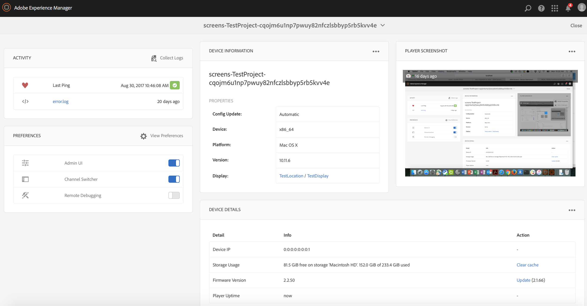

# 使用AEM Screens Player {#working-with-aem-screens-player}

您可以在AEM Screens Player上管理頻道內容和其他設定。

>[!NOTE]
>
>按下 ***Ctrl+Cmd+F*** 以結束OS X AEM Screens Player的全熒幕模式。

將管道指派給顯示區後， AEM Screens Player就會顯示內容。 您可以使用管理員UI的偏好設定（從控制面板）或播放器本身來設定播放器的設定。

## 使用裝置控制面板 {#using-the-device-dashboard}

您可以從「裝置控制面板」設定裝置的偏好設定，並可透過AEM編寫執行個體存取。

1. 從您的專案導覽至裝置控制面板，例如 ***測試專案*** > ***裝置***.

   選取 **裝置** 和 **裝置管理員** 從動作列移除。

   

1. 按一下裝置以開啟裝置控制面板。

   

1. 檢查 **偏好設定** 面板。 您可以啟用/停用 **管理員UI** 和 **頻道切換器** 這兩個選項可為您的播放器提供。

   

### 管理員UI {#the-admin-ui}

啟用 **管理員UI** 從偏好設定面板中，允許使用者從Screens播放器開啟管理員設定。 此外，如果您從裝置控制面板停用此選項，使用者將無法從播放器開啟管理員UI。

若要從Screens播放器檢視Admin UI，請在左上角長按以開啟「管理員」功能表、在已啟用觸控功能的AEM Screens播放器上按一下，或使用滑鼠。 它會在註冊完成並載入管道後顯示資訊。

>[!NOTE]
>
>此外，您也可以檢視AEM Screens Player應用程式運作時間，以檢查應用程式運作狀態。

#### 存取組態功能表選項 {#configuration-options}

您可以更新設定，如果您選取 **設定** 側選單中的選項，如下圖所示：

「組態」功能表可讓您修改下列設定：

* 重設 **韌體**， **偏好設定**，或 **到工廠** 在此對話方塊中。

* 指定AEM Screens播放器保留的最大記錄檔數 **最大數量 要保留的記錄檔**.

* 啟用或停用 **管理功能表**， **頻道切換器**、和 **活動UI** 用於Screens播放器。

  如果 **活動UI** 啟用於 **設定** 功能表，AEM Screens播放器會顯示 *播放器活動通知* 位於播放器右上角，如下圖所示。

  

>[!NOTE]
>
>此 **更新韌體** 選項僅適用於Cordova，例如Android播放器。

>[!NOTE]
>
>建議 **管理員UI** 在生產部署中停用。

#### 存取內容快取功能表選項 {#content-cache-options}

您可以從AEM Screens播放器中的管理員UI清除管道和應用程式的快取。

選取 **內容快取** 以更新快取。

### 頻道切換器 {#the-channel-switcher}

啟用 **頻道切換器** 從偏好設定面板中，可讓使用者從Screens播放器開啟頻道選擇/設定。

此外，如果您從裝置儀表板停用此選項，使用者將無法從Screens播放器控制頻道偏好設定。

您可以從Screens播放器切換並控制頻道的設定。

若要從播放器檢視頻道切換程式，請在左下角長按以開啟頻道切換程式，以便切換頻道和其他功能。

>[!NOTE]
>
>您也可以從Screens播放器啟用或停用播放器的管理功能表及頻道切換器。
>
>(請參閱 *從Screens播放器變更偏好設定* （如下節所述）。

### 從AEM Screens播放器管理偏好設定 {#managing-preferences-from-the-aem-screens-player}

您也可以從播放器本身變更管理員UI和頻道切換器的設定。

請依照下列步驟，從您的播放器變更偏好設定：

1. 長按閒置頻道左上角以開啟「管理」面板。
1. 瀏覽至 **設定** 從左側動作功能表。
1. 啟用/停用設定 **管理員UI** 或 **頻道切換器**.

## 疑難排解AEM Screens Player {#troubleshooting-aem-screens-player}

您可以針對AEM Screens Player （硬體和軟體）相關的各種問題進行疑難排解：

| **問題** | **Recommendations** |
|---|---|
| 播放器儲存空間已滿 | 消除不必要的檔案 |
| 播放器網路中斷 | 使用Cat-5/Cat-6纜線。 若使用Wifi，請縮短路由器與播放器裝置的距離 |
| AEM Screens Player當機 | 建議使用監視程式應用程式，以確保AEM Screens Player一律執行 |
| AEM Screens Player遺失設定 | 檢查與AEM伺服器的連線 |
| AEM Screens Player不會在播放器重新啟動/重新開機後自動啟動 | 檢查作業系統啟動資料夾或初始化程式 |
| AEM Screens Player顯示錯誤/舊的內容 | 檢查網路連線 |

### AEM Screens Player更新 {#updates-for-aem-screens-player}

AEM Screens Player有兩種型別的更新：

| **方法** | **詳細資料** | **透過遠端** | **自動化** | **0停機時間** |
|---|---|---|---|---|
| 韌體更新 | 透過遠端命令套用至現有的已安裝播放器。 更新後，播放器將自動重新載入現有內容。 | 是 | 自訂 | 幾乎 — 1-3秒 |
| 播放器殼層更新 | 這是要部署在播放器上的新可執行檔。 這需要在播放器上遠端複製新的二進位檔，並停止目前執行的專案，然後啟動新版本。 這可能需要重新下載套件的預先載入。 | 是（透過遠端shell） | 自訂 | 否 |

## 播放器裝置的硬體選擇准則 {#hardware-selection-guidelines-for-player-device}

下節提供Screens專案的硬體選擇准則：

* 永遠來源 ***商業*** 或 ***工業*** PC播放器及顯示面板或投影機的等級元件。

* 永遠與數位看板市場的供應商互動。
* 請務必考量環境因素，例如環境溫度和相對濕度。
* 請務必檢閱電源需求與電源調節。
* 請仔細檢閱應用程式所需的效能需求和I/O連線埠。

下表概述AEM Screens專案的硬體組態與典型使用案例：

<table>
 <tbody>
  <tr>
   <td>播放器設定</td>
   <td>處理器</td>
   <td>記憶體</td>
   <td>儲存固態硬碟</td>
   <td>GPU</td>
   <td>顯示區</td>
   <td>I/O</td>
   <td>典型使用案例</td>
  </tr>
  <tr>
   <td>基本</td>
   <td>雙核心、i3或入門級四核心Intel® Atom處理器</td>
   <td>
4GB記憶體
 
2MB快取記憶體
 </td>
   <td>
·ChromeOS 32 GB
 
·Windows 128GB
 </td>
   <td>主機板</td>
   <td>1920 x 1080</td>
   <td>DVI、  乙太網路/無線、  2個USB</td>
   <td>
    <ul>
     <li>標準全熒幕循環  </li>
     <li>日時段分割</li>
    </ul> </td>
  </tr>
  <tr>
   <td>標準</td>
   <td>四核心、Intel® Core i5處理器</td>
   <td>
8GB記憶體
 
4MB快取記憶體
 </td>
   <td>128 GBB</td>
   <td>主機板</td>
   <td>3840x2160 (4K)</td>
   <td>DVI、HDMI  乙太網路/無線、  2個USB</td>
   <td>
    <ul>
     <li>單一來源動態內容</li>
     <li>簡單互動式</li>
     <li>1-3區域配置</li>
    </ul> </td>
  </tr>
  <tr>
   <td>進階</td>
   <td>四核心含超執行緒、Intel® Core i7處理器</td>
   <td>
16GB記憶體
 
8MB快取記憶體
 </td>
   <td>256 GB</td>
   <td>專用圖形GPU</td>
   <td>3840x2160 (4K)</td>
   <td>DVI、HDMI  乙太網路/無線、  4個USB</td>
   <td>
    <ul>
     <li>4個或更多內容區域，同時播放視訊</li>
     <li>多頁互動式</li>
     <li>多來源資料觸發器</li>
    </ul> </td>
  </tr>
 </tbody>
</table>
